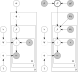

```{=html}
<style>
div.callout-note > .callout-header {
  background-color: #f8f8f8 !important;
}
.callout.callout-style-default {
  border: 1px solid #dee2e6 !important;
}
div.callout-tip > .callout-header {
  background-color: rgba(230, 159, 0, 0.2) !important;
}
/* .callout.callout-tip {
  border: 1px solid rgba(230, 159, 0, 0.2)  !important;
} */
div.callout-important > .callout-header {
  background-color: rgba(86, 180, 233, 0.2) !important;
}
/* div.callout-note.callout {
  border-left-color: #f8f8f8 !important;
} */
</style>
```

## Overview

Our goal is to make the final project as open-ended as possible, to give you the space to explore any particular topic that may have piqued your interest throughout the semester! At the same time, we hope to provide you with guidance and mentorship so that you don't feel lost as to how to start, how to proceed, and/or what to submit for the final deliverable![^montessori]

For each lecture (especially from Week 8 onwards), our hope is that there are some **next step(s)** that come to mind, that you feel like you can follow to move from **learning** the concepts covered in class to **applying** them towards some **social phenomenon** of interest to you! Though exceptions are always welcome (see previous paragraph), here we outline **two general paths** you can take, with examples under each heading that you can use as inspiration:

::: {.callout-tip title="Option 1: Modeling Social Phenomena with PGMs" icon="false"}

**Moving from *vaguely-thinking-about* to *formally modeling***

See the [example project template for Option 1](https://jjacobs.me/dsan5650-project-modeling/), which uses the following PGM to model the latent "personas" (`VILLAIN`, `SURFER DUDE`) which then manifest in particular movie characters. Full descriptions of the PGM variables are given in the paper, but you can get a sense for what's happening by noting the variables which define each **plate**: $D$ represents the number of **movies**, $E$ represents the number of **characters** in a given movie, and $W$ represents tuples pairing **words** in the movie descriptions with **roles** (think of, e.g., `HERO` or `VILLAIN`) that may be associated with those words.

{fig-align="center" width="80%"}

:::

::: {.callout-important title="Option 2: Pushing Towards the Asymptote of Causality" icon="false"}

**Taking an existing *associational* analysis and tackling confounders**

See the [example project template for Option 2](https://jjacobs.me/dsan5650-project-modeling/), which takes existing studies of present-day GDP by country and shows how important it is (for the sake of assessing **causal** impacts, rather than just associations between variables) to include the **confounding variable** of **continent**: here the causal impact of **Terrain Ruggedness** on present-day GDP per capita is **positive** for countries within Africa, but **negative** everywhere else in the world!

```{r, dev = "svg", dev.args=list(bg="transparent")}
#| label: fig-nunn-plot
#| warning: false
#| code-fold: true
#| fig-align: center
#| fig-cap: Results from @nunn_ruggedness_2012, where the causal impact of terrain ruggedness on present-day GDP per capita **reverses direction** when considering African vs. non-African countries!
library(tidyverse) |> suppressPackageStartupMessages()
rug_df <- read_csv("assets/rugged_data.csv", show_col_types=FALSE)
# Compute Box-Cox params
bc_params <- car::powerTransform(
  object = cbind(
    rug_df$rgdppc_2000,
    rug_df$rugged
  )
)
rug_df <- rug_df |> mutate(
  continent = ifelse(cont_africa == 1, "African", "Non-African"),
  gdpc_transformed = rgdppc_2000_m ^ bc_params$lambda[1],
  rugged_transformed = rugged ^ bc_params$lambda[2],
)
rug_df |> ggplot(aes(
  x = rugged_transformed,
  y = gdpc_transformed
)) +
  geom_text(aes(label=isocode), size=3) +
  geom_smooth(method="lm", fullrange=TRUE) +
  facet_wrap(~ continent) +
  theme_classic() +
  theme(
    panel.background = ggplot2::element_rect(fill='transparent'),
    plot.background = ggplot2::element_rect(fill='transparent', color=NA),
    plot.title = element_text(hjust=0.5),
  ) +
  labs(
    title="Differential Effects of Ruggedness by Continent",
    x="Terrain Ruggedness",
    y="Log GDP Per Capita, 2000",
  )
```

:::

## Concrete Requirements

For the two options described above, the following info boxes describe the structure of the deliverable(s) you're responsible for:

::: {.callout-tip title="Option 1: Modeling Social Phenomena with PGMs" collapse="false" icon="false"}

**Moving from *vaguely-thinking-about* to *formally modeling***

An effective project following this option is one that uses the machinery of PGMs to **enhance our understanding of a given social phenomenon**, by taking e.g. a qualitative "hunch" we might have about how something works (like the gendered nature of film roles, in the example project template) and then nailing down (a) the relevant pieces of the phenomenon as **nodes** in the PGM and (b) their interrelationships as **edges** in the PGM. The structure of your deliverable, therefore, should generally look as follows:

1.  Clearly state the **social phenomenon** you're aiming to model (e.g., in the Option 1 template, gendered film roles; or in Reading Adventure 2, Congressional voting and its polarization over time), and then argue for the utility of PGMs to sharpen what may be a **vague, qualitative understanding** one might have about this phenomenon

    Reading Adventure 2 is again helpful as an example here, since the DW-NOMINATE model discussed there essentially allowed researchers to quantitatively *measure* political factors that were often argued about but rarely "resolved": in place of debates around e.g. *whether* the US Congress was polarized or not, researchers could now capture the degree of polarization quantitatively (by measuring clustering relative to principal components of legislative voting data), and subsequently link it to data on other phenonema like campaign finance.

    Returning to the gendered film roles example, the beginning of an Option 1 project about this phenomenon could include something like:
    
    > *In place of vague discussions and claims of improved gender representation in Hollywood, our unsupervised model's ability to identify the `HERO` role and its skew towards male actors will also enable researchers to quantitatively track **how much** progress was made, e.g. across different decades, or in response to different SAG-AFTRA policies.*

2.  Once you've argued for the utility of capturing aspects of the social phenomenon with PGMs, include the PGM itself (generated via PyMC, graphviz, dagitty, or any other library that you're comfortable with!), and provide a table like Table 1 in the template explaining what each **variable** in the PGM captures.

3.  Finally, you should present a novel **finding** that you were able to derive by applying your model to data on some social phenomenon. This is where the notion that Jeff talked about early on in the course, of how **science builds on previous studies** (and how Bayes' Rule tells us specifically how we should **update** our understanding of a phenomenon after carrying out a project), becomes relevant! Because, here is where you should report anything **surprising** that you found, relative to what you expected going into the project.

    Consider the Innovation in French Revolutionary debates paper discussed in Lab 1, for example: the researchers who carried out that study, along with many people reading it, were surprised at how certain speechmakers who are typically considered less influential than Robespierre nonetheless registered extremely high "scores" on the Novelty and Resonance measures. This novel finding, in turn, led researchers to go back and re-analyze the speeches made by these surprisingly-influential delegates, and re-evaluate whose ideas impacted the eventual form of the First French Republic!

:::

::: {.callout-important title="Option 2: Associational $\leadsto$ Causal Analysis" collapse="false" icon="false"}

**Figuring out how to address some existing <i>drawback</i> of the algorithm/data structure**

The structure of your deliverable should be as follows:

1. To begin, you should **summarize existing literature** that you're building upon: this could be, e.g., a summary of a past project you've done, or of a published paper or series of published papers that you think fail to address causal concerns as-is
2. Then, you should **explain exactly what the "missing pieces" are**, in terms of **bridging the gap** between associational and causal analysis: what covariates have not been properly accounted for, for example?
3. You should then **explicitly state a course topic** which can be used to address this shortcoming, and **justify its use**: for example, can a propensity score-based analysis be used to balance the treatment and control groups?
    i. For example, recall the point from Week 8 that *propensity scores can only be used when there is sufficient **common support*** between the treatment and control groups in a dataset! In that week's simulated smoking-cessation example, the DGP for the relationship between `motivation` and `enrollment` gave rise to a scenario where we did **not** have common support for the **lowest and highest 25%** of people with respect to `motivation` score (since *nobody* from the lowest 25% enrolled, while *everybody* from the highest 25% enrolled). We **did**, however, have common support for the middle 50%, since this middle 50% had a mixture of enrollers and non-enrollers. For your project, then, if you choose to pursue a propensity score-based analysis, you'll need to be explicit about the specific **subset(s)** of your **population** for which the propensity-weighted estimate(s) are valid.

:::

## Individual vs. Group Projects

It is totally up to you whether you'd like to do the project individually or in a group with other students. However, if you are pursuing the project as a group, please choose **one member** of the group to serve as the **"project lead"**, and include this detail in an email to your mentor.

The mentor for the **group** project will then be whoever was assigned as the **individual** mentor for the project leader (this choice doesn't have to be related to the actual work on the project, it is just for us to be able to allocate mentees fairly between the course staff!).

Expectations for group projects will **scale** based on the number of members in the group: for example, a group with two members will be expected to carry out a more substantive project, such that it requires approximately two times the amount of work that would be expected for individual projects^[This detail is not something we're trying to explicitly measure or be harsh about, but is included here since otherwise (if the expectations for individual and group projects were the exact same) the work would scale the other way: that each person in a two-person project would be doing half the amount of work that a person doing an individual project is doing... Hopefully that makes sense from a fairness perspective!.]

## Timeline

* **Proposal (Abstract on Notion)**:
    * ***Submitted*** to instructors by Tuesday, July 15th, 6:30pm EDT
    * ***Approved*** by an instructor by Tuesday, July 22nd, 6:30pm EDT
* **Final Draft**:
    * ***Submitted*** to instructors for review by Friday, July 31st, 5:59pm EDT
    * ***Approved*** by an instructor by Wednesday, August 5th, 11:59pm EDT
* **Final Submission**:
    * ***Submitted*** via Canvas by Friday, August 7th, 11:59pm EDT

## Submission Format

The course's [Canvas page]() now has a "Final Project" assignment, where you will upload your final submission for grading. The following is a rough sketch of what we're looking for in terms of the structure of your submission:

* HTML format, as a rendered <a href='https://quarto.org/docs/manuscripts/' target='_blank'>Quarto manuscript</a>, would be optimal, but can be PDF if preferred---for example, if you choose Option 4 (involving mathematical proofs), you might instead want to use LaTeX rendered to PDF.
* A requirement in terms of **number of pages** is difficult, but a reasonable range for the **PDF format** would be 3-10 pages double-spaced. Therefore, for a **Quarto** document or **Jupyter** notebook, the length can be the equivalent of this (for example, you can print-preview the Quarto doc to see how many pages it would produce if printed)
* It should have an **abstract**, a 250-500 word paragraph at the very top of the manuscript, summarizing what you did (this can be copied from your Notion abstract, or updated as needed!)
* **Citations** should be set up so that they're handled automatically. By <a href='https://quarto.org/docs/authoring/footnotes-and-citations.html' target='_blank'>Quarto's citation manager</a> for example, or by <a href='https://www.overleaf.com/learn/latex/Bibliography_management_with_bibtex' target='_blank'>Bibtex/Biber</a> if you're using LaTeX.

## References

::: {#refs}
:::

[^montessori]: If you can't tell, my whole educational philosophy here is just the [Montessori system](https://en.wikipedia.org/wiki/Montessori_education)---this approach was originally developed for younger (primary school) children, but lots and lots of <a href='https://www.penguinrandomhouse.com/books/579922/how-we-learn-by-stanislas-dehaene/' target='_blank'>recent educational research</a> indicates that it's an actually an extremely effective way to learn, and to motivate self-learning, for people of any age 😎
