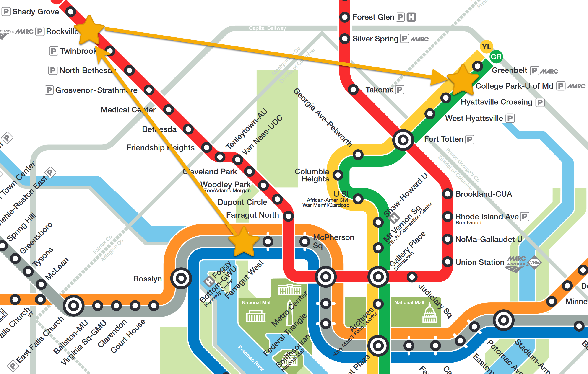
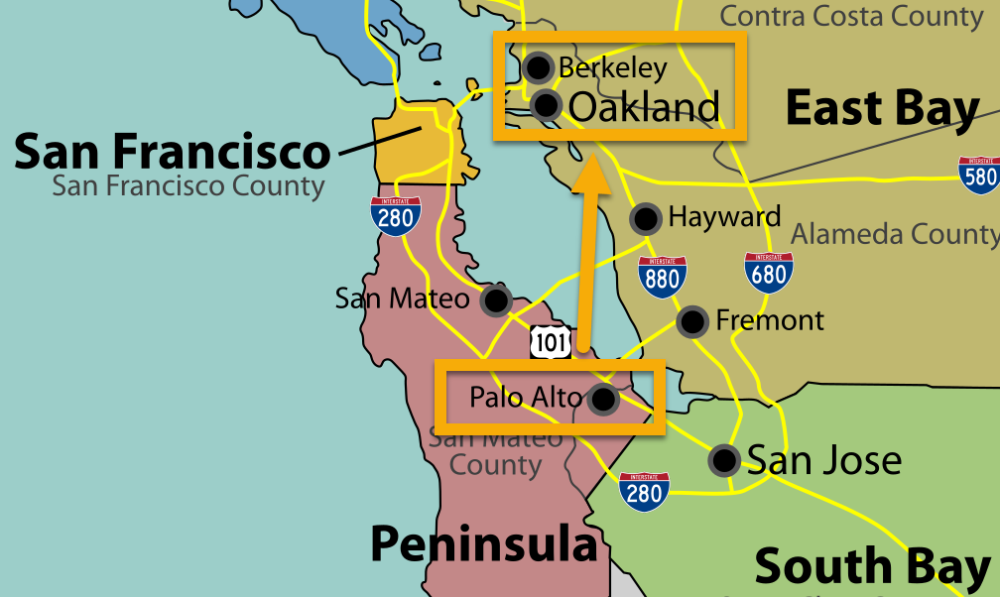
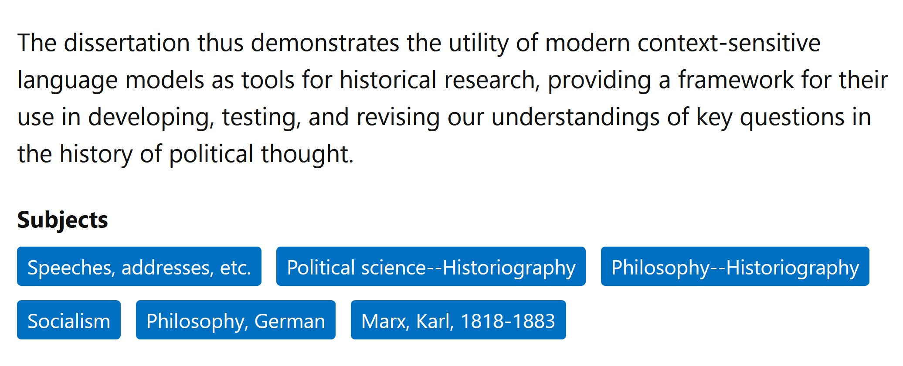
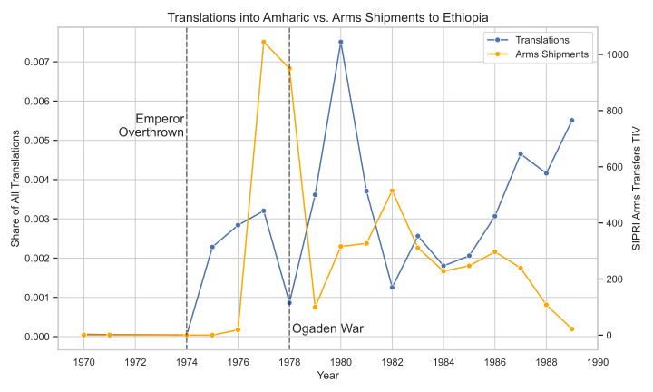
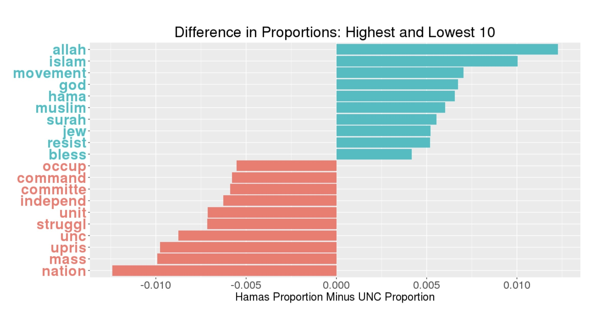

::: {.content-visible unless-format="revealjs"}

<center>
<a class="h2" href="./slides.html" target="_blank">Open slides in new window &rarr;</a>
</center>

:::

# Schedule {.smaller .crunch-title .crunch-callout .code-90 data-name="Schedule"}

Today's Planned Schedule:

| | Start | End | Topic |
|:- |:- |:- |:- |
| **Lecture** | 6:30pm | 7:00pm | [Quick Hello Hi Everyone Style Intro &rarr;](#who-am-i-why-is-georgetown-having-me-teach-this) |
| | 7:00pm | 7:25pm | [[science]{.orbitron-jj} $\leadsto$ [Social Science]{.barrio-jj} "Phase Transition" &rarr;](#the-science.orbitron-jj-leadsto-social-science.barrio-jj-phase-transition) |
| | 7:25pm | 7:50pm | [Motivating Examples I: Social Science &rarr;](#motivation-i-humble-bayesian-social-science) |(#soci) |
| **Break!** | 7:50pm | 8:00pm | |
| | 8:00pm | 8:30pm | [Motivating Examples II: Causal Inference &rarr;](#motivation-ii-causal-inference) |
| | 8:30pm | 9:00pm | [Course Logistics &rarr;](#course-logistics) |

: {tbl-colwidths="[12,12,12,64]"}



::: {.hidden}

```{=html}
<style>
.orbitron-jj {
  font-family: "Orbitron", sans-serif;
  font-optical-sizing: auto;
  font-style: normal;
}
.barrio-jj {
  font-family: "Barrio", system-ui;
  /* font-weight: 400; */
  font-style: normal;
}
.yuji-boku-jj {
  font-family: "Yuji Boku", serif;
  /* font-weight: 400; */
  font-style: normal;
}
</style>
```

:::

# Who Am I? Why Is Georgetown Having Me Teach This? {data-stack-name="Intro"}

## Prof. Jeff Introduction! {.crunch-title}

* Born in **NW DC** &rarr; high school in **Rockville, MD**
* **University of Maryland**: Computer Science, Math, Econ

{fig-align="center"}

## The World Outside of DC {.crunch-title}

<i class='bi bi-1-circle'></i> Studied abroad in **Beijing** (Peking University/北大) &rarr; internship with Huawei in **Hong Kong** (HKUST)

::: {style="float: right; margin-left: 8px"}

{width="600"}

:::

<i class='bi bi-2-circle'></i> **Stanford**, MS in Computer Science

<i class='bi bi-3-circle'></i> Research Economist, **UC Berkeley**

<i class='bi bi-4-circle'></i> **Columbia**, PhD in Political Economy


## Why Is Georgetown Having Me Teach This? {.smaller .crunch-title .title-11 .crunch-ul .crunch-li-8 .crunch-quarto-layout-panel .crunch-quarto-figure .ul-block}


::: {#fig-background-right style="float: right;"}
<center>

```{python}
#| label: bg-sunburst
#| fig-align: center
#| align: center
#| echo: false
cb_palette = [
    "#E69F00", "#56B4E9", "#009E73",
    "#F0E442", "#0072B2", "#D55E00",
    "#CC79A7"
]
import plotly.express as px
import plotly.io as pio
pio.renderers.default = "notebook"
import pandas as pd
year_df = pd.DataFrame({
  'field': ['Math<br>(BS)','CS<br>(BS,MS)','Pol Phil<br>(PhD Pt 1)','Econ<br>(BS+Job)','Pol Econ<br>(PhD Pt 2)'],
  'cat': ['Quant','Quant','Humanities','Social Sci','Social Sci'],
  'yrs': [4, 6, 3, 6, 5]
})
fig = px.sunburst(
    year_df, path=['cat','field'], values='yrs',
    width=450, height=400, color='cat',
    color_discrete_map={'Quant': cb_palette[0], 'Humanities': cb_palette[1], 'Social Sci': cb_palette[2]},
    hover_data=[]
)
fig.update_traces(
   hovertemplate=None,
   hoverinfo='skip'
)
# Update layout for tight margin
# See https://plotly.com/python/creating-and-updating-figures/
fig.update_layout(margin = dict(t=0, l=0, r=0, b=0))
fig.show()
```
</center>

Years spent questing in dungeons of academia
:::

* Quanty things $\leadsto$ PhD in **Political Economy**
* PhD exam major: **Political Philosophy**
* PhD exam minor: **International Relations** (["How to Do Things with Translations"](https://cs.stanford.edu/~jjacobs3/Jacobs-Translations_Paper_2018-09-01.pdf))
* Brain-changing Research Fellowships at...
* [Santa Fe Institute](https://en.wikipedia.org/wiki/Santa_Fe_Institute): *dedicated to the multidisciplinary study of complex systems: physical, **computational**, biological, **social***
* [Centre for the Study of the History of Political Thought](https://projects.history.qmul.ac.uk/hpt/), Queen Mary University of London (QMUL): *New approaches to the **history of political thought** [Quentin Skinner, "Cambridge School"] have changed how we study **ideas from the past** and their relevance to **contemporary politics**. The focus of the Centre is to explore [that sort of thing then, innit guv'nor!].*

## Dissertation (NLP x History) {.crunch-title}

*"Our Word is Our Weapon": Text-Analyzing Wars of Ideas from the French Revolution to the First Intifada*

{fig-align="center"}

## (IR Part) Wars of Ideas I: Cold War {.smaller .crunch-title .title-12 .crunch-img}

* Cold War arms shipments (SIPRI) vs. propaganda (*Печать СССР*): here, to 🇪🇹

{fig-align="center"}

## (Middle East Part) Wars of Ideas II: First Intifada, 1987-1993 {.smaller .crunch-title .title-08}

{fig-align="center"}

## Research Nowadays

* Most cited paper: "Monopsony in Online Labor Markets" (Uses Double-Debiased ML for Causal Inference!)
* Most recent paper: "Operationalizing Freedom as Non-Domination in the Labor Market" (Cambridge U Press)
* Rarely cited paper but often-thought-about obsession: "How To Do Things With Translations"
* Related thing you can buy in a bookstore: [Editorial board for new translation of] *Capital, Vol. 1* by Karl Marx (Princeton U Press)

## But Now... Teaching! {.smaller}

* Growth mindset: "I can't do this" $\leadsto$ "I can't do this *yet*!"
* Think of anything you're able to do... There was a point in life when you didn't know how to do it! What happened? Your brain **established** and/or **rearranged** neural pathways as you **struggled** with it!
* How does this neural re-arrangement work? One "cheatcode" is **spaced repetition**:

](images/forgetting-curve.webp){fig-align="center"}

## Lil Wayne on Spaced Repetition {.smaller .crunch-title .crunch-quarto-figure}

::: {#fig-lilwayne}



From [The Carter (Documentary)](https://en.wikipedia.org/wiki/The_Carter){target='_blank'}
:::

## Maria Montessori on Your Final Project {.title-09 .aside-05}

> Our teaching should be governed, not by a desire to **make** students learn things, but by the endeavor to **keep burning within them** that light which is called **curiosity**. [@montessori_spontaneous_1916]

* To this end: your final project is to explore some potential **causal linkage** from $X$ to $Y$ (more later!)
* The sole requirement is: sufficient **curiosity** to serve as **fuel** for your journey from **associational** world to **causal** world

## Earning Your Grade: Effort + Growth Mindset! {.crunch-title .title-11 .crunch-blockquote .crunch-ul .text-65 .crunch-p-3 .table-70 .crunch-quarto-figure .crunch-quarto-layout-panel}

<i class='bi bi-1-circle'></i> Because you **learn to [&nbsp;&nbsp;&nbsp;&nbsp;&nbsp;&nbsp;&nbsp;&nbsp;]{.underline} by [&nbsp;&nbsp;&nbsp;&nbsp;&nbsp;&nbsp;&nbsp;&nbsp;]{.underline}ing**, the **more [&nbsp;&nbsp;&nbsp;&nbsp;&nbsp;&nbsp;&nbsp;&nbsp;]{.underline}ing you do** [adapted to where you're at, **background**-wise, **time-outside-of-class**-wise], the better **grade** you can get:

* For each [&nbsp;&nbsp;&nbsp;&nbsp;&nbsp;&nbsp;&nbsp;&nbsp;]{.underline} you do [["good faith attempt"](https://www.cs.umd.edu/~nelson/classes/resources/good_faith_attempt/)], you receive **one ✅s**
* If it looks good as-is, with "good" defined as "demonstrates understanding of the relevant material [to instructors, in dialogue with students]", you receive a **second [✅]{.check-gold}**
* Otherwise you can earn this **second [✅]{.check-gold}** by **re-trying** until understanding is achieved

<i class='bi bi-2-circle'></i> ✅s **convert to points** via **(required) main quests**, (technically not required) **sidequests**:

:::: {layout="[58,42]"}
::: {#main-quests}

```{=html}
<table>
<colgroup>
<col style="width: 35%;">
<col style="width: 5%;">
<col style="width: 30%;">
<col style="width: 30%;">
</colgroup>
<thead>
<tr>
  <th>Main Quest</th>
  <th class='tdc'>#</th>
  <th class='tdc'>Completion?</th>
  <th class='tdc'>Understanding?</th>
</tr>
</thead>
<tbody>
<tr>
  <td class='tdvc'>Homework (🔲🔲)</td>
  <td class='tdc'>4</td>
  <td class='tdc'>🔲🔲🔲🔲🔲🔲🔲🔲</td>
  <td class='tdc'><span class='box-gold'>🔲🔲🔲🔲🔲🔲🔲🔲</span></td>
</tr>
<tr>
  <td>Midterm (🔲🔲)</td>
  <td class='tdc'>1</td>
  <td class='tdc'>🔲🔲</td>
  <td class='tdc'><span class='box-gold'>🔲🔲</span></td>
</tr>
<tr>
  <td>Project (🔲🔲🔲)</td>
  <td class='tdc'>1</td>
  <td class='tdc'>🔲🔲🔲</td>
  <td class='tdc'><span class='box-gold'>🔲🔲🔲</span></td>
</tr>
<tr>
  <td>Meeting (<span class='box-left-half'>🔲</span>)</td>
  <td class='tdc'>2</td>
  <td colspan='2' class='tdc'>🔲</td>
</tr>
<tr>
  <td colspan="4" class='tdc tdvc'><b>Total = 27 🔲s</b></td>
</tr>
</tbody>
</table>
```

:::
::: {#side-quests}

```{=html}
<table>
<colgroup>
<col style="width: 46%;">
<col style="width: 4%;">
<col style="width: 25%;">
<col style="width: 25%;">
</colgroup>
<thead>
<tr>
  <th>Side Quest</th>
  <th class='tdc'></th>
  <th class='tdc'></th>
  <th class='tdc'></th>
</tr>
</thead>
<tbody>
<tr>
  <td><span data-qmd="Lab (<span class='box-left-half'>🔲</span>)"></span></td>
  <td class='tdc'>8</td>
  <td class='tdc'>🔲🔲🔲🔲</td>
  <td class='tdc'><span class='box-gold'>🔲🔲🔲🔲</span></td>
</tr>
<tr>
  <td><span data-qmd="Reading (<span class='box-left-half'>🔲</span>)"></span></td>
  <td class='tdc'>8</td>
  <td class='tdc'>🔲🔲🔲🔲</td>
  <td class='tdc'><span class='box-gold'>🔲🔲🔲🔲</span></td>
</tr>
<tr>
  <td>Meeting (<span class='box-left-half'>🔲</span>)</td>
  <td class='tdc'>2</td>
  <td colspan='2' class='tdc'>🔲</td>
</tr>
<tr>
  <td colspan="4" class='tdc tdvc'><b>Total = 17 🔲s</b></td>
</tr>
<tr>
  <td colspan="4" class='tdc tdvc cb1a-bg' style='border: 2px solid darkgrey;'><b>Combined = 44 🔲s</b></td>
</tr>
</tbody>
</table>
```

:::
::::

<center style='margin-top: 10px !important;'>

```{=html}
<table class='table-no-borders'>
<tbody>
<tr>
  <td class='tdr' style='border-right: 1px solid black !important; padding-right: 5px !important;'>0.5</td>
  <td class='tdr' style='border-right: 1px solid black !important; padding-right: 5px !important;'>1.0</td>
  <td class='tdr' style='border-right: 1px solid black !important; padding-right: 5px !important;'>1.5</td>
  <td class='tdr' style='border-right: 1px solid black !important; padding-right: 5px !important;'>2.0</td>
  <td class='tdr' style='border-right: 1px solid black !important; padding-right: 5px !important;'>2.5</td>
  <td class='tdr' style='border-right: 1px solid black !important; padding-right: 5px !important;'>3.0</td>
  <td class='tdr' style='border-right: 1px solid black !important; padding-right: 5px !important;'>3.5</td>
  <td class='tdr' style='border-right: 1px solid black !important; padding-right: 5px !important;'>4.0</td>
</tr>
<tr>
  <td class='tdr tdvc'>🔲🔲🔲🔲🔲</td>
  <td class='tdr tdvc'>🔲🔲🔲🔲🔲</td>
  <td class='tdr tdvc'>🔲🔲🔲🔲🔲</td>
  <td class='tdr tdvc'>🔲🔲🔲🔲🔲</td>
  <td class='tdr tdvc'>🔲🔲🔲🔲🔲</td>
  <td class='tdr tdvc'>🔲🔲🔲🔲🔲</td>
  <td class='tdr tdvc'>🔲🔲🔲🔲🔲</td>
  <td class='tdr tdvc'>🔲🔲🔲🔲🔲</td>
</tr>
<tr>
  <td colspan='3' class='tdc tdvc' style='padding: 5px !important;'><span class='flip-emoji'>🏃‍♀️</span></td>
  <td colspan="2" class='tdc tdvc' style='padding: 5px !important;'>🙇‍♀️🧘🧠💪<b>&nbsp;&darr;&nbsp;</b>💪🧠🧘🙇‍♀️</td>
  <td colspan='3' class='tdc tdvc' style='padding: 5px !important;'><span class='flip-emoji'>🏃‍♀️</span></td>
</tr>
<tr>
  <td class='tdr tdvc'>✅✅✅✅✅</td>
  <td class='tdr tdvc'>✅✅✅✅✅</td>
  <td class='tdr tdvc'>✅✅✅✅✅</td>
  <td class='tdr tdvc'>✅✅✅✅✅</td>
  <td class='tdr tdvc'>✅✅✅✅✅</td>
  <td class='tdr tdvc'>✅✅✅✅✅</td>
  <td class='tdr tdvc'>✅✅✅✅✅</td>
  <td class='tdr tdvc'>✅✅✅✅✅</td>
</tr>
</tbody>
</table>
```

</center>

# The [Science]{.orbitron-jj} $\leadsto$ [Social Science]{.barrio-jj} "Phase Transition" {data-name="Science &rarr; Social Science"}

<center>

[Today's Demo: [Schelling's Attendance Model](https://observablehq.com/@jpowerj/schelling-attendance)]{.boxed-cb}

</center>

# Course Logistics {data-stack-name="Logistics"}

## JupyterHub

<center>

[**https://guhub.io**](https://guhub.io){style="border: 5px solid #e69f00; padding: 5px"}

</center>

](images/jhub.png){fig-align="center"}

## References

::: {#refs}
:::
