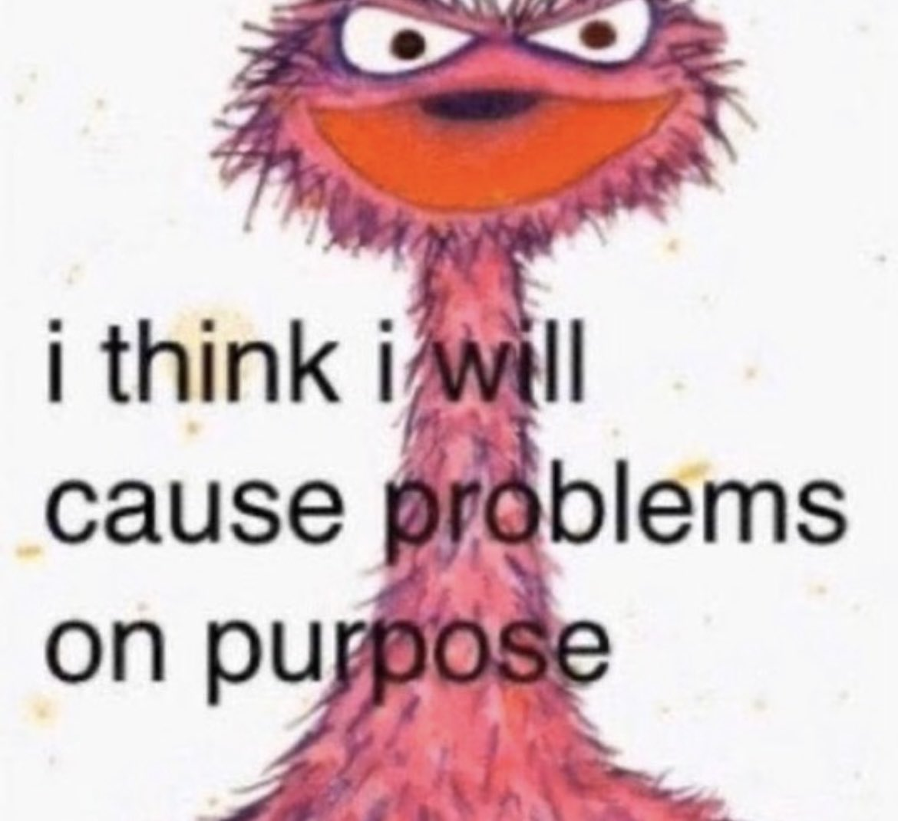

::: {.content-visible unless-format="revealjs"}

<center>
<a class="h2" href="./slides.html" target="_blank">Open slides in new window &rarr;</a>
</center>

:::

# Schedule {.smaller .crunch-title .crunch-callout .code-90 data-name="Schedule"}

Today's Planned Schedule:

| | Start | End | Topic |
|:- |:- |:- |:- |
| **Lecture** | 6:30pm | 7:00pm | [Quick Hello Hi Everyone Style Intro &rarr;](#who-am-i-why-is-georgetown-having-me-teach-this) |
| | 7:00pm | 7:25pm | [[science]{.orbitron-jj} $\leadsto$ [Social Science]{.barrio-jj} "Phase Transition" &rarr;](#the-science.orbitron-jj-leadsto-social-science.barrio-jj-phase-transition) |
| | 7:25pm | 7:50pm | [Motivating Examples I: Social Science &rarr;](#motivation-i-humble-bayesian-social-science) |(#soci) |
| **Break!** | 7:50pm | 8:00pm | |
| | 8:00pm | 8:30pm | [Motivating Examples II: Causal Inference &rarr;](#motivation-ii-causal-inference) |
| | 8:30pm | 9:00pm | [Course Logistics &rarr;](#course-logistics) |

: {tbl-colwidths="[12,12,12,64]"}



::: {.hidden}

```{=html}
<style>
.orbitron-jj {
  font-family: "Orbitron", sans-serif;
  font-optical-sizing: auto;
  font-style: normal;
}
.barrio-jj {
  font-family: "Barrio", system-ui;
  /* font-weight: 400; */
  font-style: normal;
}
.yuji-boku-jj {
  font-family: "Yuji Boku", serif;
  /* font-weight: 400; */
  font-style: normal;
}
</style>
```

:::

# Who Am I? Why Is Georgetown Having Me Teach This? {data-stack-name="Intro"}

## Prof. Jeff Introduction! {.crunch-title}

* Born in **NW DC** &rarr; high school in **Rockville, MD**
* **University of Maryland**: Computer Science, Math, Econ

{fig-align="center"}

## The World Outside of DC {.crunch-title}

<i class='bi bi-1-circle'></i> Studied abroad in **Beijing** (Peking University/北大) &rarr; internship with Huawei in **Hong Kong** (HKUST)

::: {style="float: right; margin-left: 8px"}

{width="600"}

:::

<i class='bi bi-2-circle'></i> **Stanford**, MS in Computer Science

<i class='bi bi-3-circle'></i> Research Economist, **UC Berkeley**

<i class='bi bi-4-circle'></i> **Columbia**, PhD in Political Economy


## Why Is Georgetown Having Me Teach This? {.smaller .crunch-title .title-11 .crunch-ul .crunch-li-8 .crunch-quarto-layout-panel .crunch-quarto-figure .ul-block}


::: {#fig-background-right style="float: right;"}
<center>

```{python}
#| label: bg-sunburst
#| fig-align: center
#| align: center
#| echo: false
cb_palette = [
    "#E69F00", "#56B4E9", "#009E73",
    "#F0E442", "#0072B2", "#D55E00",
    "#CC79A7"
]
import plotly.express as px
import plotly.io as pio
pio.renderers.default = "notebook"
import pandas as pd
year_df = pd.DataFrame({
  'field': ['Math<br>(BS)','CS<br>(BS,MS)','Pol Phil<br>(PhD Pt 1)','Econ<br>(BS+Job)','Pol Econ<br>(PhD Pt 2)'],
  'cat': ['Quant','Quant','Humanities','Social Sci','Social Sci'],
  'yrs': [4, 6, 3, 6, 5]
})
fig = px.sunburst(
    year_df, path=['cat','field'], values='yrs',
    width=450, height=400, color='cat',
    color_discrete_map={'Quant': cb_palette[0], 'Humanities': cb_palette[1], 'Social Sci': cb_palette[2]},
    hover_data=[]
)
fig.update_traces(
   hovertemplate=None,
   hoverinfo='skip'
)
# Update layout for tight margin
# See https://plotly.com/python/creating-and-updating-figures/
fig.update_layout(margin = dict(t=0, l=0, r=0, b=0))
fig.show()
```
</center>

Years spent questing in dungeons of academia
:::

* Quanty things $\leadsto$ PhD in **Political Economy**
* PhD exam major: **Political Philosophy**
* PhD exam minor: **International Relations** (["How to Do Things with Translations"](https://cs.stanford.edu/~jjacobs3/Jacobs-Translations_Paper_2018-09-01.pdf))
* Brain-changing Research Fellowships at...
* [Santa Fe Institute](https://en.wikipedia.org/wiki/Santa_Fe_Institute): *dedicated to the multidisciplinary study of complex systems: physical, **computational**, biological, **social***
* [Centre for the Study of the History of Political Thought](https://projects.history.qmul.ac.uk/hpt/), Queen Mary University of London (QMUL): *New approaches to the **history of political thought** [Quentin Skinner, "Cambridge School"] have changed how we study **ideas from the past** and their relevance to **contemporary politics**. The focus of the Centre is to explore [that sort of thing then, innit guv'nor!].*

## Dissertation (NLP x History) {.crunch-title}

*"Our Word is Our Weapon": Text-Analyzing Wars of Ideas from the French Revolution to the First Intifada*

{fig-align="center"}

## (IR Part) Wars of Ideas I: Cold War {.smaller .crunch-title .title-12 .crunch-img}

* Cold War arms shipments (SIPRI) vs. propaganda (*Печать СССР*): here, to 🇪🇹

{fig-align="center"}

## (Middle East Part) Wars of Ideas II: First Intifada, 1987-1993 {.smaller .crunch-title .title-08}

{fig-align="center"}

## Research Nowadays

* Most cited paper: "Monopsony in Online Labor Markets" (Uses Double-Debiased ML for Causal Inference!)
* Most recent paper: "Operationalizing Freedom as Non-Domination in the Labor Market" (Cambridge U Press)
* Rarely cited paper but often-thought-about obsession: "How To Do Things With Translations"
* Related thing you can buy in a bookstore: [Editorial board for new translation of] *Capital, Vol. 1* by Karl Marx (Princeton U Press)

## But Now... Teaching! {.smaller}

* Growth mindset: "I can't do this" $\leadsto$ "I can't do this *yet*!"
* Think of anything you're able to do... There was a point in life when you didn't know how to do it! What happened? Your brain **established** and/or **rearranged** neural pathways as you **struggled** with it!
* How does this neural re-arrangement work? One "cheatcode" is **spaced repetition**:

](images/forgetting-curve.webp){fig-align="center"}

## Lil Wayne on Spaced Repetition {.smaller .crunch-title .crunch-quarto-figure}

::: {#fig-lilwayne}



From [The Carter (Documentary)](https://en.wikipedia.org/wiki/The_Carter){target='_blank'}
:::

## Maria Montessori on Your Final Project {.title-09 .aside-05}

> Our teaching should be governed, not by a desire to **make** students learn things, but by the endeavor to **keep burning within them** that light which is called **curiosity**. [@montessori_spontaneous_1916]

* To this end: your final project is to explore some potential **causal linkage** from $X$ to $Y$ (more later!)
* The sole requirement is: sufficient **curiosity** to serve as **fuel** for your journey from **associational** world to **causal** world

## Earning Your Grade: Effort + Growth Mindset! {.crunch-title .title-11 .crunch-blockquote .crunch-ul .text-65 .crunch-p-3 .table-70 .crunch-quarto-figure .crunch-quarto-layout-panel}

<i class='bi bi-1-circle'></i> Because you **learn to [&nbsp;&nbsp;&nbsp;&nbsp;&nbsp;&nbsp;&nbsp;&nbsp;]{.underline} by [&nbsp;&nbsp;&nbsp;&nbsp;&nbsp;&nbsp;&nbsp;&nbsp;]{.underline}ing**, the **more [&nbsp;&nbsp;&nbsp;&nbsp;&nbsp;&nbsp;&nbsp;&nbsp;]{.underline}ing you do** [adapted to where you're at, **background**-wise, **time-outside-of-class**-wise], the better **grade** you can get:

* For each [&nbsp;&nbsp;&nbsp;&nbsp;&nbsp;&nbsp;&nbsp;&nbsp;]{.underline} you do [["good faith attempt"](https://www.cs.umd.edu/~nelson/classes/resources/good_faith_attempt/)], you receive **one ✅s**
* If it looks good as-is, with "good" defined as "demonstrates understanding of the relevant material [to instructors, in dialogue with students]", you receive a **second [✅]{.check-gold}**
* Otherwise you can earn this **second [✅]{.check-gold}** by **re-trying** until understanding is achieved

<i class='bi bi-2-circle'></i> ✅s **convert to points** via **(required) main quests**, (technically not required) **sidequests**:

:::: {layout="[58,42]"}
::: {#main-quests}

```{=html}
<table>
<colgroup>
<col style="width: 35%;">
<col style="width: 5%;">
<col style="width: 30%;">
<col style="width: 30%;">
</colgroup>
<thead>
<tr>
  <th>Main Quest</th>
  <th class='tdc'>#</th>
  <th class='tdc'>Completion?</th>
  <th class='tdc'>Understanding?</th>
</tr>
</thead>
<tbody>
<tr>
  <td class='tdvc'>Homework (🔲🔲)</td>
  <td class='tdc'>4</td>
  <td class='tdc'>🔲🔲🔲🔲🔲🔲🔲🔲</td>
  <td class='tdc'><span class='box-gold'>🔲🔲🔲🔲🔲🔲🔲🔲</span></td>
</tr>
<tr>
  <td>Midterm (🔲🔲)</td>
  <td class='tdc'>1</td>
  <td class='tdc'>🔲🔲</td>
  <td class='tdc'><span class='box-gold'>🔲🔲</span></td>
</tr>
<tr>
  <td>Project (🔲🔲🔲)</td>
  <td class='tdc'>1</td>
  <td class='tdc'>🔲🔲🔲</td>
  <td class='tdc'><span class='box-gold'>🔲🔲🔲</span></td>
</tr>
<tr>
  <td>Meeting (<span class='box-left-half'>🔲</span>)</td>
  <td class='tdc'>2</td>
  <td colspan='2' class='tdc'>🔲</td>
</tr>
<tr>
  <td colspan="4" class='tdc tdvc'><b>Total = 27 🔲s</b></td>
</tr>
</tbody>
</table>
```

:::
::: {#side-quests}

```{=html}
<table>
<colgroup>
<col style="width: 46%;">
<col style="width: 4%;">
<col style="width: 25%;">
<col style="width: 25%;">
</colgroup>
<thead>
<tr>
  <th>Side Quest</th>
  <th class='tdc'></th>
  <th class='tdc'></th>
  <th class='tdc'></th>
</tr>
</thead>
<tbody>
<tr>
  <td><span data-qmd="Lab (<span class='box-left-half'>🔲</span>)"></span></td>
  <td class='tdc'>8</td>
  <td class='tdc'>🔲🔲🔲🔲</td>
  <td class='tdc'><span class='box-gold'>🔲🔲🔲🔲</span></td>
</tr>
<tr>
  <td><span data-qmd="Reading (<span class='box-left-half'>🔲</span>)"></span></td>
  <td class='tdc'>8</td>
  <td class='tdc'>🔲🔲🔲🔲</td>
  <td class='tdc'><span class='box-gold'>🔲🔲🔲🔲</span></td>
</tr>
<tr>
  <td>Meeting (<span class='box-left-half'>🔲</span>)</td>
  <td class='tdc'>2</td>
  <td colspan='2' class='tdc'>🔲</td>
</tr>
<tr>
  <td colspan="4" class='tdc tdvc'><b>Total = 17 🔲s</b></td>
</tr>
<tr>
  <td colspan="4" class='tdc tdvc cb1a-bg' style='border: 2px solid darkgrey;'><b>Combined = 44 🔲s</b></td>
</tr>
</tbody>
</table>
```

:::
::::

<center style='margin-top: 10px !important;'>

```{=html}
<table class='table-no-borders'>
<tbody>
<tr>
  <td class='tdr' style='border-right: 1px solid black !important; padding-right: 5px !important;'>0.5</td>
  <td class='tdr' style='border-right: 1px solid black !important; padding-right: 5px !important;'>1.0</td>
  <td class='tdr' style='border-right: 1px solid black !important; padding-right: 5px !important;'>1.5</td>
  <td class='tdr' style='border-right: 1px solid black !important; padding-right: 5px !important;'>2.0</td>
  <td class='tdr' style='border-right: 1px solid black !important; padding-right: 5px !important;'>2.5</td>
  <td class='tdr' style='border-right: 1px solid black !important; padding-right: 5px !important;'>3.0</td>
  <td class='tdr' style='border-right: 1px solid black !important; padding-right: 5px !important;'>3.5</td>
  <td class='tdr' style='border-right: 1px solid black !important; padding-right: 5px !important;'>4.0</td>
</tr>
<tr>
  <td class='tdr tdvc'>🔲🔲🔲🔲🔲</td>
  <td class='tdr tdvc'>🔲🔲🔲🔲🔲</td>
  <td class='tdr tdvc'>🔲🔲🔲🔲🔲</td>
  <td class='tdr tdvc'>🔲🔲🔲🔲🔲</td>
  <td class='tdr tdvc'>🔲🔲🔲🔲🔲</td>
  <td class='tdr tdvc'>🔲🔲🔲🔲🔲</td>
  <td class='tdr tdvc'>🔲🔲🔲🔲🔲</td>
  <td class='tdr tdvc'>🔲🔲🔲🔲🔲</td>
</tr>
<tr>
  <td colspan='3' class='tdc tdvc' style='padding: 5px !important;'><span class='flip-emoji'>🏃‍♀️</span></td>
  <td colspan="2" class='tdc tdvc' style='padding: 5px !important;'>🙇‍♀️🧘🧠💪<b>&nbsp;&darr;&nbsp;</b>💪🧠🧘🙇‍♀️</td>
  <td colspan='3' class='tdc tdvc' style='padding: 5px !important;'><span class='flip-emoji'>🏃‍♀️</span></td>
</tr>
<tr>
  <td class='tdr tdvc'>✅✅✅✅✅</td>
  <td class='tdr tdvc'>✅✅✅✅✅</td>
  <td class='tdr tdvc'>✅✅✅✅✅</td>
  <td class='tdr tdvc'>✅✅✅✅✅</td>
  <td class='tdr tdvc'>✅✅✅✅✅</td>
  <td class='tdr tdvc'>✅✅✅✅✅</td>
  <td class='tdr tdvc'>✅✅✅✅✅</td>
  <td class='tdr tdvc'>✅✅✅✅✅</td>
</tr>
</tbody>
</table>
```

</center>


# The [Science]{.orbitron-jj} $\leadsto$ [Social Science]{.barrio-jj} "Phase Transition" {data-stack-name="Science &rarr; Social Science"}

<center>

[Today's Demo: [Schelling's Attendance Model](https://observablehq.com/@jpowerj/schelling-attendance)]{.boxed-cb}

</center>

## Coarse-Graining Units of Observation {.smaller .title-12 .table-85}

```{=html}
<table>
<thead>
<tr>
  <th>Field</th>
  <th colspan="2">Example Unit of Observation</td>
</tr>
</thead>
<tbody>
<tr>
  <td width="20%">Physics</td>
  <td width="30%"><span data-qmd="Particle"></span></td>
  <td width="50%" align="right"><span data-qmd="\[Particle = **Fine-Graining** of Molecules\]"></span></td>
</tr>
<tr>
  <td>Chemistry</td>
  <td><span data-qmd="Molecule = $\cup$(Particles)"></span></td>
  <td><span data-qmd="\[Molecule = **Coarse-Graining** of Particles\]"></span></td>
</tr>
<tr>
  <td>Biology</td>
  <td colspan="2"><span data-qmd="Cell = $\cup$(Molecules)"></span></td>
</tr>
<tr>
  <td>Neuro/Cog Sci</td>
  <td colspan="2"><span data-qmd="Brain = $\cup$(Cells)"></span></td>
</tr>
<tr>
  <td>Human Physiology</td>
  <td colspan="2"><span data-qmd="Body = Brain $\cup$ Other Organs"></span></td>
</tr>
<tr style="border-top: 5px solid #e69f00; border-bottom: 5px solid #e69f00;">
  <td colspan="3" align="center" class='cb1a-bg'><span data-qmd="&uarr; [Science]{.orbitron-jj} &nbsp;&nbsp; 🧐 **something happens here...** 🤔 &nbsp;&nbsp; &darr; [Social Science]{.barrio-jj}"></span></td>
</tr>
<tr>
  <td>Anthropology</td>
  <td colspan="2"><span data-qmd="Human-Relational System (e.g., Kinship) = $\cup$(Brains) $\times$ Natural Environment"></span></td>
</tr>
<tr>
  <td>Economics</td>
  <td colspan="2"><span data-qmd="Economy = Specific relational system of *exchange* w.r.t. scarce resources"></span></td>
</tr>
<tr>
  <td>Political Economy</td>
  <td colspan="2"><span data-qmd="Economy-Context = Economic Exchange $\cap$ Relational Power"></span></td>
</tr>
<tr>
  <td>Sociology</td>
  <td colspan="2"><span data-qmd="Society = $\cup$(Relational Systems: Kinship, Friendship, Authority, Power, Violence)"></span></td>
</tr>
<tr>
  <td>History</td>
  <td colspan="2"><span data-qmd="[*Longue-Durée*](https://en.wikipedia.org/wiki/Longue_dur%C3%A9e) = Evolution of Societies over Time and Space"></span></td>
</tr>
</tbody>
</table>
```

## *Homo sapiens*/*Homo arbitratus*/*Homo mischievous* {.title-065 .crunch-title .crunch-ul .ul-block}

::: {#mischievous style="float: right;"}

{fig-align="center" width="290"}

:::

* Latin [*sapiens*](https://en.wiktionary.org/wiki/sapiens#Latin) denotes being "discerning" or "wise"
* But... technically nothing stops us from **choosing** to be "unwise" whenever we'd like... bc **free will**
* $\Rightarrow$ For this class, humans are *Homo arbitratus*: [*arbitratus*](https://en.wiktionary.org/wiki/arbitratus#Latin) denotes **choosing** what to do, after we've [sapiently] thought about it

## Laws of Physics vs. "Laws" of Social Science {.title-08 .crunch-title .crunch-ul .crunch-quarto-figure .aside-80 .crunch-li-8 .crunch-img .crunch-footnotes}

* If we tell an inanimate object that we've discovered a **law** saying that it will accelerate towards Earth at $9.8~\textrm{m}/\textrm{s}^2$
  * ...It will likely^[Obligatory quantum footnote: human agency [maybe] plays a role, in a quirky way, in physics at tiny subatomic scales; but once we **coarse grain** to atoms (+avoid speed of light), Newton's Laws accurate to many decimals 🤯] still accelerate towards Earth at $9.8~\textrm{m}/\textrm{s}^2$

:::: {layout="[70,30]"}
::: {#human-law}

* If we tell a **human** we've discovered a **law** saying they will quack like a duck at 7:30pm EDT every Wednesday
  * ...They can utilize their **free will** to violate this "law"

:::
::: {#cause-problems}

{fig-align="center"}

:::
::::

## Strangely-Relevant CS Topic: The Halting Problem {.smaller .title-09 .table-75 .crunch-title .crunch-ul .crunch-li-8}

* Kurt Gödel $\leftrightarrow$ Alan Turing: [*Entscheidungsproblem*](https://www.cs.virginia.edu/~robins/Turing_Paper_1936.pdf)
* **Theorem**: It is not possible to write a computer program $P(x)$ that detects whether or not a computer program $x$ will eventually halt (as opposed to, e.g., looping forever)
* **Proof**: Assume $P(x)$ *is* possible to write. Run it on `mischievous_program.py`. Infinite contradiction loop.

:::: {.columns}
::: {.column width="60%"}

``` {.python filename="halting_problem_solver.py" style="margin-bottom: 25px;"}
def will_it_halt(program, input):
  # Put code you think will work here
  # Return True if program will halt, False otherwise
```

``` {.python filename="mischievous_program.py"}
def my_mischievous_function(input):
  if will_it_halt(my_mischevious_function, input):
    while True: pass # Infinite loop
  else:
    return # Halt
```

:::
::: {.column width="40%"}

```{=html}
<center>

<table>
<thead>
<tr>
  <th><span data-qmd="Input&rarr;<br>&darr;Program"></span></th>
  <th align="center">0</th>
  <th align="center">1</th>
  <th align="center">2</th>
  <th align="center"><span data-qmd="$\cdots$"></span></th>
</tr>
</thead>
<tbody>
<tr>
  <td>0</td>
  <td class='cb1a-bg' align="center"><span data-qmd="**Halt**"></span></td>
  <td align="center">Loop</td>
  <td align="center">Loop</td>
  <td align="center"><span data-qmd="$\cdots$"></span></td>
</tr>
<tr>
  <td>1</td>
  <td>Loop</td>
  <td class='cb1a-bg'><span data-qmd="**Loop**"></span></td>
  <td>Halt</td>
  <td><span data-qmd="$\cdots$"></span></td>
</tr>
<tr>
  <td>2</td>
  <td>Loop</td>
  <td>Loop</td>
  <td class='cb1a-bg'><span data-qmd="**Loop**"></span></td>
  <td><span data-qmd="$\cdots$"></span></td>
</tr>
<tr>
  <td><span data-qmd="$\vdots$"></span></td>
  <td><span data-qmd="$\vdots$"></span></td>
  <td><span data-qmd="$\vdots$"></span></td>
  <td><span data-qmd="$\vdots$"></span></td>
  <td class='cb1a-bg'><span data-qmd="$\mathbf{\ddots}$"></span></td>
</tr>
<tr style="border-top: 3px solid black;">
  <td align="center"><span data-qmd="{width='50'}"></span></td>
  <td class='cb1a-bg' style="vertical-align: middle;"><span data-qmd="**Loop**"></span></td>
  <td class='cb1a-bg' style="vertical-align: middle;"><span data-qmd="**Halt**"></span></td>
  <td class='cb1a-bg' style="vertical-align: middle;"><span data-qmd="**Halt**"></span></td>
  <td class='cb1a-bg' style="vertical-align: middle;"><span data-qmd="$\mathbf{\cdots}$"></span></td>
</tr>
</tbody>
</table>

</center>
```

:::
::::

## The Takeaway: Bayesian Humility! {.crunch-title .title-09 .crunch-ul .crunch-li-8 .aside-05 .text-90}

* Social [science]{.orbitron-jj}, with ["science"]{.orbitron-jj} used in the same sense as for physics, may be a quixotic endeavor^[At least, for the time being... BUT see @sperber_explaining_1996, which will come up later]
* Instead, we'll do [**social science**]{.barrio-jj}, where we use data to...
* <i class='bi bi-1-circle'></i> Infer **tendencies**: $\mathcal{H}$ = «$X$ tends to cause $Y$»
* <i class='bi bi-2-circle'></i> With some degree of **veracity**: $\Pr(\mathcal{H}) \approx 0.7$
* <i class='bi bi-3-circle'></i> Construct models that we can **update** with **new evidence**: Bayes' rule! $\Pr(\mathcal{H} \mid E) = \frac{\Pr(E \mid \mathcal{H} ) \Pr(\mathcal{H})}{\Pr(E)} \approx 0.8$
* Pls notice "slippage" between **aleatory probability** *within* $\mathcal{H}$ ("tends to") vs. **epistemic probability** "outside of", talking *about* $\mathcal{H}$ ("I'm 70\% confident about $\mathcal{H}$")

# Matching Estimators for Apples-to-Apples Comparisons {data-stack-name="Causality" .crunch-title}

](images/fruit.png){fig-align="center"}

## Case Study: Military Inequality $\leadsto$ Military Success {.smaller .crunch-title .title-09 .crunch-ul .crunch-blockquote .crunch-li-8}

* @lyall_divided_2020: "Treating certain ethnic groups as second-class citizens [...] leads victimized soldiers to subvert military authorities once war begins. The higher an army's inequality, the greater its rates of desertion, side-switching, and casualties"

> Matching constructs **pairs of belligerents** that are **similar** across a wide range of traits thought to dictate battlefield performance but that **vary** in levels of prewar inequality. The more similar the belligerents, the better our estimate of inequality's effects, as all other traits are shared and thus cannot explain observed differences in performance, helping assess how battlefield performance **would have** improved (declined) if the belligerent had a lower (higher) level of prewar inequality.
> 
> Since [non-matched] cases are **dropped** [...] selected cases are more representative of average belligerents/wars than outliers with few or no matches, [providing] surer ground for testing generalizability of the book's claims than focusing solely on canonical but unrepresentative usual suspects (Germany, the United States, Israel)

## Does Inequality Cause Poor Military Performance? {.smaller .crunch-title .title-10 .table-80 .text-60}

| <br>Covariates | Sultanate of Morocco<br> *Spanish-Moroccan War, 1859-60* | Khanate of Kokand<br> *War with Russia, 1864-65* |
| - | - | - |
| **$X$: Military Inequality** | Low (0.01) | Extreme (0.70) |
| **$\mathbf{Z}$: Matched Covariates:** | | |
| Initial relative power | 66% | 66% |
| Total fielded force | 55,000 | 50,000 |
| Regime type | Absolutist Monarchy (−6) | Absolute Monarchy (−7) |
| Distance from capital | 208km | 265km |
| Standing army | Yes | Yes |
| Composite military | Yes | Yes |
| Initiator | No | No |
| Joiner | No | No |
| Democratic opponent | No | No |
| Great Power | No | No |
| Civil war | No | No |
| Combined arms | Yes | Yes |
| Doctrine | Offensive | Offensive |
| Superior weapons | No | No |
| Fortifications | Yes | Yes |
| Foreign advisors | Yes | Yes |
| Terrain | Semiarid coastal plain | Semiarid grassland plain |
| Topography | Rugged | Rugged |
| War duration | 126 days | 378 days |
| Recent war history w/opp | Yes | Yes |
| Facing colonizer | Yes | Yes |
| Identity dimension | Sunni Islam/Christian | Sunni Islam/Christian |
| New leader | Yes | Yes |
| Population | 8–8.5 million | 5–6 million |
| Ethnoling fractionalization (ELF) | High | High |
| Civ-mil relations | Ruler as commander | Ruler as commander |
| **$Y$: Battlefield Performance:** | | |
| Loss-exchange ratio | 0.43 | 0.02 |
| Mass desertion | No | Yes |
| Mass defection | No | No |
| Fratricidal violence | No | Yes |

# Motivation II: Humble-Bayesian Social Science {data-stack-name="CSS"}

## The Logic of Violence in Civil War {.smaller .crunch-title}

{fig-align="center"}

## Particularly Fun Non-"Standard" Examples

* DeDeo, French Revolution
* Grimmer, Mirrors for Sultans and Princes

# Course Logistics {data-stack-name="Logistics"}

## JupyterHub

<center>

[**https://guhub.io**](https://guhub.io){style="border: 5px solid #e69f00; padding: 5px"}

</center>

](images/jhub.png){fig-align="center"}

## References

::: {#refs}
:::
