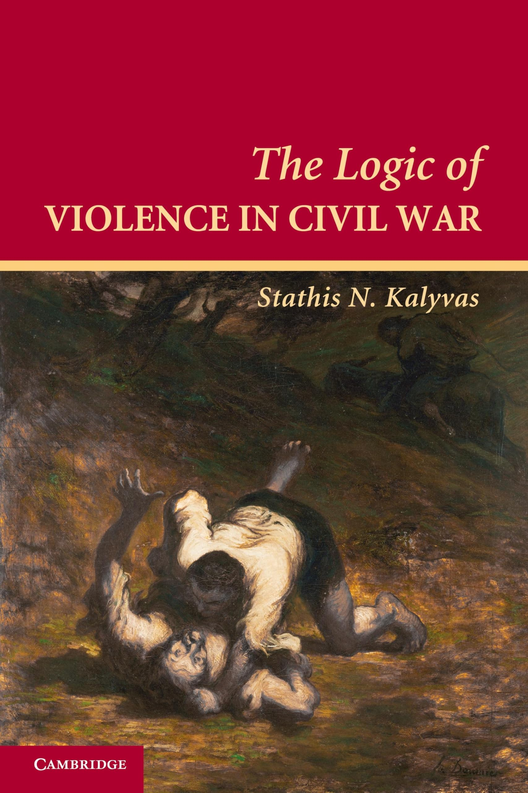
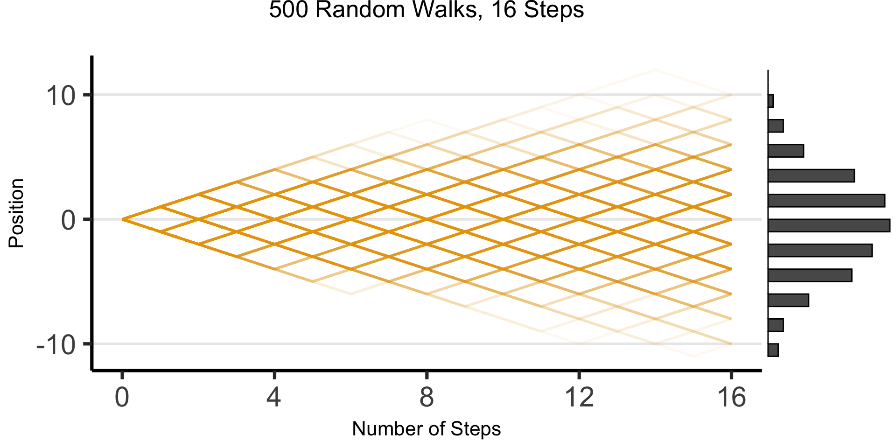
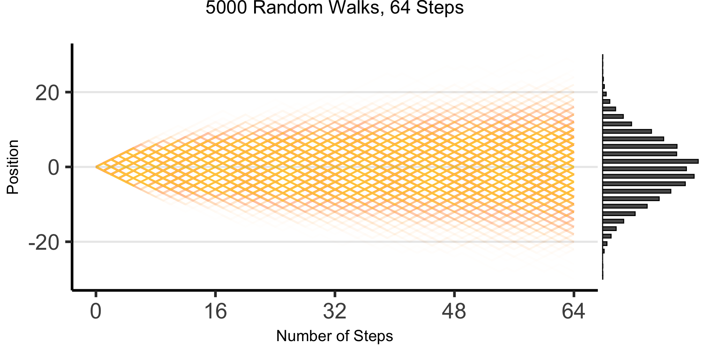
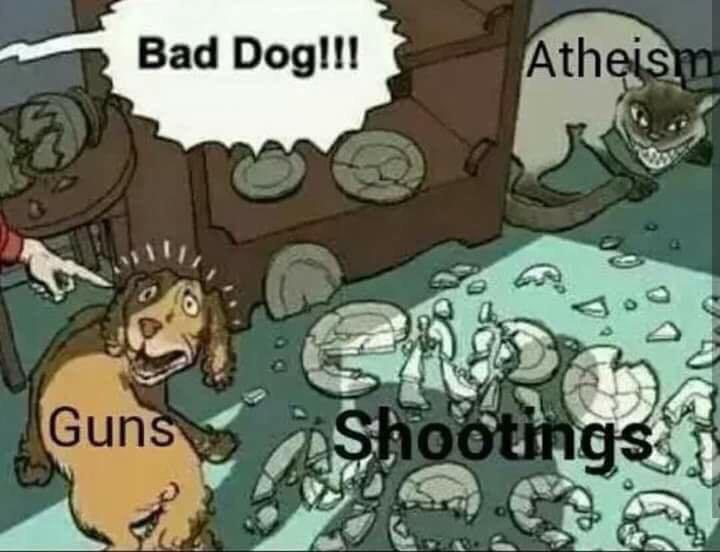
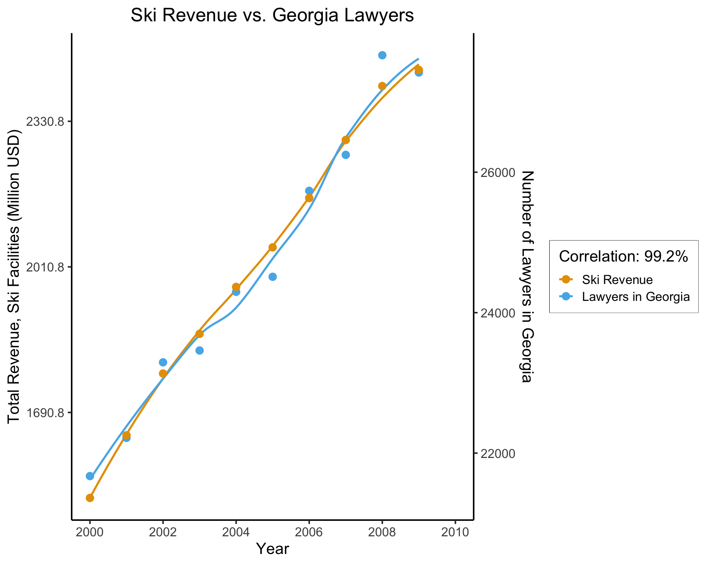
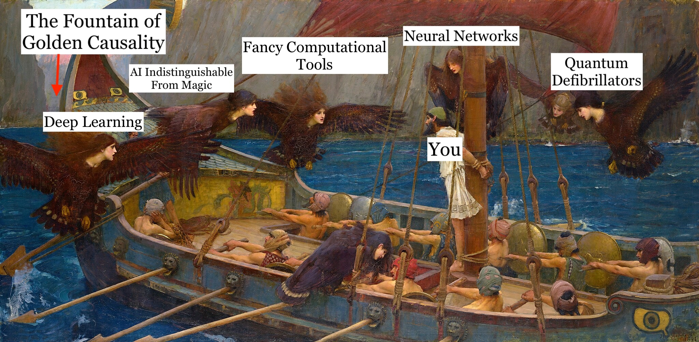

::: {.content-visible unless-format="revealjs"}

<center>
<a class="h2" href="./slides.html" target="_blank">Open slides in new window &rarr;</a>
</center>

:::

# Schedule {.smaller .crunch-title .crunch-callout .code-90}

Today's Planned Schedule:

| | Start | End | Topic |
|:- |:- |:- |:- |
| **Lecture** | 6:30pm | 7:00pm | [HW1 Questions and Concerns &rarr;](#hw1-questions-andor-concerns)
| | 7:00pm | 7:30pm | [Motivating Examples: Causal Inference &rarr;](#motivation-ii-causal-inference) |
| | 7:30pm | 7:45pm | [Your First Probabilistic Graphical Model! &rarr;](#your-first-probabilistic-graphical-model)
| **Break!** | 7:45pm | 8:00pm | |
| | 8:00pm | 9:00pm | [PGM "Lab" &rarr;](#hidden-markov-models-(hmms-are-our-ur-pgms))

: {tbl-colwidths="[12,12,12,64]"}




::: {.hidden}

```{=html}
<style>
.barrio-jj {
  font-family: "Barrio", system-ui;
  /* font-weight: 400; */
  font-style: normal;
}
</style>
```

:::

# The [Science]{.orbitron-jj} $\leadsto$ [Social Science]{.barrio-jj} "Phase Transition" {data-stack-name="Science &rarr; Social Science"}

<center>

[Today's Demo: [Schelling's Attendance Model](https://observablehq.com/@jpowerj/schelling-attendance)]{.boxed-cb}

</center>

## Coarse-Graining Units of Observation {.smaller .title-12 .table-85}

```{=html}
<table>
<thead>
<tr>
  <th>Field</th>
  <th colspan="2">Example Unit of Observation</td>
</tr>
</thead>
<tbody>
<tr>
  <td width="20%">Physics</td>
  <td width="30%"><span data-qmd="Particle"></span></td>
  <td width="50%" align="right"><span data-qmd="\[Particle = **Fine-Graining** of Molecules\]"></span></td>
</tr>
<tr>
  <td>Chemistry</td>
  <td><span data-qmd="Molecule = $\cup$(Particles)"></span></td>
  <td><span data-qmd="\[Molecule = **Coarse-Graining** of Particles\]"></span></td>
</tr>
<tr>
  <td>Biology</td>
  <td colspan="2"><span data-qmd="Cell = $\cup$(Molecules)"></span></td>
</tr>
<tr>
  <td>Neuro/Cog Sci</td>
  <td colspan="2"><span data-qmd="Brain = $\cup$(Cells)"></span></td>
</tr>
<tr>
  <td>Human Physiology</td>
  <td colspan="2"><span data-qmd="Body = Brain $\cup$ Other Organs"></span></td>
</tr>
<tr style="border-top: 5px solid #e69f00; border-bottom: 5px solid #e69f00;">
  <td colspan="3" align="center" class='cb1a-bg'><span data-qmd="&uarr; [Science]{.orbitron-jj} &nbsp;&nbsp; 🧐 **something happens here...** 🤔 &nbsp;&nbsp; &darr; [Social Science]{.barrio-jj}"></span></td>
</tr>
<tr>
  <td>Anthropology</td>
  <td colspan="2"><span data-qmd="Human-Relational System (e.g., Kinship) = $\cup$(Brains) $\times$ Natural Environment"></span></td>
</tr>
<tr>
  <td>Economics</td>
  <td colspan="2"><span data-qmd="Economy = Specific relational system of *exchange* w.r.t. scarce resources"></span></td>
</tr>
<tr>
  <td>Political Economy</td>
  <td colspan="2"><span data-qmd="Economy-Context = Economic Exchange $\cap$ Relational Power"></span></td>
</tr>
<tr>
  <td>Sociology</td>
  <td colspan="2"><span data-qmd="Society = $\cup$(Relational Systems: Kinship, Friendship, Authority, Power, Violence)"></span></td>
</tr>
<tr>
  <td>History</td>
  <td colspan="2"><span data-qmd="[*Longue-Durée*](https://en.wikipedia.org/wiki/Longue_dur%C3%A9e) = Evolution of Societies over Time and Space"></span></td>
</tr>
</tbody>
</table>
```

## *Homo sapiens*/*Homo arbitratus*/*Homo mischievous* {.title-065 .crunch-title .crunch-ul .ul-block}

::: {#mischievous style="float: right;"}

{fig-align="center" width="290"}

:::

* Latin [*sapiens*](https://en.wiktionary.org/wiki/sapiens#Latin) denotes being "discerning" or "wise"
* But... technically nothing stops us from **choosing** to be "unwise" whenever we'd like... bc **free will**
* $\Rightarrow$ For this class, humans are *Homo arbitratus*: [*arbitratus*](https://en.wiktionary.org/wiki/arbitratus#Latin) denotes **choosing** what to do, after we've [sapiently] thought about it

## Laws of Physics vs. "Laws" of Social Science {.title-08 .crunch-title .crunch-ul .crunch-quarto-figure .aside-80 .crunch-li-8 .crunch-img .crunch-footnotes .text-95}

* If we tell an inanimate object that we've discovered a **law** saying that it will accelerate towards Earth at $9.8~\textrm{m}/\textrm{s}^2$
  * ...It will likely^[Obligatory quantum footnote: human agency [maybe] plays a role, in a quirky way, in physics at tiny subatomic scales; but once we **coarse grain** to atoms (+avoid speed of light), Newton's Laws accurate to many decimals 🤯] still accelerate towards Earth at $9.8~\textrm{m}/\textrm{s}^2$

:::: {layout="[70,30]"}
::: {#human-law}

* If we tell a **human** we've discovered a **law** saying they will quack like a duck at 7:30pm EDT every Wednesday
  * ...They can utilize their **free will** to violate this "law"

:::
::: {#cause-problems}

{fig-align="center"}

:::
::::

## Strangely-Relevant CS Topic: The Halting Problem {.smaller .title-09 .table-75 .crunch-title .crunch-ul .crunch-li-8}

* Kurt Gödel $\leftrightarrow$ Alan Turing: [*Entscheidungsproblem*](https://www.cs.virginia.edu/~robins/Turing_Paper_1936.pdf)
* **Theorem**: It is not possible to write a computer program $P(x)$ that detects whether or not a computer program $x$ will eventually halt (as opposed to, e.g., looping forever)
* **Proof**: Assume $P(x)$ *is* possible to write. Run it on `mischievous_program.py`. Infinite contradiction loop.

:::: {.columns}
::: {.column width="60%"}

``` {.python filename="halting_problem_solver.py" style="margin-bottom: 25px;"}
def will_it_halt(program, input):
  # Put code you think will work here
  # Return True if program will halt, False otherwise
```

``` {.python filename="mischievous_program.py"}
def my_mischievous_function(input):
  if will_it_halt(my_mischevious_function, input):
    while True: pass # Infinite loop
  else:
    return # Halt
```

:::
::: {.column width="40%"}

```{=html}
<center>

<table>
<thead>
<tr>
  <th><span data-qmd="Input&rarr;<br>&darr;Program"></span></th>
  <th align="center">0</th>
  <th align="center">1</th>
  <th align="center">2</th>
  <th align="center"><span data-qmd="$\cdots$"></span></th>
</tr>
</thead>
<tbody>
<tr>
  <td>0</td>
  <td class='cb1a-bg' align="center"><span data-qmd="**Halt**"></span></td>
  <td align="center">Loop</td>
  <td align="center">Loop</td>
  <td align="center"><span data-qmd="$\cdots$"></span></td>
</tr>
<tr>
  <td>1</td>
  <td>Loop</td>
  <td class='cb1a-bg'><span data-qmd="**Loop**"></span></td>
  <td>Halt</td>
  <td><span data-qmd="$\cdots$"></span></td>
</tr>
<tr>
  <td>2</td>
  <td>Loop</td>
  <td>Loop</td>
  <td class='cb1a-bg'><span data-qmd="**Loop**"></span></td>
  <td><span data-qmd="$\cdots$"></span></td>
</tr>
<tr>
  <td><span data-qmd="$\vdots$"></span></td>
  <td><span data-qmd="$\vdots$"></span></td>
  <td><span data-qmd="$\vdots$"></span></td>
  <td><span data-qmd="$\vdots$"></span></td>
  <td class='cb1a-bg'><span data-qmd="$\mathbf{\ddots}$"></span></td>
</tr>
<tr style="border-top: 3px solid black;">
  <td align="center"><span data-qmd="{width='50'}"></span></td>
  <td class='cb1a-bg' style="vertical-align: middle;"><span data-qmd="**Loop**"></span></td>
  <td class='cb1a-bg' style="vertical-align: middle;"><span data-qmd="**Halt**"></span></td>
  <td class='cb1a-bg' style="vertical-align: middle;"><span data-qmd="**Halt**"></span></td>
  <td class='cb1a-bg' style="vertical-align: middle;"><span data-qmd="$\mathbf{\cdots}$"></span></td>
</tr>
</tbody>
</table>

</center>
```

:::
::::

## The Takeaway: Bayesian Humility! {.crunch-title .title-09 .crunch-ul .crunch-li-8 .aside-05 .text-85}

* Social [science]{.orbitron-jj}, with ["science"]{.orbitron-jj} used in the same sense as for physics, may be a quixotic endeavor^[At least, for the time being... BUT see @sperber_explaining_1996, which will come up later]
* Instead, we'll do [**social science**]{.barrio-jj}, where we use data to...
* <i class='bi bi-1-circle'></i> Infer **tendencies**: $\mathsf{H}$ = «$X$ tends to cause $Y$»
* <i class='bi bi-2-circle'></i> With some degree of **veracity**: $\Pr(\mathsf{H}) \approx 0.7$
* <i class='bi bi-3-circle'></i> Construct models that we can **update** with **new evidence**: Bayes' rule! $\Pr(\mathsf{H} \mid E) = \frac{\Pr(E \mid \mathsf{H} ) \Pr(\mathsf{H})}{\Pr(E)} \approx 0.8$
* Notice "slippage" between **aleatory probability** *within* $\mathsf{H}$ ("tends to") vs. **epistemic probability** "outside of", talking *about* $\mathsf{H}$ ("I'm 70\% confident about $\mathsf{H}$")

# Matching Estimators for Apples-to-Apples Comparisons {data-stack-name="Causality" .crunch-title}

](images/fruit.png){fig-align="center"}

## Case Study: Military Inequality $\leadsto$ Military Success {.smaller .crunch-title .title-09 .crunch-ul .crunch-blockquote .crunch-li-8}

* @lyall_divided_2020: "Treating certain ethnic groups as second-class citizens [...] leads victimized soldiers to subvert military authorities once war begins. The higher an army's inequality, the greater its rates of desertion, side-switching, and casualties"

> Matching constructs **pairs of belligerents** that are **similar** across a wide range of traits thought to dictate battlefield performance but that **vary** in levels of prewar inequality. The more similar the belligerents, the better our estimate of inequality's effects, as all other traits are shared and thus cannot explain observed differences in performance, helping assess how battlefield performance **would have** improved (declined) if the belligerent had a lower (higher) level of prewar inequality.
> 
> Since [non-matched] cases are **dropped** [...] selected cases are more representative of average belligerents/wars than outliers with few or no matches, [providing] surer ground for testing generalizability of the book's claims than focusing solely on canonical but unrepresentative usual suspects (Germany, the United States, Israel)

## Does Inequality Cause Poor Military Performance? {.smaller .crunch-title .title-10 .table-80 .text-60}

| <br>Covariates | Sultanate of Morocco<br> *Spanish-Moroccan War, 1859-60* | Khanate of Kokand<br> *War with Russia, 1864-65* |
| - | - | - |
| **$X$: Military Inequality** | Low (0.01) | Extreme (0.70) |
| **$\mathbf{Z}$: Matched Covariates:** | | |
| Initial relative power | 66% | 66% |
| Total fielded force | 55,000 | 50,000 |
| Regime type | Absolutist Monarchy (−6) | Absolute Monarchy (−7) |
| Distance from capital | 208km | 265km |
| Standing army | Yes | Yes |
| Composite military | Yes | Yes |
| Initiator | No | No |
| Joiner | No | No |
| Democratic opponent | No | No |
| Great Power | No | No |
| Civil war | No | No |
| Combined arms | Yes | Yes |
| Doctrine | Offensive | Offensive |
| Superior weapons | No | No |
| Fortifications | Yes | Yes |
| Foreign advisors | Yes | Yes |
| Terrain | Semiarid coastal plain | Semiarid grassland plain |
| Topography | Rugged | Rugged |
| War duration | 126 days | 378 days |
| Recent war history w/opp | Yes | Yes |
| Facing colonizer | Yes | Yes |
| Identity dimension | Sunni Islam/Christian | Sunni Islam/Christian |
| New leader | Yes | Yes |
| Population | 8–8.5 million | 5–6 million |
| Ethnoling fractionalization (ELF) | High | High |
| Civ-mil relations | Ruler as commander | Ruler as commander |
| **$Y$: Battlefield Performance:** | | |
| Loss-exchange ratio | 0.43 | 0.02 |
| Mass desertion | No | Yes |
| Mass defection | No | No |
| Fratricidal violence | No | Yes |

# Motivation II: Humble-Bayesian Social Science {data-stack-name="CSS"}

## The Logic of Violence in Civil War {.smaller .crunch-title}

{fig-align="center"}

## Particularly Fun Non-"Standard" Examples

* @barron_individuals_2018
* @blaydes_mirrors_2018
* @kozlowski_geometry_2019

# Motivating Examples: Causal Inference {data-stack-name="Causal Inference"}

* The *methodology* we'll use to *draw inferences* about social phenomena from data

## Disclaimer: Unfortunate Side Effects of Engaging Seriously with Causality {.smaller .crunch-title .title-10 .crunch-p .crunch-img}

:::: {.columns}
::: {.column width="50%"}

<i class='bi bi-1-circle'></i> You'll no longer be able to read "scientific" writing without striking this expression (involuntarily):

:::
::: {.column width="50%"}

<i class='bi bi-2-circle'></i> "Scientific" talks will begin to sound like the following:

:::
::::

:::: {layout="[5,5]" layout-valign="default"}
::: {#expression}

{fig-align="center" width="300"}

:::
::: {#looked-at-the-data}



:::
::::

## Blasting Off Into Causality! {.title-10 .crunch-title}

{fig-align="center"}

## Data-Generating Processes (DGPs) {.title-09 .text-85 .crunch-title .crunch-ul .crunch-quarto-figure .crunch-quarto-layout-panel .crunch-li-5}

:::: {layout="[55,45]" layout-align="center" layout-valign="center"}
::: {#dgps-5100}

* You saw this in DSAN 5100!
* «$X_1, \ldots, X_n$ drawn i.i.d. Normal, mean $\mu$ variance $\sigma^2$» characterizes **DGP of $(X_1, \ldots, X_n)$**

:::

{fig-align="center" width="280"}

::::

* 5650: **Dive into DGPs**, rather than treating as black box/footnote to Law of Large Numbers, so we can move [*asymptotically!*]...
* **From *associational* statements**:
  * «$\underbrace{\text{An increase}}_{\small\text{noun}}$ in $X$ by 1 is associated with increase in $Y$ by $\beta$»
* **To *causal* ones**: «$\underbrace{\text{Increasing}}_{\small\text{verb}}$ $X$ by 1 *causes* $Y$ to increase by $\beta$»

## DGPs and the Emergence of Order {.crunch-title .crunch-quarto-layout-panel .title-09 .crunch-quarto-figure}

::: {layout="[1,1]"}

* Who can guess the state of this process after 10 steps, with 1 person?
* 10 people? 50? 100? (If they find themselves on the same spot, they stand on each other's heads)
* 100 steps? 1000?

{fig-align="center" width="430"}

:::

## The Result: 16 Steps

{fig-align="center"}

## The Result: 64 Steps

{fig-align="center"}

## "Mathematical/Scientific Modeling" {.smaller .crunch-title .crunch-ul}

* Thing we observe (poking out of water): **data**
* Hidden but possibly discoverable via deeper dive (ecosystem under surface): **DGP**

<!-- My sincere belief and definitely not an image forwarded to me unironically by a family member when I was a tween -->

{fig-align="center"}

## So What's the Problem? {.crunch-title .crunch-ul .crunch-li-8 .inline-90 .text-90}

* Non-probabilistic models: High potential for being garbage
  * *tldr: even if SUPER certain, using $\Pr(\mathsf{H}) = 1-\varepsilon$ with tiny $\varepsilon$ has literal life-saving advantages*^[See [Appendix Slide](#appendix-zero-probabilities)] [@finetti_probability_1972]
* Probabilistic models: Getting there, still looking at "surface"
  * Of the $N = 100$ times we observed event $X$ occurring, event $Y$ also occurred $90$ of those times
  * $\implies \Pr(Y \mid X) = \frac{\#[X, Y]}{\#[X]} = \frac{90}{100} = 0.9$
* Causal models: Does $Y$ happen **because of** $X$ happening? For that, need to start modeling **what's happening under the surface** making $X$ and $Y$ **"pop up" together** so often

## The *Shallow* Problem of Causal Inference {.title-08}

:::: {.columns}
::: {.column width="65%"}

{fig-align="center"}

:::
::: {.column width="35%"}

``` {.r style="font-size: 72%;"}
cor(ski_df$value, law_df$value)
```

```
[1] 0.9921178
```

::: {style="font-size: 50% !important;"}
(Data from Vigen, <a href='http://web.archive.org/web/20191006000802/http://tylervigen.com/view_correlation?id=29272' target='_blank'>Spurious Correlations</a>)
:::

This, however, is only a *mini-boss*. Beyond it lies the truly invincible **FINAL BOSS**... 🙀

:::
::::

## The *Fundamental* Problem of Causal Inference {.crunch-title .crunch-ul .crunch-callout .title-07}

The only workable definition of «$X$ causes $Y$»:

::: {.callout-note icon="false" title="<i class='bi bi-info-circle pe-1'></i> Defining Causality [@hume_treatise_1739, ruining everything as usual 😤]"}

$X$ causes $Y$ if and only if:

1. $X$ *temporally precedes* $Y$ and
2. 
    * In **two worlds** $W_0$ and $W_1$ where
    * everything is exactly the same **except that** $X = 0$ in $W_0$ and $X = 1$ in $W_1$,
    * $Y = 0$ in $W_0$ and $Y = 1$ in $W_1$

:::

* The problem? We live in **one** world, not two identical worlds simultaneously 😭

## What Is To Be Done?

{fig-align="center"}

## Probability++ {.crunch-title}
  
* Tools from prob/stats (RVs, CDFs, Conditional Probability) **necessary but not sufficient** for causal inference!
* Example: Say we use DSAN 5100 tools to discover:
  * Probability that event $E_1$ occurs is $\Pr(E_1) = 0.5$
  * Probability that $E_1$ occurs **conditional on** another event $E_0$ occurring is $\Pr(E_1 \mid E_0) = 0.75$
* Unfortunately, we still **cannot** infer that the occurrence of $E_0$ **causes** an increase in the likelihood of $E_1$ occurring.

## Beyond Conditional Probability {.crunch-title .text-90}

* This issue (that **conditional probabilities** could not be interpreted causally) at first represented a kind of dead end for scientists interested in employing probability theory to study causal relationships...
* Recent decades: researchers have built up an additional "layer" of modeling tools, augmenting existing machinery of probability to address causality head-on!
* @pearl_causality_2000: Formal proofs that ($\Pr$ axioms) $\cup$ ($\textsf{do}$ axioms) $\Rightarrow$ causal inference procedures successfully recover causal effects

## Preview: do-Calculus {.crunch-title .crunch-math .text-80 .table-85 .crunch-ul .inline-85 .math-90 .crunch-li-6}

* *Extends* core of probability to incorporate causality, via $\textsf{do}$ operator
* $\textsf{do}(X = 5)$ is a "special" **event**, representing **intervention in DGP** to **force** $X \leftarrow 5$... $\textsf{do}(X = 5)$ **not the same event** as $X = 5$!

| $X = 5$ | $\neq$ | $\textsf{do}(X = 5)$ |
|:-:|:-:|:-:|
| *Observing* that $X$ took on value 5 (for some possibly-unknown reason) | $\neq$ | *Intervening* to force $X \leftarrow 5$, all else in DGP remaining the same (intervention then "flows" through rest of DGP) |

: {tbl-colwidths="[46,2,52]"}

* Trickiest 5650 thing to wrap head around at first!
* "Special" means $\Pr(\textsf{do}(X = 5))$ *not* well-defined, only $\Pr(Y = 6 \mid \textsf{do}(X = 5))$
  * What would $\Pr(X = 6 \mid \textsf{do}(X = 5)))$ be? $\Pr(X = 5 \mid \textsf{do}(X = 5))$?
* To avoid confusion with "normal" events, we may use notation like:

  $$
  \Pr(Y = 6 \mid \textsf{do}(X = 5)) \equiv \textstyle \Pr_{\textsf{do}(X = 5)}(Y = 6) \text{ or }\Pr(Y = 6 \mid \Omega_{X = 5})
  $$

## Causal World Unlocked 😎 (With Great Power Comes Great Responsibility...) {.title-08 .crunch-title .crunch-ul}

* With $\textsf{do}(\cdot)$ in hand... (Alongside DGP satisfying axioms slightly more strict than core probability axioms)
* We *can* make causal inferences from similar pair of facts! If:
  * Probability that event $E_1$ occurs is $\Pr(E_1) = 0.5$,
  * The probability that $E_1$ occurs **conditional on** the event $\textsf{do}(E_0)$ occurring is $\Pr(E_1 \mid \textsf{do}(E_0)) = 0.75$,
* **Now** we can actually infer that the occurrence of $E_0$ **caused** an increase in the likelihood of $E_1$ occurring!

## Ulysses and the [Computational] Sirens {.smaller .crunch-title .title-11}

{fig-align="center"}

# Your First PGM! {.smaller .crunch-title .title-10 .crunch-ul .crunch-li-8 .crunch-quarto-figure .crunch-img .crunch-p data-stack-name="PGMs"}

](images/medical.jpg){.lightbox fig-align="center" width="50%"}

* <i class='bi bi-1-circle'></i> Which of the variables (ovals) are **observed**? Which are **latent**?
* <i class='bi bi-2-circle'></i> What do you think the arrows represent?
* <i class='bi bi-3-circle'></i> Can we use this to find the **"root cause"** of (e.g.) observed **chest pain**? Or conversely, to **predict** possible &uarr; in likelihood of chest pain if we start smoking?

## Bayesian Inference but with Pictures {.title-09 .crunch-title .crunch-ul .crunch-li-8 .crunch-callout .text-90 .inline-90 .crunch-p-6}

A **Probabilistic Graphical Model (PGM)** provides us with:

* A **formal**-mathematical...
* But also easily **visualizable** (by construction)...
* Representation of a **data-generating process (DGP)!**

Example: Let's model how **weather** $W$ affects **evening plans** $Y$: the choice between **going to a party** or **staying in to watch movies**

::: {.callout-tip title="<i class='bi bi-info-circle' style='vertical-align: middle;'></i> DGP: The Partier's Dilemma" icon="false"}

1.  A person $i$ wakes up with some initial affinity for partying: $\Pr(Y_i = \textsf{Go})$
2.  $i$ then goes to their window and observes the weather $W_i$ outside:
    i. If the weather is **sunny**, $i$'s affinity increases: $\Pr(Y_i = \textsf{Go} \mid W_i = \textsf{Sun}) > \Pr(Y = \textsf{Go})$
    ii. Otherwise, if it is **rainy**, $i$'s affinity decreases: $\Pr(Y_i = \textsf{Go} \mid W_i = \textsf{Rain}) < \Pr(Y = \textsf{Go})$

:::

## Two Main "Building Blocks" {.crunch-title .title-09 .inline-90 .math-80 .crunch-ul .crunch-math .crunch-li-8 .text-80}

[**Nodes**]{.boxed} like $\require{enclose}\enclose{circle}{X}$ denote **Random Variables**:

$$
\require{enclose}\boxed{\enclose{circle}{X}} \simeq \boxed{ \begin{array}{c|cc}x & \textsf{Tails} & \textsf{Heads} \\\hline \Pr(X = x) & 0.5 & 0.5\end{array}}
$$

[**Edges**]{.boxed} like $\require{enclose}\enclose{circle}{X} \rightarrow \enclose{circle}{Y}$ denote **relationships** between RVs

* What an edge "means" can get [ontologically] tricky!
* Retain sanity by just remembering: an edge $\require{enclose}\enclose{circle}{X} \rightarrow \enclose{circle}{Y}$ is included in our PGM if we "care about" modeling the **conditional probability table (CPT)** of $Y$ w.r.t. $X$

$$
\require{enclose}\boxed{ \enclose{circle}{X} \rightarrow \enclose{circle}{Y} } \simeq \boxed{
  \begin{array}{c|cc}
  x & \Pr(Y = \textsf{Lose} \mid X = x) & \Pr(Y = \textsf{Win} \mid X = x) \\\hline
  \textsf{Tails} & 0.8 & 0.2 \\
  \textsf{Heads} & 0.5 & 0.5
  \end{array}
}
$$

## PGM for the Partier's Dilemma {.smaller .crunch-title .crunch-ul .table-90}

* A node $\require{enclose}\enclose{circle}{W}$ denoting RV $W$, which can take on values in $\mathcal{R}_W = \{\textsf{Sun}, \textsf{Rain}\}$,
* A node $\require{enclose}\enclose{circle}{Y}$ denoting RV $Y$, which can take on values in $\mathcal{R}_Y = \{\textsf{Go}, \textsf{Stay}\}$, and 
* An edge $\require{enclose}\enclose{circle}{W} \rightarrow \enclose{circle}{Y}$ representing the following relationship between $W$ and $Y$:
  * $\Pr(Y = \textsf{Go} \mid W = \textsf{Sun}) = 0.8$
  * $\Pr(Y = \textsf{Stay} \mid W = \textsf{Sun}) = 0.2$
  * $\Pr(Y = \textsf{Go} \mid W = \textsf{Rain}) = 0.1$
  * $\Pr(Y = \textsf{Stay} \mid W = \textsf{Rain}) = 0.9$

:::: {layout="[1,1]"}
::: {#fig-partier-dgp}

{fig-align="center" width="400"}

Our PGM of the Partier's Dilemma
:::
::: {#fig-partier-cpt}

| | $\Pr(Y = \textsf{Stay} \mid W)$ | $\Pr(Y = \textsf{Go} \mid W)$ |
|-:|:-:|:-:|
| $W = \textsf{Sun}$ | 0.2 | 0.8 |
| $W = \textsf{Rain}$ | 0.9 | 0.1 |

The Conditional Probability Table (CPT) for the edge $\require{enclose}\enclose{circle}{W} \rightarrow \enclose{circle}{Y}$ in @fig-partier-dgp
:::
::::

## Observed vs. Latent Nodes {.crunch-title}

* PGMs help us make **valid (Bayesian) inferences** about the world in the face of **incomplete information**!
* Key remaining tool: separation of nodes into two categories:
  * **Observed nodes** (shaded)
  * **Latent nodes** (unshaded)
* $\Rightarrow$ Can use our PGM as a **weather-inference machine!**
* If we **observe** $i$ at a party, what can we infer about the **weather** outside?

## Observed Partier, Latent Weather {.title-09 .crunch-title}

* We can draw this situation as a PGM with **shaded** and **unshaded nodes**, distinguishing what we **know** from what we'd like to **infer**:

{fig-align="center" width="400"}

| | | |
|:-:|:-:|:-:|
| ❓ | &nbsp; | ✅ |

: {tbl-colwidths="[17,66,17]"}

* And we can now use Bayes' Rule to compute how observed information ($i$ at party $\Rightarrow [Y = \textsf{Go}]$) "flows" back into $W$

## Computation via Bayes' Rule {.smaller .crunch-title .crunch-ul .crunch-math .math-80}

* Bayes' Rule, $\Pr(A \mid B) = \frac{\Pr(B \mid A)\Pr(A)}{\Pr(B)}$, tells us how to use info about $\Pr(B \mid A)$ to obtain info about $\Pr(A \mid B)$!
* We use it to obtain a distribution for $W$ **updated to incorporate** new info $[Y = \textsf{Go}]$:

$$
\begin{align*}
&\Pr(W = \textsf{Sun} \mid Y = \textsf{Go}) 
= \frac{\Pr(Y = \textsf{Go} \mid W = \textsf{Sun}) \Pr(W = \textsf{Sun})}{\Pr(Y = \textsf{Go})} \\
=\, &\frac{\Pr(Y = \textsf{Go} \mid W = \textsf{Sun}) \Pr(W = \textsf{Sun})}{\Pr(Y = \textsf{Go} \mid W = \textsf{Sun}) \Pr(W = \textsf{Sun}) + \Pr(Y = \textsf{Go} \mid W = \textsf{Rain}) \Pr(W = \textsf{Rain})}
\end{align*}
$$

* Plug in info from CPT to obtain our new (conditional) probability of interest:

$$
\begin{align*}
\Pr(W = \textsf{Sun} \mid Y = \textsf{Go}) &= \frac{(0.8)(0.5)}{(0.8)(0.5) + (0.1)(0.5)} = \frac{0.4}{0.4 + 0.05} \approx 0.89
\end{align*}
$$

* We've learned something interesting! Observing $i$ at the party $\leadsto$ probability of sun jumps from $0.5$ (**"prior"** estimate of $W$, best guess without any other relevant info) to $0.89$ (**"posterior"** estimate of $W$, best guess after incorporating relevant info).

## References {.crunch-title}

::: {#refs}
:::

## Appendix: Zero Probabilities {.smaller}

From @koller_probabilistic_2009, pp. 66-67:

> **Zero probabilities**: A common mistake is to assign a probability of zero to an event that is extremely unlikely, but not impossible. The problem is that one can never condition away a zero probability, no matter how much evidence we get. When an event is unlikely but not impossible, giving it probability zero is guaranteed to lead to irrecoverable errors. For example, in one of the early versions of the the Pathfinder system (box 3.D), **10 percent of the misdiagnoses were due to zero probability estimates given by the expert to events that were unlikely but not impossible.**

[&larr; Back to slide](#so-whats-the-problem)
