::: {.content-visible unless-format="revealjs"}

<center>
<a class="h2" href="./slides.html" target="_blank">Open slides in new window &rarr;</a>
</center>

:::

# Schedule {.smaller .crunch-title .crunch-callout data-name="Schedule"}

Today's Planned Schedule:

| | Start | End | Topic |
|:- |:- |:- |:- |
| **Lecture** | 6:30pm | 6:45pm | [HW1 Questions and Concerns &rarr;](#hw1-questions-andor-concerns)
|  | 6:45pm | 7:15pm | [Causality Recap &rarr;](#causality-recap) |
| | 7:00pm | 7:30pm | [Motivating Examples: Causal Inference &rarr;](#motivation-ii-causal-inference) |
| | 7:30pm | 7:45pm | [Your First Probabilistic Graphical Model! &rarr;](#your-first-probabilistic-graphical-model)
| **Break!** | 7:45pm | 8:00pm | |
| | 8:00pm | 9:00pm | [PGM "Lab" &rarr;](#hidden-markov-models-(hmms-are-our-ur-pgms))

: {tbl-colwidths="[12,12,12,64]"}



::: {.hidden}

```{=html}
<style>
.orbitron-jj {
  font-family: "Orbitron", sans-serif;
  font-optical-sizing: auto;
  font-style: normal;
}
.barrio-jj {
  font-family: "Barrio", system-ui;
  /* font-weight: 400; */
  font-style: normal;
}
.yuji-boku-jj {
  font-family: "Yuji Boku", serif;
  /* font-weight: 400; */
  font-style: normal;
}
</style>
```

:::

# Logistics {.crunch-title .title-11 .crunch-ul .crunch-p .smaller .table-85 .crunch-li-5 data-stack-name="Recap"}

<center style='margin-bottom: 10px;'>

[🆕 JAH AutoHinter **Documentation** at [**`jjacobs.me/jah`**](https://jjacobs.me/jah) &nbsp;🆕]{.boxed-cb}

</center>

<i class='bi bi-1-circle'></i> HW1 Questions / Concerns?

<i class='bi bi-2-circle'></i> Labs + Reading Adventures coming this+next week:

```{=html}
<table>
<colgroup>
<col style='width: 42%'>
<col style='width: 58%'>
</colgroup>
<thead>
<tr>
  <th class='tdc'>Labs</th>
  <th class='tdc'>Reading Quests</th>
</tr>
</thead>
<tbody>
<tr>
  <td><span data-qmd="**Lab 1:** Novelty and Resonance in French Revolution Debates <span class='badge text-bg-secondary' style='padding-top: 0.2em; padding-bottom: 0.2em; padding-left: 0.4em; padding-right: 0.4em; margin-right: 0.1em;'><code style='color: white;'>#</code>InformationTheory</span><span class='badge text-bg-secondary' style='padding-top: 0.2em; padding-bottom: 0.2em; padding-left: 0.4em; padding-right: 0.4em;'><code style='color: white;'>#</code>TextAnalysis</span>"></span></td>
  <td><div data-qmd="**RQ 1:** How to Do Things with Rhetoric <span class='badge text-bg-secondary' style='padding-top: 0.2em; padding-bottom: 0.2em; padding-left: 0.4em; padding-right: 0.4em; margin-right: 0.1em;'><code style='color: white;'>#</code>InformationTheory</span><span class='badge text-bg-secondary' style='padding-top: 0.2em; padding-bottom: 0.2em; padding-left: 0.4em; padding-right: 0.4em; margin-right: 0.1em;'><code style='color: white;'>#</code>TextAnalysis</span><span class='badge text-bg-secondary' style='padding-top: 0.2em; padding-bottom: 0.2em; padding-left: 0.4em; padding-right: 0.4em;'><code style='color: white;'>#</code>WarsOfIdeas</span><ul><li>Corpora: [@elster_roundtable_1996; @kassenova_atomic_2022; @schoenhals_doing_1992; @mishal_speaking_1994; @oireachtas_explore_2022]</li><li>Style vs. Content: [@wang_winning_2017]</li></ul>"></div></td>
</tr>
<tr>
  <td><span data-qmd="**Lab 2:** Optical Illusions as Causal Colliders <span class='badge text-bg-secondary' style='padding-top: 0.2em; padding-bottom: 0.2em; padding-left: 0.4em; padding-right: 0.4em; margin-right: 0.1em;'><code style='color: white;'>#</code>CausalGraphs</span><span class='badge text-bg-secondary' style='padding-top: 0.2em; padding-bottom: 0.2em; padding-left: 0.4em; padding-right: 0.4em; margin-right: 0.1em;'><code style='color: white;'>#</code>MindPlayinTricksOnMe</span><span class='badge text-bg-secondary' style='padding-top: 0.2em; padding-bottom: 0.2em; padding-left: 0.4em; padding-right: 0.4em;'><code style='color: white;'>#</code>WebPPL</span>"></span></td>
  <td><span data-qmd="**RQ 2:** Hitler's Willing Executioners? [@imai_quantitative_2018] <span class='badge text-bg-secondary' style='padding-top: 0.2em; padding-bottom: 0.2em; padding-left: 0.4em; padding-right: 0.4em; margin-right: 0.1em;'><code style='color: white;'>#</code>EcologicalInference</span><span class='badge text-bg-secondary' style='padding-top: 0.2em; padding-bottom: 0.2em; padding-left: 0.4em; padding-right: 0.4em; margin-right: 0.1em;'><code style='color: white;'>#</code>PyMC</span>"></span></td>
</tr>
<tr>
  <td><span data-qmd="**Lab 3:** DW-NOMINATE, Latent Ideology, and Campaign Financing <span class='badge text-bg-secondary' style='padding-top: 0.2em; padding-bottom: 0.2em; padding-left: 0.4em; padding-right: 0.4em;'><code style='color: white;'>#</code>LatentVariables</span>"></span></td>
  <td><span data-qmd="**RQ 3:** PGMs for @horowitz_ethnic_1985, *Ethnic Groups in Conflict* <span class='badge text-bg-secondary' style='padding-top: 0.2em; padding-bottom: 0.2em; padding-left: 0.4em; padding-right: 0.4em; margin-right: 0.1em;'><code style='color: white;'>#</code>PGMs</span><span class='badge text-bg-secondary' style='padding-top: 0.2em; padding-bottom: 0.2em; padding-left: 0.4em; padding-right: 0.4em;'><code style='color: white;'>#</code>Operationalization</span>"></span></td>
</tr>
</tbody>
</table>
```

<!-- W02 Recap -->

## W02 Recap: Aleatory vs. Epistemic Probability {.crunch-title .title-09 .crunch-ul .crunch-li-8 .aside-05 .text-85}

* Social [science]{.orbitron-jj}, with ["science"]{.orbitron-jj} used in the same sense as for physics, may be a quixotic endeavor^[At least, for the time being... BUT see @sperber_explaining_1996, which will come up later]
* Instead, we'll do [**social science**]{.barrio-jj}, where we use data to...
* <i class='bi bi-1-circle'></i> Infer **tendencies**: $\mathsf{H}$ = «$X$ tends to cause $Y$»
* <i class='bi bi-2-circle'></i> With some degree of **veracity**: $\Pr(\mathcal{H}) \approx 0.7$
* <i class='bi bi-3-circle'></i> Construct models that we can **update** with **new evidence**: Bayes' rule! $\Pr(\mathcal{H} \mid E) = \frac{\Pr(E \mid \mathcal{H} ) \Pr(\mathcal{H})}{\Pr(E)} \approx 0.8$
* Notice "slippage" between **aleatory probability** *within* $\mathcal{H}$ ("tends to") vs. **epistemic probability** "outside of", talking *about* $\mathcal{H}$ ("I'm 70\% confident about $\mathcal{H}$")

## Disclaimer: Unfortunate Side Effects of Engaging Seriously with Causality {.smaller .title-10 .crunch-p .crunch-img}

:::: {.columns}
::: {.column width="50%"}

<i class='bi bi-1-circle'></i> You'll no longer be able to read "scientific" writing without striking this expression (involuntarily):

:::
::: {.column width="50%"}

<i class='bi bi-2-circle'></i> "Scientific" talks will begin to sound like the following:

:::
::::

:::: {layout="[5,5]" layout-valign="default"}
::: {#expression}

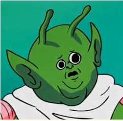{fig-align="center" width="300"}

:::
::: {#looked-at-the-data}



:::
::::

## Blasting Off Into Causality! {.title-10 .crunch-title}

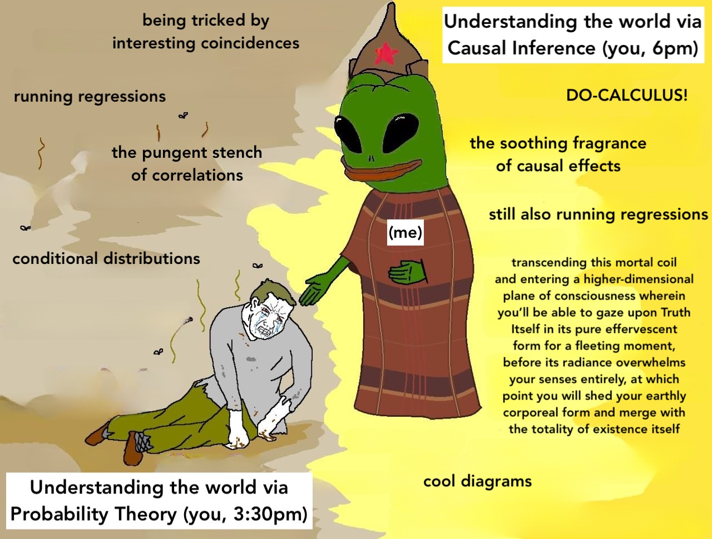{fig-align="center"}

## Data-Generating Processes (DGPs) {.title-09 .text-85 .crunch-title .crunch-ul .crunch-quarto-figure .crunch-quarto-layout-panel .crunch-li-5}

:::: {layout="[55,45]" layout-align="center" layout-valign="center"}
::: {#dgps-5100}

* You saw this in DSAN 5100!
* «$X_1, \ldots, X_n$ drawn i.i.d. Normal, mean $\mu$ variance $\sigma^2$» characterizes **DGP of $(X_1, \ldots, X_n)$**

:::

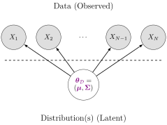{fig-align="center" width="300"}

::::

* 5650: **Dive into DGPs**, rather than treating as black box/footnote to Law of Large Numbers, so we can move [*asymptotically!*]...
* **From *associational* statements**:<br>«$\underbrace{\text{An increase}}_{\small\text{noun}}$ in $X$ by 1 is associated with increase in $Y$ by $\beta$»
* **To *causal* ones**: «$\underbrace{\text{Increasing}}_{\small\text{verb}}$ $X$ by 1 *causes* $Y$ to increase by $\beta$»

## Causality in the Social World {.smaller .crunch-title .title-11 .crunch-ul .crunch-li-8 .crunch-img .crunch-quarto-layout-panel .crunch-quarto-figure}

* Thing we observe (poking out of water): **data**
* Hidden but possibly discoverable via deeper dive (ecosystem under surface): **DGP**
* Plz remember centrality of **DGP!** [Heat $\rightarrow$ Thermometer Level]

<!-- My sincere belief and definitely not an image forwarded to me unironically by a family member when I was a tween -->

{#fig-shootings fig-align="center" width="45%"}

## [potted_plant]{.material-symbols-outlined} One Last Metaphor... {.crunch-quarto-layout-panel}

<div class='grid-parent' style='display: grid; grid-template-columns: 30% 50% 20%; align-items: center;'>

::: {#thermo-left}

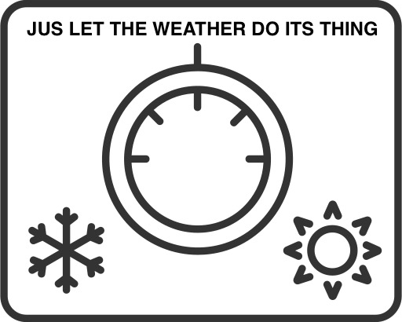{fig-align="center" width="80%"}

:::
::: {#thermo-mid}

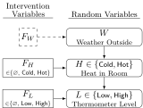{fig-align="center" width="100%"}

:::
::: {#thermo-right}

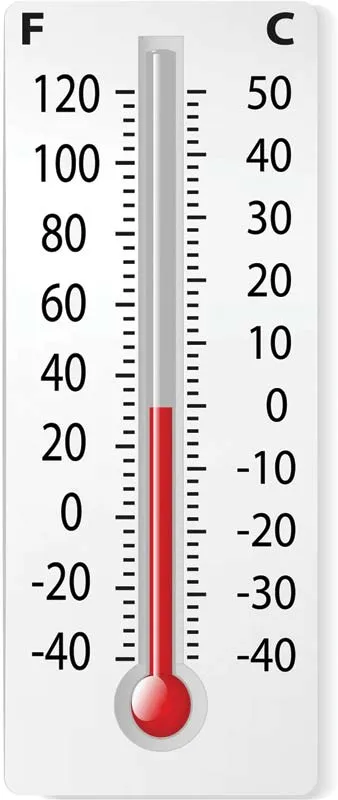{fig-align="center" width="70%"}

:::

</div>

# Your First PGM! {.smaller .crunch-title .title-10 .crunch-ul .crunch-li-8 .crunch-quarto-figure .crunch-img .crunch-p data-stack-name="PGMs"}

](images/medical.jpg){.lightbox fig-align="center" width="50%"}

* <i class='bi bi-1-circle'></i> Which of the variables (ovals) are **observed**? Which are **latent**?
* <i class='bi bi-2-circle'></i> What do you think the arrows represent?
* <i class='bi bi-3-circle'></i> Can we use this to find the **"root cause"** of (e.g.) observed **chest pain**? Or conversely, to **predict** possible &uarr; in likelihood of chest pain if we start smoking?

## Bayesian Inference but with Pictures {.title-09 .crunch-title .crunch-ul .crunch-li-8 .crunch-callout .text-90 .inline-90 .crunch-p-6}

A **Probabilistic Graphical Model (PGM)** provides us with:

* A **formal**-mathematical...
* But also easily **visualizable** (by construction)...
* Representation of a **data-generating process (DGP)!**

Example: Let's model how **weather** $W$ affects **evening plans** $Y$: the choice between **going to a party** or **staying in to watch movies**

::: {.callout-tip title="<i class='bi bi-info-circle' style='vertical-align: middle;'></i> DGP: The Partier's Dilemma" icon="false"}

1.  A person $i$ wakes up with some initial affinity for partying: $\Pr(Y_i = \textsf{Go})$
1.  $i$ then goes to their window and observes the weather $W_i$ outside:
    1. If weather is **sunny**, $i$'s affinity increases: $\Pr(Y_i = \textsf{Go} \mid W_i = \textsf{Sun}) > \Pr(Y = \textsf{Go})$
    2. Otherwise, if **rainy**, $i$'s affinity decreases: $\Pr(Y_i = \textsf{Go} \mid W_i = \textsf{Rain}) < \Pr(Y = \textsf{Go})$

:::

## Two Main "Building Blocks" {.crunch-title .title-09 .math-80 .crunch-ul .crunch-math .crunch-li-8 .text-80}

[**Nodes**]{.boxed} like $\require{enclose}\enclose{circle}{X}$ denote **Random Variables**:

$$
\require{enclose}\boxed{\enclose{circle}{X}} \simeq \boxed{ \begin{array}{c|cc}x & \textsf{Tails} & \textsf{Heads} \\\hline \Pr(X = x) & 0.5 & 0.5\end{array}}
$$

[**Edges**]{.boxed} like $\require{enclose}\enclose{circle}{X} \rightarrow \enclose{circle}{Y}$ denote **relationships** between RVs

* What an edge "means" can get [ontologically] tricky! (We'll change the meaning when we move to **causal** PGMs)
* Retain sanity by just remembering: edge $\require{enclose}\enclose{circle}{X} \rightarrow \enclose{circle}{Y}$ is included if we "care about" modeling **conditional probability** of $Y$ **given values of** $X$

  $$
  \require{enclose}\boxed{ \enclose{circle}{X} \rightarrow \enclose{circle}{Y} } \simeq \boxed{
    \begin{array}{c|cc}
    x & \Pr(Y = \textsf{Lose} \mid X = x) & \Pr(Y = \textsf{Win} \mid X = x) \\\hline
    \textsf{Tails} & 0.8 & 0.2 \\
    \textsf{Heads} & 0.5 & 0.5
    \end{array}
  }
  $$

## Full PGM Specification {.crunch-title .smaller .title-11 .crunch-ul .crunch-quarto-figure .crunch-img .crunch-p}

* We have **fully specified** a PGM $\mathcal{G}$ once we have provided:<br><i class='bi bi-1-circle'></i> A list of nodes $\{\require{enclose}\enclose{circle}{X_1}, \ldots, \enclose{circle}{X_n}\}$, one per RV $X_i$<br><i class='bi bi-2-circle'></i> **Conditional Probability Tables (CPTs)** specifying $\Pr(X_i \mid \text{Pa}(X_i))$ for all $\require{enclose}\enclose{circle}{X_i}$
* $\text{Pa}(X_i)$ denotes **all parents of $X_i$** (sources of arrows **pointing into** $\require{enclose}\enclose{circle}{X_i}$)

:::: {.columns}
::: {.column width="40%"}

* Here $\text{Pa}(\text{Cough}) = \{L, C\}$, so CPT for $\text{Cough}$ provides $\Pr(\text{Cough} = v \mid L = \ell, C = c)$ for all possible values $v$ of $\text{Cough}$, $\ell$ of $L$ (Lung Disease) and $c$ of $C$ (Cold)
* $\text{Pa}(\text{Smokes}) = \varnothing$! So CPT for $\text{Smokes}$ only needs to provide $\Pr(S = s)$ for the two possible values $s \in \mathcal{R}_S = \{\textsf{F}, \textsf{T}\}$

:::
::: {.column width="60%"}

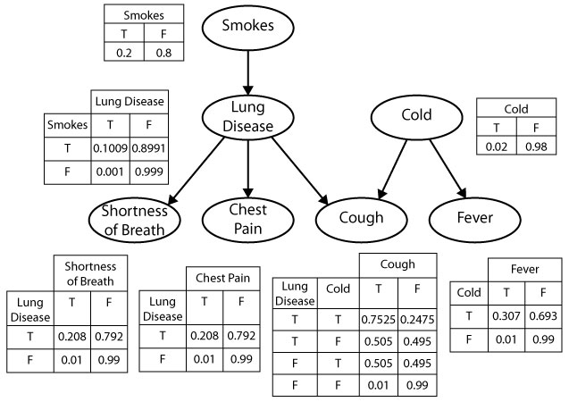{.lightbox fig-align="center" width="90%"}

:::
::::

## [potted_plant]{.material-symbols-outlined} Intervening... {.smaller .crunch-title}

:::: {.columns}
::: {.column width="45%"}

<center>

&nbsp;<br>***Before...***

</center>

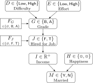{fig-align="center" width="100%"}

:::
::: {.column width="10%"}

<center>

$\textsf{do}(G \leftarrow \textsf{A})$

</center>

:::
::: {.column width="45%"}

<center>

&nbsp;<br>***...After***

</center>

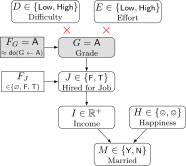{fig-align="center" width="100%"}

:::
::::

## PGM for the Partier's Dilemma {.smaller .crunch-title .crunch-ul .table-90}

* A node $\require{enclose}\enclose{circle}{W}$ denoting RV $W$, which can take on values in $\mathcal{R}_W = \{\textsf{Sun}, \textsf{Rain}\}$,
* A node $\require{enclose}\enclose{circle}{Y}$ denoting RV $Y$, which can take on values in $\mathcal{R}_Y = \{\textsf{Go}, \textsf{Stay}\}$, and 
* An edge $\require{enclose}\enclose{circle}{W} \rightarrow \enclose{circle}{Y}$ representing the following relationship between $W$ and $Y$:
  * $\Pr(Y = \textsf{Go} \mid W = \textsf{Sun}) = 0.8$
  * $\Pr(Y = \textsf{Stay} \mid W = \textsf{Sun}) = 0.2$
  * $\Pr(Y = \textsf{Go} \mid W = \textsf{Rain}) = 0.1$
  * $\Pr(Y = \textsf{Stay} \mid W = \textsf{Rain}) = 0.9$

:::: {layout="[1,1]"}
::: {#fig-partier-dgp}

{fig-align="center" width="400"}

Our PGM of the Partier's Dilemma
:::
::: {#fig-partier-cpt}

| | $\Pr(Y = \textsf{Stay} \mid W)$ | $\Pr(Y = \textsf{Go} \mid W)$ |
|-:|:-:|:-:|
| $W = \textsf{Sun}$ | 0.2 | 0.8 |
| $W = \textsf{Rain}$ | 0.9 | 0.1 |

The Conditional Probability Table (CPT) for the edge $\require{enclose}\enclose{circle}{W} \rightarrow \enclose{circle}{Y}$ in @fig-partier-dgp
:::
::::

## Observed vs. Latent Nodes {.crunch-title}

* PGMs help us make **valid (Bayesian) inferences** about the world in the face of **incomplete information**!
* $\Rightarrow$ **Two types** of nodes based on **available information**:
  * **Observed nodes** (shaded)
  * **Latent nodes** (unshaded)
* $\leadsto$ Can use our PGM as a **weather-inference machine!**
* If we **observe** $i$ at a party, what can we infer about the **weather** outside [even if we can't go outside and observe it]?

## Observed Partier, Latent Weather {.title-09 .crunch-title}

* We can draw this situation as a PGM with **shaded** and **unshaded nodes**, distinguishing what we **know** from what we'd like to **infer**:

{fig-align="center" width="400"}

| | | |
|:-:|:-:|:-:|
| ❓ | &nbsp; | ✅ |

: {tbl-colwidths="[17,66,17]"}

* And we can now use Bayes' Rule to compute how observed information ($i$ at party $\Rightarrow [Y = \textsf{Go}]$) "flows" back into $W$

## Computation via Bayes' Rule {.smaller .crunch-title .crunch-ul .crunch-math .math-80}

* Bayes' Rule, $\Pr(A \mid B) = \frac{\Pr(B \mid A)\Pr(A)}{\Pr(B)}$, tells us how to use info about $\Pr(B \mid A)$ to obtain info about $\Pr(A \mid B)$!
* We use it to obtain a distribution for $W$ **updated to incorporate** new info $[Y = \textsf{Go}]$:

$$
\begin{align*}
&\Pr(W = \textsf{Sun} \mid Y = \textsf{Go}) 
= \frac{\Pr(Y = \textsf{Go} \mid W = \textsf{Sun}) \Pr(W = \textsf{Sun})}{\Pr(Y = \textsf{Go})} \\
=\, &\frac{\Pr(Y = \textsf{Go} \mid W = \textsf{Sun}) \Pr(W = \textsf{Sun})}{\Pr(Y = \textsf{Go} \mid W = \textsf{Sun}) \Pr(W = \textsf{Sun}) + \Pr(Y = \textsf{Go} \mid W = \textsf{Rain}) \Pr(W = \textsf{Rain})}
\end{align*}
$$

* Plug in info from CPT to obtain our new (conditional) probability of interest:

$$
\begin{align*}
\Pr(W = \textsf{Sun} \mid Y = \textsf{Go}) &= \frac{(0.8)(0.5)}{(0.8)(0.5) + (0.1)(0.5)} = \frac{0.4}{0.4 + 0.05} \approx 0.89
\end{align*}
$$

* We've learned something interesting! Observing $i$ at the party $\leadsto$ probability of sun jumps from $0.5$ (**"prior"** estimate of $W$, best guess without any other relevant info) to $0.89$ (**"posterior"** estimate of $W$, best guess after incorporating relevant info).

<!-- W03 -->

## Importance of Observed vs. Latent Distinction! {.smaller .crunch-title .title-10}

* Across many different fields, hidden stumbling-block in your project may be **failure to model this distinction** and pursue its implications!

::: {#fig-fence-dog}

<center>



</center>

Your model failing to achieve its goal bc you haven't yet distinguished observed vs. latent variables
:::

## Example from Cognitive Neuroscience: Visual Perception {.smaller .crunch-title .title-08 .crunch-ul .crunch-quarto-figure .crunch-quarto-layout-panel}

:::: {layout="[55,45]" layout-valign="center"}
::: {#cog-neuro-text}

* We "see" **3D objects** like a basketballs, but our eyes are (curved) **2D surfaces!**
* $\Rightarrow$ Our brains **construct** 3D environment by combining 2D info (**observed** photons-hitting-light-cones) with **latent** heuristic info:
  * Instantaneous **Binocular Disparity**, fusing info from **two** slightly-offset eyes,
  * Short-term **Motion** [**Parallax**](https://en.wikipedia.org/wiki/Parallax): How does object shift over short temporal "windows" of movement?
  * Long-term mental models (orange-ish circle with this line pattern is usually a basketball, which is usually this big, etc.)

:::
::: {#cog-neuro-img}

 (a very cool article!)](images/parallax.jpg){fig-align="center"}

:::
::::

* Similar examples in many other fields $\leadsto$ science is a strange waltz of general models vs. field-specific details, but there's one model that is **infinitely helpful** imo...

## Hidden Markov Models (HMMs) Are Our Ur-PGMs! {.smaller .crunch-title .title-09 .crunch-quarto-figure .crunch-quarto-layout-cell .callout-fw}

* Using ["Ur"](https://blogs.transparent.com/german/the-german-prefix-ur/) in the same sense as ["America's Ur-Choropleths"](https://kieranhealy.org/blog/archives/2015/06/12/americas-ur-choropleths/)...
* HMMs are our "Ur-Models" for Computational [**Social** Science]{.barrio-jj} specifically

:::: {layout="[3,1]" layout-valign="center"}

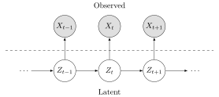{fig-align="right" width="700"}

{fig-align="left" width="100"}

::::

* Let's consider an extremely currently-popular strand of CSS research, and step through why (a) it may be harder than it initially seems, but (b) we can use HMMs to "organize"/manage/visualize the complexity!

::: {.notes}

As in, how America's Ur-Choropleths are two visualizations you can keep at hand before launching into a specific nation-wide choropleth about a specific issue!

:::

## Studying "Fake News" {.smaller .callout-fw .callout-valign .crunch-img .crunch-p .crunch-quarto-figure .crunch-title .crunch-callout .text-70 .crunch-ul .crunch-li-5 .crunch-quarto-layout-panel}


::::: {.callout}
:::: {#callout-container}
::: {style="float: left; margin-right: 12px; margin-bottom: -2px"}

{width="50"}

:::

Studying "fake news" with ML and/or Deep Learning and/or Big Data is very popular in Computational Social Science: let's use HMMs to see why it might be more... difficult/complicated than it seems at first 🙈

::::
:::::

* The (implicit) model in studies like @iyengar_news_2010 is something like:

:::: {layout="[65,35]" layout-valign="center" layout-align="center"}
::: {#iyengar-text}

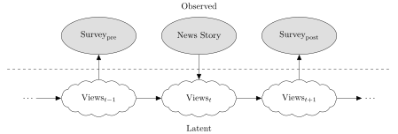{fig-align="center" width="520"}

* Thus allowing results to be summarized in a table like:

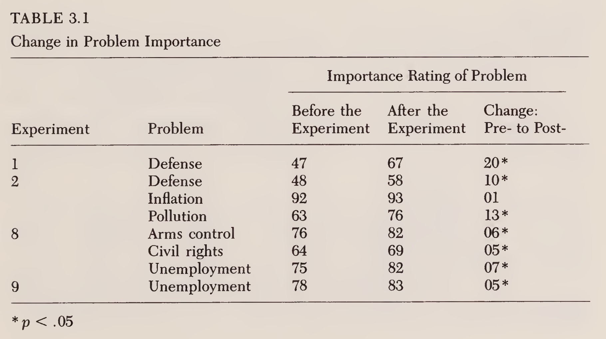{fig-align="center" width="400"}

:::
::: {#iyengar-img}

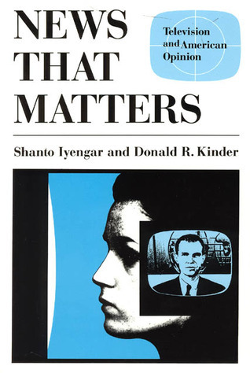{fig-align="center" width="60%"}

:::
::::

## The Devil in the Details I {.smaller .crunch-title .lh-adjust}

> Residents of the [New Haven, Connecticut area]{.jjbox} participated in one of two experiments, each of which spanned [six consecutive days]{.jjbox} [...] took place in [November 1980]{.jjbox}, shortly after the [presidential election]{.jjbox}

> We measured **problem importance** with four questions that appeared in both the pretreatment and posttreatment questionnaires:
> 
> * Please [indicate how important]{.jjbox} you consider these
problems to be.
> * Should the federal government [do more]{.jjbox} to develop solutions to these problems, even if it means [raising taxes]{.jjbox}?
> * How much do you yourself [care]{.jjbox} about these problems?
> * [These days]{.jjbox} how much do you [talk]{.jjbox} about these
problems?

## The Devil in the Details II

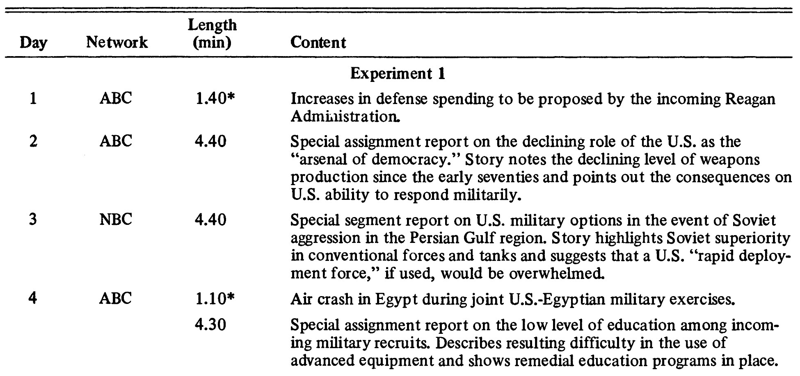{fig-align="center"}

## Randomization and Fine-Tuned Treatment {.smaller .title-10 .crunch-quarto-figure .crunch-quarto-layout-panel}

:::: {layout="[50,50]" layout-valign="center"}

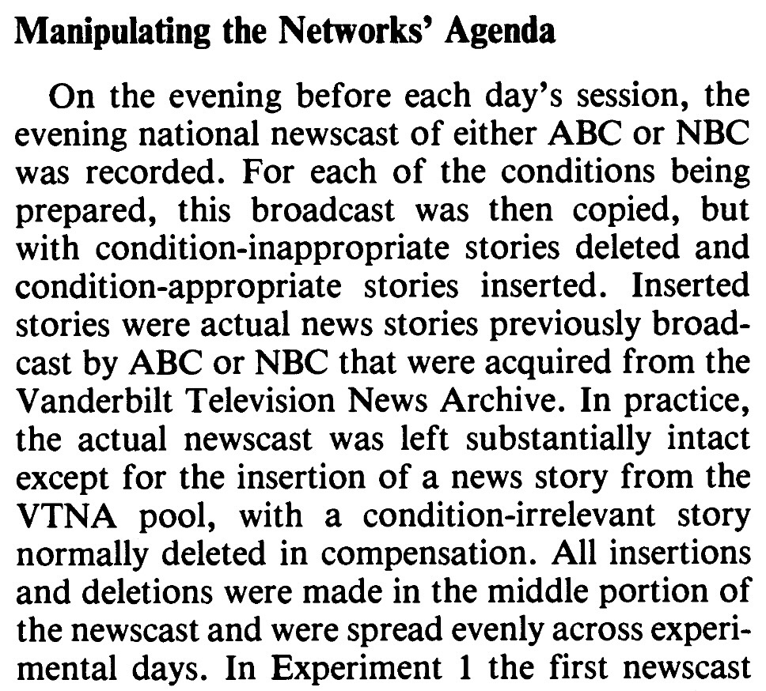{fig-align="center"}

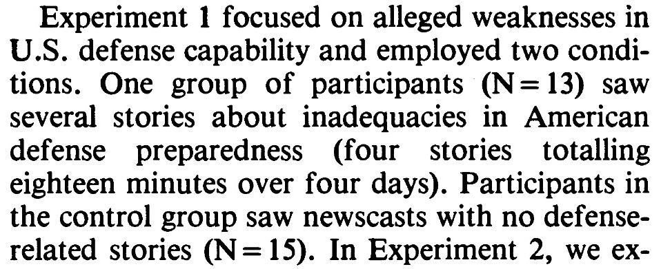{fig-align="center"}

::::

* ...These are the types of things we usually **don't** have control over as data scientists (we're just handed a `.csv`!)

## Let's Model It!

## The Final Piece: Plate Notation {.crunch-title .crunch-quarto-figure}

* For describing general distributions, there is often a "single node generating a bunch of nodes" structure:

{fig-align="center"}

* PGM notation has a built-in tool for this: **plates!**

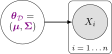{fig-align="center"}

## Crucial CSS Model We Can Now Dive Into!

](images/lda_pgm.webp){fig-align="center"}

## What Does This Give Us?

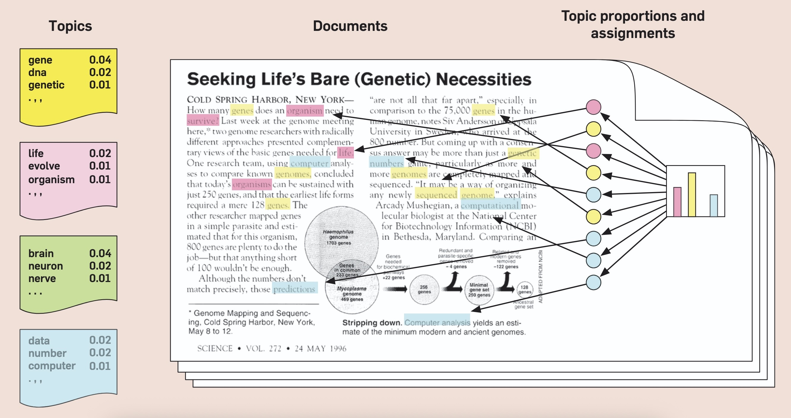{fig-align="center"}

## Before We Branch Off Of PGMs {.smaller}

*(Even in non-causal settings)*

](images/lda_pgm.webp){fig-align="center"}

* We don't exactly think "Shakespeare decided on a set of topics, one per word-slot then chose a common word from each word slot"... and yet...!

# Your First Causal Diagram {data-stack-name="Causal PGMs"}

## The Elite Hacker Known Only As [GUMP]{.orbitron-jj} {.smaller .crunch-title .title-11}

[GUMP]{.orbitron-jj} has figured out how to hack Georgetown grade servers, instantly zapping their grade up to an A+...

<center style="width: 100%;">



</center>

## The Four Elemental Confounds {.smaller data-stack-name="Forks, Pipes, Colliders"}

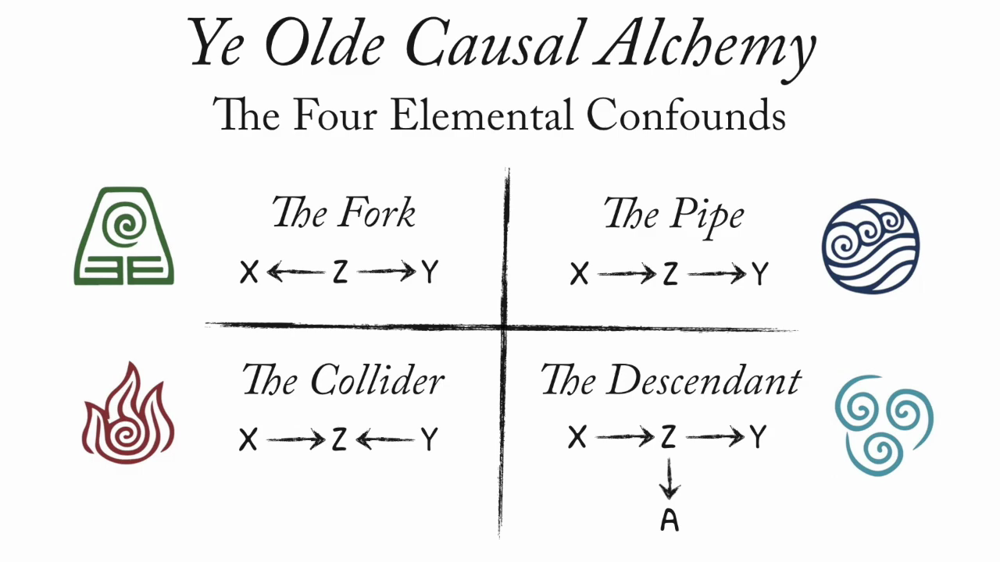{fig-align="center"}

## References

::: {#refs}
:::

# Appendix 1: Zero Probabilities {.smaller .crunch-title .title-11}

From @koller_probabilistic_2009, pp. 66-67:

> **Zero probabilities**: A common mistake is to assign a probability of zero to an event that is extremely unlikely, but not impossible. The problem is that one can never condition away a zero probability, no matter how much evidence we get. When an event is unlikely but not impossible, giving it probability zero is guaranteed to lead to irrecoverable errors. For example, in one of the early versions of the the Pathfinder system (box 3.D), **10 percent of the misdiagnoses were due to zero probability estimates given by the expert to events that were unlikely but not impossible.**

[&larr; Back to slide](#so-whats-the-problem)

# Appendix 2: More Computational Social Science Examples

## The Logic of Violence in Civil War {.smaller .crunch-title}

{fig-align="center"}

## Particularly Fun Non-"Standard" Examples

* @barron_individuals_2018
* @blaydes_mirrors_2018
* @kozlowski_geometry_2019