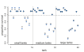
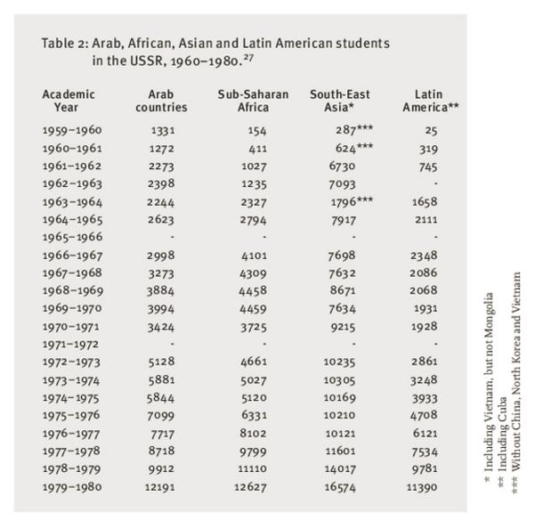
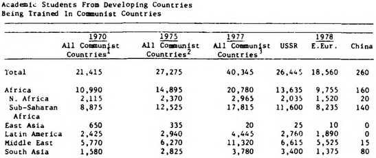
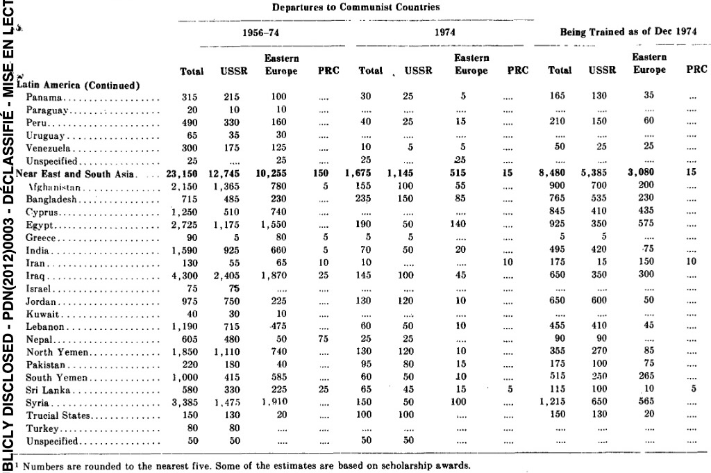
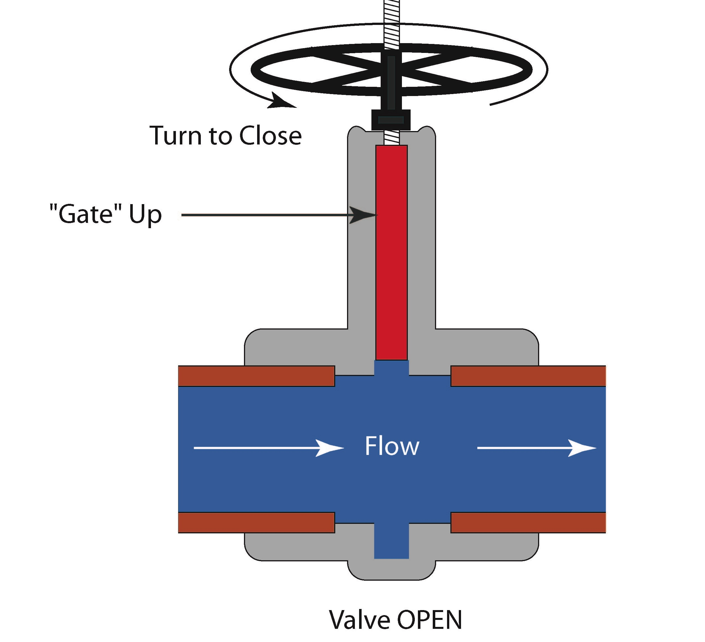
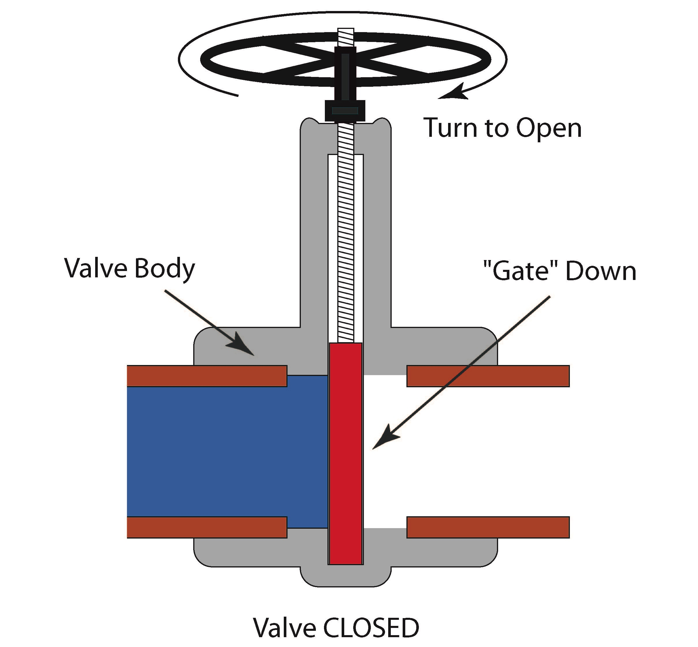

::: {.content-visible unless-format="revealjs"}

<center>
<a class="h2" href="./slides.html" target="_blank">Open slides in new window &rarr;</a>
</center>

:::

# Schedule {.smaller .crunch-title .crunch-callout .code-90 data-name="Schedule"}

Today's Planned Schedule:

| | Start | End | Topic |
|:- |:- |:- |:- |
| **Lecture** | 6:30pm | 7:10pm | [PGM as Modeling Language &rarr;](#roadmap) |
| | 7:10pm | 7:30pm | [The Ladder of Causal Inference &rarr;](#the-ladder-of-causal-inference) |
| | 7:30pm | 7:50pm | [Elemental Confounds I: Forks and Chains &rarr;](#the-four-elemental-confounds)
| **Break!** | 7:50pm | 8:00pm | |
| | 8:00pm | 8:50pm | [Elemental Confounds II: ⚠️Colliders⚠️ &rarr;](#the-collider) |
| | 8:50pm | 9:00pm | [Elemental Confounds III: Proxies &rarr;](#proxies-for-Z) |

: {tbl-colwidths="[12,12,12,64]"}



::: {.hidden}

```{r}
#| label: r-source-globals
source("../dsan-globals/_globals.r")
```

:::

# Roadmap {.smaller .crunch-title .title-12 .crunch-ul .crunch-quarto-figure .crunch-li-8 .crunch-p .crunch-quarto-layout-panel .caption-60 data-stack-name="PGM as Language"}

<center>

**5300 &rarr; Now**

</center>

:::: {layout="[60,40]"}
::: {#left-5300}

* In e.g. 5300, you learned a bunch of *ad hoc* models: Linear Regression, Decision Trees, SVMs
* PGMs provide a formalized **modeling language** for "writing out" models unambiguously in a way your computer understands: specifying exactly how to estimate **parameters** from **data**

:::
::: {#img-5300}

)](images/linear_regression.png){fig-align="center" width="220"}

:::
::::

<center>

**Now &rarr; August**: *Class **splits** into two themes, running in parallel!*

</center>

:::: {layout="[50,50]" layout-valign="center"}
::: {#now-august-text}

* <i class='bi bi-1-circle'></i> What kinds of cool comp social sci models are unlocked, that we can now **implement** in this language? [HW2]
* <i class='bi bi-2-circle'></i> How can we **expand** PGM vocabulary to incorporate **causality**? [Midterm]

:::
::: {#now-august-img}

![From PGMs to SWIGs [@bezuidenhout_single_2024]](images/dag-swig.svg){fig-align="center" width="410"}

:::
::::

## Why Take the Time to Learn a Modeling *Language* (vs. Individual Models)? {.smaller .crunch-title .title-09 .crunch-quarto-figure .crunch-p .crunch-ul .table-70 .code-black .table-nolines .table-crunch-td .text-65 .crunch-li-8 .crunch-quarto-layout-panel}

* My answer: allows you to **adapt** to specifics/**idiosyncrasies** of your problem!
* **Language** metaphor: Learning models vs. learning modeling language $\Leftrightarrow$ Learning phrases in a language vs. learning to speak the language
* "Hello, one hamburger please" is good, but what if you...
* <i class='bi bi-question-circle'></i> Are allergic to ketchup and need to make sure it's removed
* <i class='bi bi-question-circle'></i> Want to replace sesame seed bun with poppy seed bun, if they have it
* <i class='bi bi-question-circle'></i> Prefer spicy, but not too spicy, mustard <i class='bi bi-question-circle'></i> Bun only <i class='bi bi-question-circle'></i> Animal style <i class='bi bi-question-circle'></i> ...

:::: {layout="[40,60]"}
::: {#syntax-left}

<center>

Languages give us a **syntax**...

| | | |
|-|-|-|
| S | $\rightarrow$ | NP VP |
| NP | $\rightarrow$ | DetP N \| AdjP NP |
| VP | $\rightarrow$ | V NP |
| AdjP | $\rightarrow$ | Adj \| Adv AdjP |
| N | $\rightarrow$ | `frog` \| `tadpole` |
| V | $\rightarrow$ | `sees` \| `likes` |
| Adj | $\rightarrow$ | `big` \| `small` |
| Adv | $\rightarrow$ | `very` |
| DetP | $\rightarrow$ | `a` \| `the` |

</center>

:::
::: {#syntax-right}

<center>

...For expressing **arbitrary** (infinitely many!) sentences

</center>

{fig-align="center" width="330"}

:::
::::

## Example 1: Multilevel Tadpoles (McElreath, Ch. 13) {.smaller .crunch-title .crunch-ul .title-09 .crunch-p .crunch-quarto-figure .crunch-li-7 .crunch-img}

*Need a **language** that can communicate the following info to estimation algorithm:*

* <i class='bi bi-0-circle'></i> Unit of *observation* is **tadpole**, but unit of *analysis* is **tank**
* <i class='bi bi-1-circle'></i> Ultimately, I **care about** $Y =$ **survival rate** (**dependent** var), as function of $X =$ **tank properties** (**independent** var)
* <i class='bi bi-2-circle'></i> ...But the $n_i = 48$ tanks actually come in $n_j = 3$ **types**: small (10 bois), medium (25), large (35) *(Bonus: What if there are different numbers of tanks per type?)*
* <i class='bi bi-3-circle'></i> I need it to account for impact of **tank size**, then <i class='bi bi-4-circle'></i> **pool** info across tank sizes

{fig-align="center"}

## Example 2: Dissertation Nightmare {.smaller .crunch-title .crunch-img .crunch-fig-top .crunch-quarto-figure .crunch-figcaption .crunch-quarto-layout-panel}

:::: {layout="[45,55]" layout-valign="center" layout-align="center"}
::: {#multilevel-left}

{fig-align="center"}

:::
::: {#multilevel-right}

{fig-align="center" width="85%"}

{fig-align="center" width="90%"}

:::
::::

## Nightmarish Without a Modeling *Language*! {.smaller .crunch-title .title-11 .crunch-li-8 .table-80 .text-65 .code-85 .crunch-ul}

* Modeling *language* $\Rightarrow$ **Unambiguously "encode"** idiosyncratic domain knowledge
* Dissertation: **Cold War** $\times$ **"Third World"** $\leadsto$ **Cuban** 🇨🇺 trans-continental operations^[Helpful metaphor [@gleijeses_visions_2013]: Cuba $\approx$ Forward-deployed "3rd World Outpost" for USSR (Soviet $ but Cuban training of PAIGC &rarr; MPLA), as Israel $\approx$ Forward-deployed "3rd World Outpost" for US (US $ but Israeli training of SAVAK &rarr; SADF)]
* **Main narrative** (for estimation): **1975** (South Africa [**invades Angola**](https://en.wikipedia.org/wiki/Operation_Savannah_(Angola)), 14 Oct &rarr; 🇨🇺 [intervention](https://en.wikipedia.org/wiki/Cuban_intervention_in_Angola), 4 Nov) to **1979** (USSR requests 🇨🇺 troops to **Ethiopia** for [Ogaden War](https://en.wikipedia.org/wiki/Ogaden_War))
* [**Ontology**] **Fix** **1979 geographic entities** at **National** level (as modeling choice, like fixing 2000 USD to measure inflation): $\textsf{Cuba}_{1979}$, $\textsf{Angola}_{1979}$, $\textsf{PDRY}_{1979}$, $\textsf{YAR}_{1979}$
* Different **tokens** (Think NLP: `"Congo"`, `"DRC"`, `"Republic of Congo"`) can then be **contextualized**: can "track" and **link** data appropriately despite splits, merges, name changes
* Say we have data on "Number of Communist Militants in $X$" (*Hoover Yearbook*)...

```{=html}
<table>
<thead>
<tr style="border-bottom: 0px;">
  <th align="center" style="border-bottom: 0px;">Entity</th>
  <th colspan="2" align="center" style="border-bottom: 0px;">Data from 1947-1971 at...</th>
  <th colspan="2" align="center" style="border-bottom: 0px;">Data from 1971-Present at...</th>
</tr>
</thead>
<tbody>
<tr>
  <td rowspan="2" style="vertical-align: middle;" align="center"><span data-qmd="$\textsf{Pakistan}_{1979}$"></span></td>
  <td><span data-qmd="**National Level:**"></span></td>
  <td><span data-qmd='$\frac{62}{62+70} \times$ "Pakistan"'></span></td>
  <td><span data-qmd="**National Level:**"></span></td>
  <td><span data-qmd='"Pakistan"'></span></td>
</tr>
<tr>
  <td><span data-qmd="**Subnational Level:**"></span></td>
  <td><span data-qmd='"West Pakistan"'></span></td>
  <td><span data-qmd="**Subnational Level:**"></span></td>
  <td><span data-qmd="$\sum_{i \in \text{Regions}}\text{data}_i$"></span></td>
</tr>
<tr>
  <td rowspan="2" style="vertical-align: middle; border-bottom: 0px;"><span data-qmd="$\textsf{Bangladesh}_{1979}$"></span></td>
  <td><span data-qmd="**National Level:**"></span></td>
  <td><span data-qmd='$\frac{70}{62+70} \times$ "Pakistan"'></span></td>
  <td><span data-qmd="**National Level:**"></span></td>
  <td><span data-qmd='"Bangladesh"'></span></td>
</tr>
<tr>
  <td><span data-qmd="**Subnational Level:**"></span></td>
  <td><span data-qmd='"East Pakistan"'></span></td>
  <td><span data-qmd="**Subnational Level:**"></span></td>
  <td><span data-qmd="$\sum_{i \in \text{Regions}}\text{data}_i$"></span></td>
</tr>
</tbody>
</table>
```

# The Ladder of Causal Inference {.smaller .title-12 .not-title-slide .crunch-title data-name="Ladder"}

```{=html}
<table>
<!-- <thead>
<tr>
  <th>a</th>
  <th>b</th>
</tr>
</thead> -->
<tbody>
<tr>
  <td style='width: 8%;'></td>
  <td align="center" class='tdvc' style="width: 8%;"><span data-qmd="<i class='bi bi-arrow-90deg-right'></i>"></span></td>
  <td class='tdvc' colspan="2"><span data-qmd=""></span></td>
  <td colspan="2"><span data-qmd="**Counterfactuals**: What *would have* happened, if history was slightly different...<br>$\Pr(Y_{M=M_0} \mid \textsf{do}(X)) - \Pr(Y_{M=M_0} \mid \textsf{do}(\neg X))$"></span></td>
</tr>
<tr>
  <td align="right" class='tdvc'><span data-qmd="<i class='bi bi-arrow-90deg-right'></i>"></span></td>
  <td class='tdvc' colspan="2"><span data-qmd=""></span></td>
  <td colspan="3" class='tdvc'><span data-qmd="**Intervention**: What happens if I...<br>$\Pr(Y \mid \textsf{do}(X)) - \Pr(Y \mid \textsf{do}(\neg X))$"></span></td>
</tr>
<tr>
  <td class='tdvc' colspan="2"></td>
  <td colspan="4" align="left" class='tdvc'><span data-qmd="**Association**: What happened?<br>$\Pr(Y \mid X) - \Pr(Y \mid \neg X)$"></span></td>
</tr>
</tbody>
</table>
```

* $\leadsto$ Stuff we add to probability theory in 5650 is to combat **confounding**: to **"fix"** whatever is making $\Pr(Y \mid X) \neq \Pr(Y \mid \textsf{do}(X))$!

# Recap: The Four Elemental Confounds {.smaller .crunch-title .crunch-quarto-figure .title-12 .crunch-quarto-layout-panel data-stack-name="Backdoor Paths"}

](images/elemental-confounds.png){fig-align="center"}

```{r}
#| label: r-libraries
#| echo: true
#| code-fold: true
library(tidyverse) # For ggplot
library(extraDistr) # For rbern()
library(patchwork) # For side-by-side plotting
library(ggtext) # For colors in titles
library(rethinking)
library(dagitty)
n_d <- 10000 # For discrete RVs
n_c <- 300 # For continuous RVs
```

## Pipes $X \rightarrow Z \rightarrow Y$: Conditioning = *Blocking* {.smaller .crunch-title .title-11 .crunch-quarto-figure .crunch-quarto-layout-panel .crunch-img .crunch-figure .crunch-p}

:::: {layout="[30,20,50]" layout-valign="center" layout-align="center"}
::: {#pipe-open}

{fig-align="center" width="200"}

{fig-align="center" width="250"}

:::
::: {#pipe-dag-img}

```{r}
#| label: pipe-dag
#| fig-align: center
#| results: hold
library(rethinking)
library(dagitty)
library(ggdag)
pipe_dag <-dagitty("dag{
X[exposure]
Y[outcome]
X -> Y
X -> Z
Z -> Y
}")
coordinates(pipe_dag) <- list(
    x=c(X=0, Z=0.5, Y=1),
    y=c(X=1, Z=0.5, Y=1)
)
drawdag(pipe_dag, cex=4, lwd=5, radius=10)
drawopenpaths(pipe_dag, lwd=5)
adj_sets <- adjustmentSets(
    pipe_dag, effect="direct"
)
writeLines("Adjustment sets (direct effect):")
adj_sets
```

:::
::: {#pipe-plot}

```{r}
#| label: pipe-continuous
#| echo: true
#| code-fold: true
#| fig-width: 4.5
#| fig-height: 3
set.seed(5650)
cpipe_df <- tibble(
    X = rnorm(n_c),
    Z = rbern(n_c, plogis(X)),
    Y = rnorm(n_c, 2 * Z - 1)
)
cpipe_lm <- lm(Y ~ X, data=cpipe_df)
cpipe_slope <- round(cpipe_lm$coef['X'], 3)
cpipe_z0_lm <- lm(Y ~ X, data=cpipe_df |> filter(Z == 0))
cpipe_z0_slope <- round(cpipe_z0_lm$coef['X'], 2)
cpipe_z0_label <- paste0("<span style='color: #e69f00;'>Slope<sub>Z=0</sub> = ",cpipe_z0_slope,"</span>")
cpipe_z1_lm <- lm(Y ~ X, data=cpipe_df |> filter(Z == 1))
cpipe_z1_slope <- round(cpipe_z1_lm$coef['X'], 2)
cpipe_z1_label <- paste0("<span style='color: #56b4e9;'>Slope<sub>Z=1</sub> = ",cpipe_z1_slope,"</span>")
cpipe_z_texlabel <- paste0(cpipe_z0_label, " | ", cpipe_z1_label)
cpipe_xmin <- min(cpipe_df$X)
cpipe_xmax <- max(cpipe_df$X)
ggplot() +
  # Points
  geom_point(
    data=cpipe_df |> filter(Y > -3),
    aes(x=X, y=Y, color=factor(Z)),
    size=0.4*g_pointsize,
    alpha=0.8
  ) +
  # Overall lm
  geom_smooth(
    data=cpipe_df, aes(x=X, y=Y),
    method = lm, se = FALSE,
    linewidth = 3, color='white'
  ) +
  geom_smooth(
    data=cpipe_df, aes(x=X, y=Y),
    method = lm, se = FALSE,
    linewidth = 2.5, color='black'
  ) +
  theme_dsan(base_size=18) +
  theme(
    plot.title = element_text(size=18),
    plot.subtitle = element_markdown(size=16)
  ) +
  coord_equal() +
  labs(
    title = paste0(
      "Unstratified Slope = ",cpipe_slope
    ),
    x = "X", y = "Y", color = "Z"
  )
```

:::
::::

<!-- Pipe Blocked -->

:::: {layout="[30,20,50]" layout-valign="center" layout-align="center"}
::: {#pipe-closed}

{fig-align="center" width="200"}

{fig-align="center" width="250"}

:::
::: {#pipe-dag-closed-img}

```{r}
#| label: pipe-dag-closed
#| fig-align: center
#| results: hold
library(rethinking)
library(dagitty)
library(ggdag)
pipe_dag_closed <-dagitty("dag{
X[exposure]
Y[outcome]
Z[adjustedNode]
X -> Y
X -> Z
Z -> Y
}")
coordinates(pipe_dag_closed) <- list(
    x=c(X=0, Z=0.5, Y=1),
    y=c(X=1, Z=0.5, Y=1)
)
drawdag(pipe_dag_closed, cex=4, lwd=5, radius=10)
drawopenpaths(pipe_dag_closed, Z="Z", lwd=5)
adj_sets_closed <- adjustmentSets(
    pipe_dag_closed
)
writeLines("Adjustment sets (direct effect):")
adj_sets_closed
```

:::
::: {#pipe-plot}

```{r}
#| label: pipe-continuous-closed
#| echo: true
#| code-fold: true
#| fig-width: 4.5
#| fig-height: 3
set.seed(5650)
cpipe_df <- tibble(
    X = rnorm(n_c),
    Z = rbern(n_c, plogis(X)),
    Y = rnorm(n_c, 2 * Z - 1)
)
cpipe_lm <- lm(Y ~ X, data=cpipe_df)
cpipe_slope <- round(cpipe_lm$coef['X'], 3)
cpipe_z0_lm <- lm(Y ~ X, data=cpipe_df |> filter(Z == 0))
cpipe_z0_slope <- round(cpipe_z0_lm$coef['X'], 2)
cpipe_z0_label <- paste0("<span style='color: #e69f00;'>Slope<sub>Z=0</sub> = ",cpipe_z0_slope,"</span>")
cpipe_z1_lm <- lm(Y ~ X, data=cpipe_df |> filter(Z == 1))
cpipe_z1_slope <- round(cpipe_z1_lm$coef['X'], 2)
cpipe_z1_label <- paste0("<span style='color: #56b4e9;'>Slope<sub>Z=1</sub> = ",cpipe_z1_slope,"</span>")
cpipe_z_texlabel <- paste0(cpipe_z0_label, " | ", cpipe_z1_label)
cpipe_xmin <- min(cpipe_df$X)
cpipe_xmax <- max(cpipe_df$X)
ggplot() +
  # Points
  geom_point(
    data=cpipe_df |> filter(Y > -3),
    aes(x=X, y=Y, color=factor(Z)),
    size=0.6*g_pointsize,
    alpha=0.8
  ) +
  # Stratified lm
  # (slightly larger black lines)
  geom_smooth(
    data=cpipe_df,
    aes(x=X, y=Y, group=factor(Z)),
    method=lm, se=FALSE, fullrange=TRUE,
    linewidth=2.75, color='black'
  ) +
  # (Colored lines)
  geom_smooth(
    data=cpipe_df,
    aes(x=X, y=Y, color=factor(Z)),
    method=lm, se=FALSE, fullrange=TRUE,
    linewidth=2
  ) +
  theme_dsan(base_size=18) +
  theme(
    plot.title = element_markdown(size=18),
    plot.subtitle = element_markdown(size=16)
  ) +
  coord_equal() +
  labs(
    title=cpipe_z_texlabel,
    x = "X", y = "Y", color = "Z"
  )
```

:::
::::

## Forks $X \leftarrow Z \rightarrow Y$: Conditioning = *Blocking* {.smaller .crunch-title .title-11 .crunch-quarto-figure .crunch-quarto-layout-panel .crunch-img .crunch-figure .crunch-p}

:::: {layout="[30,20,50]" layout-valign="center" layout-align="center"}
::: {#pipe-open}

{fig-align="center" width="200"}

{fig-align="center" width="250"}

:::
::: {#fork-dag-img}

```{r}
#| label: fork-dag-open
#| fig-align: center
#| results: hold
library(rethinking)
library(dagitty)
library(ggdag)
pipe_dag <-dagitty("dag{
X[exposure]
Y[outcome]
X -> Y
Z -> X
Z -> Y
}")
coordinates(pipe_dag) <- list(
    x=c(X=0, Z=0.5, Y=1),
    y=c(X=1, Z=0.5, Y=1)
)
drawdag(pipe_dag, cex=4, lwd=5, radius=10)
drawopenpaths(pipe_dag, lwd=5)
adj_sets <- adjustmentSets(
    pipe_dag, effect="direct"
)
writeLines("Adjustment sets (direct effect):")
adj_sets
```

:::
::: {#open-fork-plot}

```{r}
#| label: open-fork-continuous
#| echo: true
#| code-fold: true
#| fig-width: 4.5
#| fig-height: 3
library(ggtext)
set.seed(5650)
cfork_df <- tibble(
    Z = rbern(n_c),
    X = rnorm(n_c, 2 * Z - 1),
    Y = rnorm(n_c, 2 * Z - 1)
)
library(latex2exp)
overall_lm <- lm(Y ~ X, data=cfork_df)
overall_slope <- round(overall_lm$coef['X'], 3)
z0_lm <- lm(Y ~ X, data=cfork_df |> filter(Z == 0))
z0_slope <- round(z0_lm$coef['X'], 2)
z0_label <- paste0("<span style='color: #e69f00;'>Slope<sub>Z=0</sub> = ",z0_slope,"</span>")
z1_lm <- lm(Y ~ X, data=cfork_df |> filter(Z == 1))
z1_slope <- round(z1_lm$coef['X'], 2)
z1_label <- paste0("<span style='color: #56b4e9;'>Slope<sub>Z=1</sub> = ",z1_slope,"</span>")
z_texlabel <- paste0(z0_label, " | ", z1_label)
cfork_xmin <- min(cfork_df$X)
cfork_xmax <- max(cfork_df$X)
ggplot() +
  # Points
  geom_point(
    data=cfork_df,
    aes(x=X, y=Y, color=factor(Z)),
    size=0.6*g_pointsize,
    alpha=0.8
  ) +
  # Overall lm
  geom_smooth(
    data=cfork_df, aes(x=X, y=Y),
    method = lm, se = FALSE,
    linewidth = 2.5, color='black'
  ) +
  theme_dsan(base_size=18) +
  theme(
    plot.title = element_text(size=18),
    plot.subtitle = element_markdown(size=16)
  ) +
  coord_equal() +
  labs(
    title = paste0(
      "Unstratified Slope = ",overall_slope
    ),
    x = "X", y = "Y", color = "Z"
  )
```

:::
::::

<!-- Fork Blocked -->

:::: {layout="[30,20,50]" layout-valign="center" layout-align="center"}
::: {#fork-closed}

{fig-align="center" width="200"}

{fig-align="center" width="250"}

:::
::: {#fork-dag-closed-img}

```{r}
#| label: fork-dag-closed
#| fig-align: center
#| results: hold
library(rethinking)
library(dagitty)
library(ggdag)
fork_dag_closed <-dagitty("dag{
X[exposure]
Y[outcome]
Z[adjustedNode]
X -> Y
Z -> X
Z -> Y
}")
coordinates(fork_dag_closed) <- list(
    x=c(X=0, Z=0.5, Y=1),
    y=c(X=1, Z=0.5, Y=1)
)
fork_dag_closed <- setVariableStatus(fork_dag_closed, "adjustedNode", "Z")
drawdag(fork_dag_closed, cex=4, lwd=5, radius=10)
drawopenpaths(fork_dag_closed, Z="Z", lwd=5)
```

:::
::: {#fork-plot}


```{r}
#| label: fork-continuous
#| echo: true
#| code-fold: true
#| fig-width: 4.5
#| fig-height: 3
library(ggtext)
set.seed(5650)
cfork_df <- tibble(
    Z = rbern(n_c),
    X = rnorm(n_c, 2 * Z - 1),
    Y = rnorm(n_c, 2 * Z - 1)
)
library(latex2exp)
overall_lm <- lm(Y ~ X, data=cfork_df)
overall_slope <- round(overall_lm$coef['X'], 3)
z0_lm <- lm(Y ~ X, data=cfork_df |> filter(Z == 0))
z0_slope <- round(z0_lm$coef['X'], 2)
z0_label <- paste0("<span style='color: #e69f00;'>Slope<sub>Z=0</sub> = ",z0_slope,"</span>")
z1_lm <- lm(Y ~ X, data=cfork_df |> filter(Z == 1))
z1_slope <- round(z1_lm$coef['X'], 2)
z1_label <- paste0("<span style='color: #56b4e9;'>Slope<sub>Z=1</sub> = ",z1_slope,"</span>")
z_texlabel <- paste0(z0_label, " | ", z1_label)
cfork_xmin <- min(cfork_df$X)
cfork_xmax <- max(cfork_df$X)
ggplot() +
  # Points
  geom_point(
    data=cfork_df,
    aes(x=X, y=Y, color=factor(Z)),
    size=0.6*g_pointsize,
    alpha=0.8
  ) +
  # Overall lm
  geom_smooth(
    data=cfork_df, aes(x=X, y=Y),
    method = lm, se = FALSE,
    linewidth = 2.5, color='black'
  ) +
  # Stratified lm
  # (slightly larger black lines)
  geom_smooth(
    data=cfork_df,
    aes(x=X, y=Y, group=factor(Z)),
    method=lm, se=FALSE, fullrange=TRUE,
    linewidth=2.75, color='black'
  ) +
  # (Colored lines)
  geom_smooth(
    data=cfork_df,
    aes(x=X, y=Y, color=factor(Z)),
    method=lm, se=FALSE, fullrange=TRUE,
    linewidth=2
  ) +
  theme_dsan(base_size=18) +
  theme(
    plot.title = element_text(size=18),
    plot.subtitle = element_markdown(size=16)
  ) +
  coord_equal() +
  labs(
    title = paste0(
      "Unstratified Slope = ",overall_slope
    ),
    subtitle=z_texlabel,
    x = "X", y = "Y", color = "Z"
  )
```

:::
::::

## Conditioning on a Proxy for $Z$ {.smaller .crunch-title .title-11 .crunch-quarto-figure .crunch-ul .crunch-li-5 .crunch-quarto-layout-panel .crunch-img}

:::: {layout="[65,35]" layout-valign="center"}
::: {#proxy-text}

* With just $X \rightarrow Z \rightarrow Y$, we'd have a **pipe**
* Observing $A \Rightarrow$ **some** (not all!) info about $Z$

:::
::: {#proxy-img}

{fig-align="center" width="180"}

:::
::::

<!-- Continuous Proxy Plot -->

```{r}
#| label: prox-continuous
#| echo: true
#| code-fold: true
library(tidyverse)
library(extraDistr)
library(latex2exp)
set.seed(5650)
cprox_df <- tibble(
    X = rnorm(n_c),
    Z = rbern(n_c, plogis(X)),
    Y = rnorm(n_c, 2 * Z - 1),
    A = rbern(n_c, (1-Z)*0.86 + Z*0.14)
)
cprox_lm <- lm(Y ~ X, data=cprox_df)
cprox_slope <- round(cprox_lm$coef['X'], 3)
cprox_a0_lm <- lm(Y ~ X, data=cprox_df |> filter(A == 0))
cprox_a0_slope <- round(cprox_a0_lm$coef['X'], 2)
cprox_a0_label <- paste0("<span style='color: #e69f00;'>Slope<sub>Z=0</sub> = ",cprox_a0_slope,"</span>")
# A == 1 lm
cprox_a1_lm <- lm(Y ~ X, data=cprox_df |> filter(A == 1))
cprox_a1_slope <- round(cprox_a1_lm$coef['X'], 2)
cprox_a1_label <- paste0("<span style='color: #56b4e9;'>Slope<sub>Z=1</sub> = ",cprox_a1_slope,"</span>")
cprox_a_texlabel <- paste0(cprox_a0_label, " | ", cprox_a1_label)
cprox_xmin <- min(cprox_df$X)
cprox_xmax <- max(cprox_df$X)
ggplot() +
  # Points
  geom_point(
    data=cprox_df |> filter(Y > -3),
    aes(x=X, y=Y, color=factor(A)),
    size=0.5*g_pointsize,
    alpha=0.8
  ) +
  # Overall lm
  geom_smooth(
    data=cprox_df, aes(x=X, y=Y),
    method = lm, se = FALSE,
    linewidth = 2.5, color='black'
  ) +
  # Stratified lm
  # (slightly larger black lines)
  geom_smooth(
    data=cprox_df,
    aes(x=X, y=Y, group=factor(A)),
    method=lm, se=FALSE, fullrange=TRUE,
    linewidth=2.75, color='black'
  ) +
  # (Colored lines)
  geom_smooth(
    data=cprox_df,
    aes(x=X, y=Y, color=factor(A)),
    method=lm, se=FALSE, fullrange=TRUE,
    linewidth=2
  ) +
  theme_dsan(base_size=22) +
  theme(
    plot.title = element_text(size=22),
    plot.subtitle = element_markdown(size=20)
  ) +
  coord_equal() +
  labs(
    title = paste0(
      "Unstratified Slope = ",cprox_slope
    ),
    subtitle=cprox_a_texlabel,
    x = "X", y = "Y", color = "A"
  )
```

## ⚠️Colliders⚠️ $X \rightarrow Z \leftarrow Y$: Conditioning = *Opening* {.smaller .crunch-title .title-09 .crunch-quarto-figure .crunch-ul .crunch-li-5 .crunch-p .crunch-img .crunch-quarto-layout-panel .crunch-figure}

:::: {layout="[30,20,50]" layout-valign="center" layout-align="center"}
::: {#collider-open}

{fig-align="center" width="200"}

{fig-align="center" width="220"}

:::
::: {#collider-dag-img}

```{r}
#| label: collider-dag-unobs
#| fig-align: center
#| results: hold
library(rethinking)
library(dagitty)
library(ggdag)
coll_dag <-dagitty("dag{
X[exposure]
Y[outcome]
X -> Y
X -> Z
Y -> Z
}")
coordinates(coll_dag) <- list(
    x=c(X=0, Z=0.5, Y=1),
    y=c(X=1, Z=0.5, Y=1)
)
drawdag(coll_dag, cex=4, lwd=5, radius=10)
drawopenpaths(coll_dag, lwd=5)
adj_sets_coll <- adjustmentSets(
    coll_dag, effect="direct"
)
writeLines("Adjustment sets (direct effect):")
adj_sets_coll
```

:::
::: {#open-collider-plot}

```{r}
#| label: collider-unobs
#| echo: true
#| code-fold: true
#| fig-width: 4.5
#| fig-height: 3
set.seed(5650)
ccoll_df <- tibble(
    X = rnorm(n_c),
    Y = rnorm(n_c),
    Z = rbern(n_c, plogis(2 * (X + Y - 1)))
)
ccoll_lm <- lm(Y ~ X, data=ccoll_df)
ccoll_slope <- round(ccoll_lm$coef['X'], 3)
ccoll_z0_lm <- lm(Y ~ X, data=ccoll_df |> filter(Z == 0))
ccoll_z0_slope <- round(ccoll_z0_lm$coef['X'], 2)
ccoll_z0_label <- paste0("<span style='color: #e69f00;'>Slope<sub>Z=0</sub> = ",ccoll_z0_slope,"</span>")
ccoll_z1_lm <- lm(Y ~ X, data=ccoll_df |> filter(Z == 1))
ccoll_z1_slope <- round(ccoll_z1_lm$coef['X'], 2)
ccoll_z1_label <- paste0("<span style='color: #56b4e9;'>Slope<sub>Z=1</sub> = ",ccoll_z1_slope,"</span>")
ccoll_z_texlabel <- paste0(ccoll_z0_label, " | ", ccoll_z1_label)
ccoll_xmin <- min(ccoll_df$X)
ccoll_xmax <- max(ccoll_df$X)
ggplot() +
  # Points
  geom_point(
    data=ccoll_df |> filter(Y > -3),
    aes(x=X, y=Y, color=factor(Z)),
    size=0.4*g_pointsize,
    alpha=0.8
  ) +
  # Overall lm
  geom_smooth(
    data=ccoll_df, aes(x=X, y=Y),
    method = lm, se = FALSE,
    linewidth = 3, color='white'
  ) +
  geom_smooth(
    data=ccoll_df, aes(x=X, y=Y),
    method = lm, se = FALSE,
    linewidth = 2.5, color='black'
  ) +
  theme_dsan(base_size=18) +
  theme(
    plot.title = element_markdown(size=18),
    plot.subtitle = element_markdown(size=16)
  ) +
  coord_equal() +
  labs(
    title=ccoll_z_texlabel,
    x = "X", y = "Y", color = "Z"
  )
```

:::
::::

<!-- Collider Observed -->

:::: {layout="[30,20,50]" layout-valign="center" layout-align="center"}
::: {#fork-closed}

{fig-align="center" width="200"}

{fig-align="center" width="220"}

:::
::: {#collider-dag-obs-img}

```{r}
#| label: collider-dag-obs
#| fig-align: center
#| results: hold
library(rethinking)
library(dagitty)
library(ggdag)
fork_dag_closed <-dagitty("dag{
X[exposure]
Y[outcome]
Z[adjustedNode]
X -> Y
X -> Z
Y -> Z
}")
coordinates(fork_dag_closed) <- list(
    x=c(X=0, Z=0.5, Y=1),
    y=c(X=1, Z=0.5, Y=1)
)
fork_dag_closed <- setVariableStatus(fork_dag_closed, "adjustedNode", "Z")
drawdag(fork_dag_closed, cex=4, lwd=5, radius=10)
drawopenpaths(fork_dag_closed, Z="Z", lwd=5)
```

{width="180"}

:::
::: {#collider-obs-plot}

```{r}
#| label: collider-obs
#| echo: true
#| code-fold: true
#| fig-width: 4.5
#| fig-height: 3
set.seed(5650)
ccoll_df <- tibble(
    X = rnorm(n_c),
    Y = rnorm(n_c),
    Z = rbern(n_c, plogis(2 * (X + Y - 1)))
)
ccoll_lm <- lm(Y ~ X, data=ccoll_df)
ccoll_slope <- round(ccoll_lm$coef['X'], 3)
ccoll_z0_lm <- lm(Y ~ X, data=ccoll_df |> filter(Z == 0))
ccoll_z0_slope <- round(ccoll_z0_lm$coef['X'], 2)
ccoll_z0_label <- paste0("<span style='color: #e69f00;'>Slope<sub>Z=0</sub> = ",ccoll_z0_slope,"</span>")
ccoll_z1_lm <- lm(Y ~ X, data=ccoll_df |> filter(Z == 1))
ccoll_z1_slope <- round(ccoll_z1_lm$coef['X'], 2)
ccoll_z1_label <- paste0("<span style='color: #56b4e9;'>Slope<sub>Z=1</sub> = ",ccoll_z1_slope,"</span>")
ccoll_z_texlabel <- paste0(ccoll_z0_label, " | ", ccoll_z1_label)
ccoll_xmin <- min(ccoll_df$X)
ccoll_xmax <- max(ccoll_df$X)
ggplot() +
  # Points
  geom_point(
    data=ccoll_df |> filter(Y > -3),
    aes(x=X, y=Y, color=factor(Z)),
    size=0.4*g_pointsize,
    alpha=0.8
  ) +
  # Stratified lm
  # (slightly larger black lines)
  geom_smooth(
    data=ccoll_df,
    aes(x=X, y=Y, group=factor(Z)),
    method=lm, se=FALSE, fullrange=TRUE,
    linewidth=2.75, color='black'
  ) +
  # (Colored lines)
  geom_smooth(
    data=ccoll_df,
    aes(x=X, y=Y, color=factor(Z)),
    method=lm, se=FALSE, fullrange=TRUE,
    linewidth=2
  ) +
  theme_dsan(base_size=18) +
  theme(
    plot.title = element_markdown(size=18),
    plot.subtitle = element_markdown(size=16)
  ) +
  coord_equal() +
  labs(
    title=ccoll_z_texlabel,
    x = "X", y = "Y", color = "Z"
  )
```

:::
::::

## References

::: {#refs}
:::
