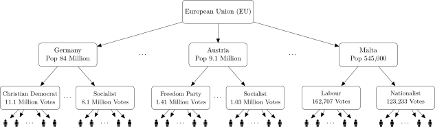
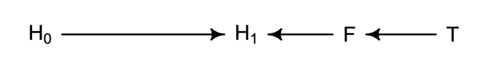
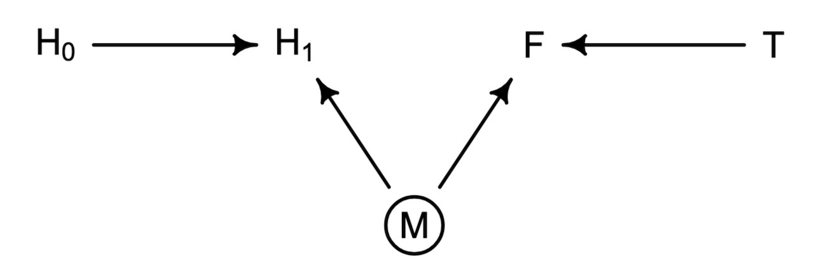
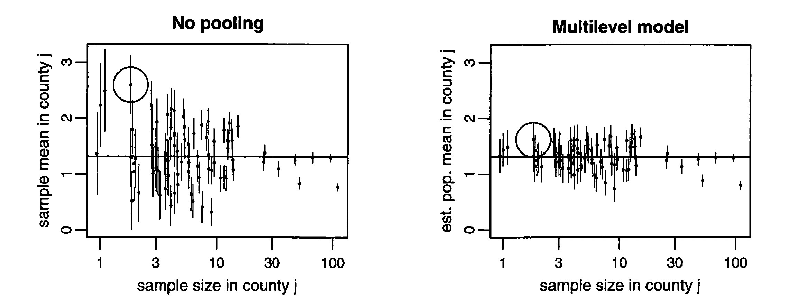
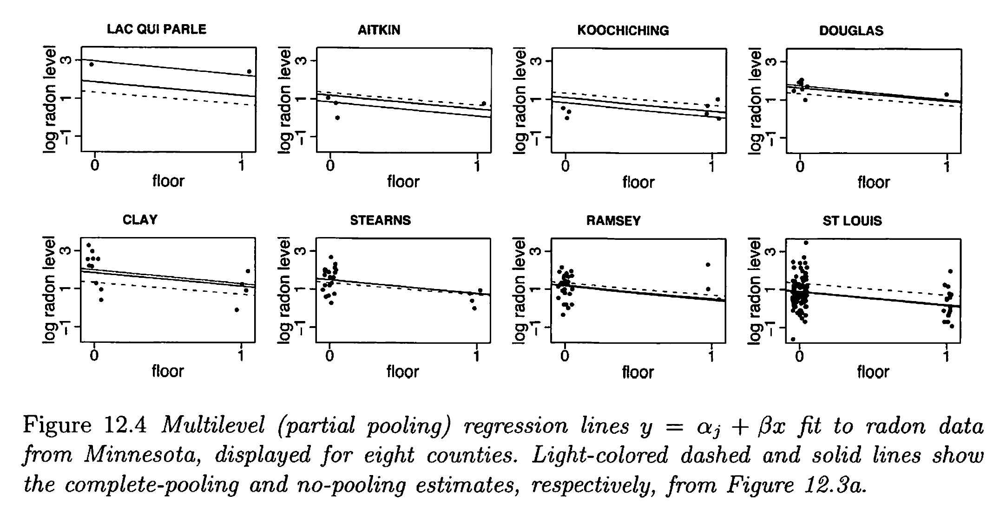

::: {.content-visible unless-format="revealjs"}

<center>
<a class="h2" href="./slides.html" target="_blank">Open slides in new window &rarr;</a>
</center>

:::

# Schedule {.smaller .crunch-title .crunch-callout .code-90 data-stack-name="Schedule"}

Today's Planned Schedule:

| | Start | End | Topic |
|:- |:- |:- |:- |
| **Lecture** | 6:30pm | 6:45pm | [Reading Adventure 2, HW2 &rarr;](#multilevel-madness) |
| | 6:45pm | 7:30pm | [The Logic of PGMs and Testable Hypotheses &rarr;]()
| | 6:45pm | 7:30pm | [Applying $\textsf{do}()$ &rarr;](#the-ladder-of-causal-inference) |
| **Break!** | 7:50pm | 8:00pm | |
| | 8:00pm | 9:00pm | [Closing Backdoor Paths &rarr;](#the-collider) |

: {tbl-colwidths="[12,12,12,64]"}



::: {.hidden}

```{r}
#| label: r-source-globals
source("../dsan-globals/_globals.r")
```

```{r}
#| label: r-libraries
#| echo: true
#| code-fold: true
library(tidyverse) # For ggplot
library(extraDistr) # For rbern()
library(patchwork) # For side-by-side plotting
library(ggtext) # For colors in titles
library(rethinking)
library(dagitty)
n_d <- 10000 # For discrete RVs
n_c <- 300 # For continuous RVs
source("mydrawdag.r")
```

:::

## Reading Adventure 2: Measuring Ideology / Polarization {.smaller .crunch-title .title-09 .crunch-quarto-layout-cell}

```{r}
#| label: fig-congress-only
#| fig-align: center
#| fig-width: 8
#| fig-cap: The "party gap" decreased from about 1900 until 1950, but has increased steadily since then
congress_comb_df <- read_csv("assets/congress_means.csv") |>
  rename(Chamber = chamber)
gap_top <- 1.0 - max(congress_comb_df$party.mean.diff.d1)
plot_ymin <- min(congress_comb_df$party.mean.diff.d1) - gap_top
congress_comb_df |>
  ggplot(aes(x=year, y=party.mean.diff.d1, color=Chamber, alpha=Chamber)) +
  # geom_rect(
  #   aes(xmin = 1941, xmax = 1945, ymin = -Inf, ymax = 1.0),
  #   fill = "grey", alpha = 0.01, inherit.aes=FALSE,
  # ) +
  geom_rect(
    aes(xmin = 1929, xmax = 1939, ymin = -Inf, ymax = 1.0),
    fill = "grey", alpha = 0.01, inherit.aes=FALSE,
  ) +
  geom_text(
    aes(
      x=1929-1, y=0.4,
      label="Great\nDepression",
      hjust=1.0, vjust=0.0, lineheight=0.85
    ),
    inherit.aes=FALSE
  ) +
  geom_line() +
  geom_point() +
  theme_dsan(base_size=18) +
  ylim(plot_ymin, 1.0) +
  geom_hline(yintercept=1.0, linetype='dashed') +
  scale_x_continuous(breaks = seq(1880, 2025, by=20)) +
  scale_color_manual(
    values=c("Combined"="black", "House"="#e69f00", "Senate"="#56b4e9")
  ) +
  scale_alpha_manual(
    values=c("Combined"=0.9, "House"=0.45, "Senate"=0.45),
  ) +
  labs(
    title="Post Civil War Polarization (1879-2025)",
    x="Year",
    y="Difference in Party Mean Ideology",
  )
```

## What Could Possibly Explain This? {.crunch-title .crunch-img}

```{r}
#| label: gini-plot
#| fig-align: center
#| fig-width: 9
#| fig-height: 4
gini_df <- read_csv("assets/mod_gini.csv")
mod_congress_df <- read_csv("assets/mod_congress.csv")
invert_rescale_gini <- function(scaled_vals, old_min, old_max, new_min, new_max) {
  old_min <- 0.348
  old_max <- 0.462
  new_min <- 0.5
  new_max <- 0.9
  inv_factor <- (scaled_vals - new_min) / (new_max - new_min)
  return(
    inv_factor * (old_max - old_min) + old_min
  )
}
ggplot() +
  # geom_rect(
  #   aes(xmin = 1941, xmax = 1945, ymin = -Inf, ymax = 1.0),
  #   fill = "grey", alpha = 0.01, inherit.aes=FALSE,
  # ) +
  geom_rect(
    aes(xmin = 1929, xmax = 1939, ymin = -Inf, ymax = Inf),
    fill = "grey", alpha = 0.01, inherit.aes=FALSE,
  ) +
  # geom_text(
  #   aes(
  #     x=1929-1, y=0.4,
  #     label="Great\nDepression",
  #     hjust=1.0, vjust=0.0, lineheight=0.85
  #   ),
  #   inherit.aes=FALSE
  # ) +
  geom_line(data=mod_congress_df, aes(x=year, y=value, color=name)) +
  geom_point(data=mod_congress_df, aes(x=year, y=value, color=name)) +
  geom_line(data=gini_df, aes(x=year, y=gini_scaled, color=name)) +
  geom_point(data=gini_df, aes(x=year, y=gini_scaled, color=name)) +
  theme_dsan(base_size=14) +
  scale_y_continuous(
    "Difference in Party Mean Ideology", 
    sec.axis = sec_axis(~ invert_rescale_gini(.), name = "Gini Coefficient")
  ) +
  labs(
    title="20th Century Inequality (1914-2025)",
    x="Year",
    y="Difference in Party Mean Ideology",
  ) +
  theme(legend.title = element_blank())
```

```{r}
#| label: gini-corr
cong_gini_df <- inner_join(gini_df, mod_congress_df, by=join_by(year))
cor(cong_gini_df$value.x, cong_gini_df$value.y, use="complete.obs")
```

## But Inequality $\neq$ Wealth of Top 1%... {.crunch-title .title-09}

```{r}
#| label: wealth-plot
#| fig-align: center
#| fig-width: 9
#| fig-height: 4
income_df <- read_csv("assets/income_ineq.csv")
invert_rescale_income <- function(scaled_vals, old_min, old_max, new_min, new_max) {
  old_min <- 0.1035
  old_max <- 0.2229
  new_min <- 0.52
  new_max <- 0.95
  inv_factor <- (scaled_vals - new_min) / (new_max - new_min)
  return(
    inv_factor * (old_max - old_min) + old_min
  )
}
ggplot() +
  # geom_rect(
  #   aes(xmin = 1941, xmax = 1945, ymin = -Inf, ymax = 1.0),
  #   fill = "grey", alpha = 0.01, inherit.aes=FALSE,
  # ) +
  geom_rect(
    aes(xmin = 1929, xmax = 1939, ymin = -Inf, ymax = Inf),
    fill = "grey", alpha = 0.01, inherit.aes=FALSE,
  ) +
  # geom_text(
  #   aes(
  #     x=1929-1, y=0.4,
  #     label="Great\nDepression",
  #     hjust=1.0, vjust=0.0, lineheight=0.85
  #   ),
  #   inherit.aes=FALSE
  # ) +
  geom_line(data=mod_congress_df, aes(x=year, y=value, color=name)) +
  geom_point(data=mod_congress_df, aes(x=year, y=value, color=name)) +
  geom_line(data=income_df, aes(x=year, y=value, color=name)) +
  geom_point(data=income_df, aes(x=year, y=value, color=name)) +
  theme_dsan(base_size=14) +
  scale_y_continuous(
    "Difference in Party Mean Ideology", 
    sec.axis = sec_axis(~ invert_rescale_income(.), name = "Top 1% Wealth Share")
  ) +
  labs(
    title="Post Civil War Polarization (1914-2025)",
    x="Year",
  )
```

```{r}
#| label: income-corr
cong_income_df <- inner_join(income_df, mod_congress_df, by=join_by(year))
cong_income_mod_df <- cong_income_df |> filter(year >= 1970)
cor(cong_income_mod_df$value.x, cong_income_mod_df$value.y, use="complete.obs")
```

## HW2: Multilevel Madness {.smaller data-name="Multilevel Madness"}

{fig-align="center"}

We will open and look at it today after the break!

# The Four Elemental Confounds... Today: What to *Do* About Them! {.smaller .crunch-title .crunch-quarto-figure .title-12 .crunch-quarto-layout-panel data-stack-name="Forks, Pipes, Colliders"}

](images/elemental-confounds.png){fig-align="center"}

## Blocking Backdoor Paths {.smaller .crunch-title .title-12 .inline-90}

`dagitty`: R interface to [dagitty.net](https://www.dagitty.net/dags.html)

```{r}
#| label: rethinking-dag
#| echo: true
#| code-fold: show
#| output-location: column
rt_dag <- dagitty("dag{
X [exposure]
Y [outcome]
U [unobserved]
X -> Y
X <- U <- A -> C -> Y
U -> B <- C
}")
coordinates(rt_dag) <- list(
  x=c(U=0, X=0, A=0.5, B=0.5, C=1, Y=1),
  y=c(X=0.75, Y=0.75, B=0.5, U=0.25, C=0.25, A=0)
)
drawdag_jj(
  rt_dag, cex=2.5, lwd=3, radius=7, arr.width=0.6, arr.length=0.6, shift_arrows=FALSE
)
```

:::: {.columns}
::: {.column width="55%"}

Two backdoor paths!

<i class='bi bi-1-circle'></i> $X \leftarrow \require{enclose}\enclose{circle}{U} \leftarrow A \rightarrow C \rightarrow Y$: Open or closed?

<i class='bi bi-2-circle'></i> $X \leftarrow \require{enclose}\enclose{circle}{U} \rightarrow B \leftarrow C \rightarrow Y$: Open or closed?

:::
::: {.column width="45%"}

```{r}
#| label: backdoor-adj
#| code-fold: show
adjustmentSets(rt_dag)
```

:::
::::

## Collider Bias / Included Variable Bias {.smaller .crunch-title .title-12 .inline-90}

```{r}
#| label: rethinking-collider
#| echo: true
#| code-fold: show
#| output-location: column
rt_dag <- dagitty("dag{
X [exposure]
Y [outcome]
U [unobserved]
X -> Y
X <- U
Y <- C
U -> A <- C
}")
coordinates(rt_dag) <- list(
  x=c(U=0, X=0, A=0.5, C=1, Y=1),
  y=c(X=0.75, Y=0.75, U=0.25, C=0.25, A=0.25)
)
drawdag_jj(
  rt_dag, cex=2.5, lwd=3, radius=7, arr.width=0.6, arr.length=0.6, shift_arrows=FALSE
)
```

:::: {.columns}
::: {.column width="50%"}

Backdoor paths?

:::
::: {.column width="50%"}

Adjustments needed?

:::
::::


## Collider Bias / Included Variable Bias: Answers {.smaller .crunch-title .title-10 .inline-90}

```{r}
#| label: rethinking-collider-answer
#| echo: true
#| code-fold: show
#| output-location: column
rt_dag <- dagitty("dag{
X [exposure]
Y [outcome]
U [unobserved]
X -> Y
X <- U
Y <- C
U -> A <- C
}")
coordinates(rt_dag) <- list(
  x=c(U=0, X=0, A=0.5, C=1, Y=1),
  y=c(X=0.75, Y=0.75, U=0.25, C=0.25, A=0.25)
)
drawdag_jj(
  rt_dag, cex=2.5, lwd=3, radius=7, arr.width=0.6, arr.length=0.6, shift_arrows=FALSE
)
```

:::: {.columns}
::: {.column width="50%"}

Backdoor paths?

<i class='bi bi-1-circle'></i> $X \leftarrow \require{enclose}\enclose{circle}{U} \rightarrow A \leftarrow C \rightarrow Y$: **Closed**

:::
::: {.column width="50%"}

Adjustments needed?

```{r}
#| label: backdoor-collider-adj-answer
#| code-fold: show
adjustmentSets(rt_dag)
```

:::
::::

## First "Real" Example: Anti-Fungal Soil Treatment {.smaller .crunch-title .title-10}

* $H_0$: Height at time $t = 0$
* $H_1$: Height at time $t = 1$
* $F$: Fungus growth amount
* $T$: Fungal treatment applied?

{fig-align="center"}

```{r}
#| label: fungus
#| echo: false
#| code-fold: show
#| results: hold
library(dagitty)
plant_dag <- dagitty( "dag {
H_0 -> H_1
F -> H_1
T -> F
}")
coordinates( plant_dag ) <- list(
  x=c(H_0=0,T=1,F=0.75,H_1=0.5),
  y=c(H_0=0,T=0,F=0,H_1=0)
)
# drawdag_jj(plant_dag, cex=3, lwd=4, arr.width=0.5, arr.length=0.5, arr.adj=0)
```

```{r}
#| label: fungus-indep
impliedConditionalIndependencies(plant_dag)
```

## Alternative: Unobserved Moisture {.smaller .crunch-title .title-10}

* $H_0$: Height at time $t = 0$
* $H_1$: Height at time $t = 1$
* $F$: Fungus growth amount
* $T$: Fungal treatment applied?
* $M$: Moisture level

{fig-align="center"}

```{r}
#| label: fungus2
#| echo: false
#| code-fold: show
#| results: hold
library(dagitty)
plant_dag <- dagitty( "dag {
H_0 -> H_1
F -> H_1
T -> F
}")
coordinates( plant_dag ) <- list(
  x=c(H_0=0,T=1,F=0.75,H_1=0.5),
  y=c(H_0=0,T=0,F=0,H_1=0)
)
# drawdag_jj(plant_dag, cex=3, lwd=4, arr.width=0.5, arr.length=0.5, arr.adj=0)
```

# Multilevel Modeling {data-stack-name="Multilevel Models"}

## Pooling: None, Full, and Adaptive {.smaller .crunch-title}

{fig-align="center"}

$$
\hat{\alpha}_j^{\text {multilevel }} = \frac{\frac{n_j}{\sigma_y^2} \bar{y}_j+\frac{1}{\sigma_\alpha^2} \bar{y}_{\text {all }}}{\frac{n_j}{\sigma_y^2}+\frac{1}{\sigma_\alpha^2}}
$$

## Why Adaptive >> None or Full? {.smaller .crunch-title}

{fig-align="center"}

$$
\alpha_j \sim \mathcal{N}(\mu_\alpha, \sigma_\alpha), \text{ for }j = 1, \ldots, J
$$

* In the limit of $\sigma_\alpha \rightarrow \infty$, the soft constraints do nothing, and there is no pooling;
* As $\sigma_\alpha \rightarrow 0$, they pull the estimates all the way to zero, yielding the complete-pooling estimate

## References

::: {#refs}
:::
