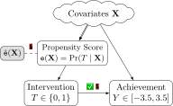
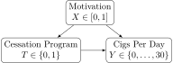
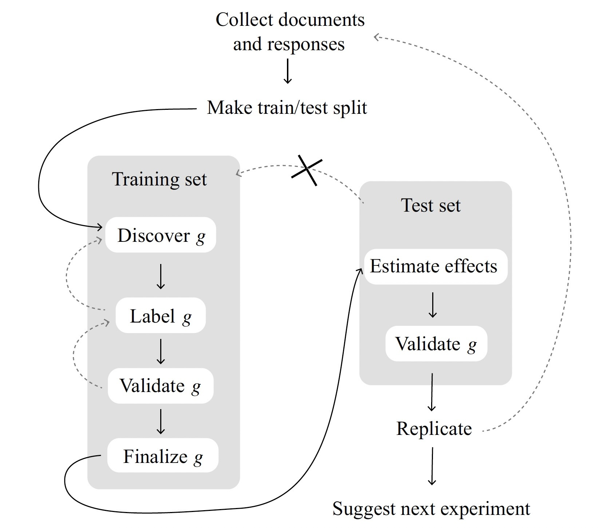

::: {.content-visible unless-format="revealjs"}

<center>
<a class="h2" href="./slides.html" target="_blank">Open slides in new window &rarr;</a>
</center>

:::

# Schedule {.smaller .crunch-title .crunch-callout .code-90 data-stack-name="Schedule"}

Today's Planned Schedule:

| | Start | End | Topic |
|:- |:- |:- |:- |
| **Lecture** | 6:30pm | 6:45pm | [Final Project Tings &rarr;](#final-project-tings) |
| | 6:45pm | 7:20pm | [Double Robustness &rarr;](#double-robustness)
| | 7:20pm | 8:00pm | [When Conditioning Won't Cut It: IVs &rarr;](#hard-mode-when-conditioning-cant-fix-things) |
| **Break!** | 8:00pm | 8:10pm | |
| | 8:10pm | 9:00pm | [Drawing Causal Inferences from Text Data &rarr;](#lab-causal-inference-with-text) |

: {tbl-colwidths="[12,12,12,64]"}

::: {.hidden}

```{r}
#| label: r-source-globals
source("../dsan-globals/_globals.r")
```

:::



# Final Project Templates {data-stack-name="Final Projects"}

* They now live on the [Final Project page](../final.qmd)!

## Option 1: Modeling Social Phenomena with PGMs {.smaller .crunch-title .title-10}

:::: {layout="[1,1]" layout-align="center" layout-valign="center"}
::: {.column width="50%"}

{#fig-bamman fig-align="center" width="100%"}

:::
::: {.column width="50%"}

* $D$: Number of movies
* $E$: Number of characters in a given movie
* $W$: Tuples pairing words in the movie descriptions with roles (e.g., `HERO` or `VILLAIN`)

:::
::::

## Option 2: Pushing Towards the Asymptote of Causality {.smaller .crunch-title .title-09}

```{r, dev = "svg", dev.args=list(bg="transparent")}
#| label: fig-nunn-plot
#| warning: false
#| code-fold: true
#| fig-align: center
#| fig-cap: Results from @nunn_ruggedness_2012, where the causal impact of terrain ruggedness on present-day GDP per capita **reverses direction** when considering African vs. non-African countries!
library(tidyverse) |> suppressPackageStartupMessages()
rug_df <- read_csv("assets/rugged_data.csv", show_col_types=FALSE)
# Compute Box-Cox params
bc_params <- car::powerTransform(
  object = cbind(
    rug_df$rgdppc_2000,
    rug_df$rugged
  )
)
rug_df <- rug_df |> mutate(
  continent = ifelse(cont_africa == 1, "African", "Non-African"),
  gdpc_transformed = rgdppc_2000_m ^ bc_params$lambda[1],
  rugged_transformed = rugged ^ bc_params$lambda[2],
)
rug_df |> ggplot(aes(
  x = rugged_transformed,
  y = gdpc_transformed
)) +
  geom_text(aes(label=isocode), size=3) +
  geom_smooth(method="lm", fullrange=TRUE) +
  facet_wrap(~ continent) +
  theme_classic() +
  theme(
    panel.background = ggplot2::element_rect(fill='transparent'),
    plot.background = ggplot2::element_rect(fill='transparent', color=NA),
    plot.title = element_text(hjust=0.5),
  ) +
  labs(
    title="Differential Effects of Ruggedness by Continent",
    x="Terrain Ruggedness",
    y="Log GDP Per Capita, 2000",
  )
```

# Recap: Propensity Scores {.smaller .crunch-title .title-11 data-stack-name="Propensity Scores"}

{fig-align="center" width="50%"}

## How Exactly Do We *Adjust For* $\hat{\mathtt{e}}(\mathbf{X})$? {.smaller .title-12 .crunch-quarto-figure .crunch-img .crunch-p}

::: {style="width: 100%"}

* Simulation example: smoking reduction

:::

:::: {.columns}
::: {.column width="40%"}

```{r}
#| label: naive-smoking-model
library(tidyverse)
library(Rlab)
set.seed(5650)
n <- 250
motiv_vals <- runif(n, 0, 1)
enroll_vals <- ifelse(
  motiv_vals < 0.25,
  0,
  # We know motiv > 0.25
  ifelse(
    motiv_vals > 0.75,
    1,
    # We know 0.25 < motiv < 0.75
    rbern(n, prob=(motiv_vals - 0.125)*1.5)
  )
)
ncigs_vals <- rbinom(n, size=30, prob=0.6-0.2*enroll_vals)
smoke_df <- tibble(
  motiv=motiv_vals,
  enroll=enroll_vals,
  ncigs=ncigs_vals
)
(smoke_mean_df <- smoke_df |> group_by(enroll) |> summarize(mean_ncigs=mean(ncigs)))
naive_smoke_lm <- lm(ncigs ~ enroll, data=smoke_df)
summary(naive_smoke_lm) |> broom::tidy() |>
  select(term, estimate)
```

:::
::: {.column width="60%"}

{fig-align="center" width="70%"}

```{r, dev = "svg", dev.args=list(bg="transparent")}
#| label: smoke-naive-plot
smoke_df |> ggplot(aes(x=enroll, y=ncigs)) +
  geom_boxplot(
    aes(group=enroll),
    width=0.5
  ) +
  geom_smooth(
    method='lm',
    formula='y ~ x',
    se=TRUE
  ) +
  geom_point(
    data=smoke_mean_df,
    aes(x=enroll, y=mean_ncigs),
    size=3
  ) +
  theme_dsan(base_size=24) +
  transparent_bg() +
  labs(
    title="Naïve Estimate of Program Effectiveness",
    x="Enrolled?",
    y="Cigarettes Per Day",
  ) +
  scale_x_continuous(breaks=c(0, 1))
```

:::
::::

## Inverse Probability-of-Treatment Weighting {.smaller .crunch-title .title-11 .crunch-img .crunch-quarto-figure .crunch-p}

:::: {.columns}
::: {.column width="50%"}

```{r, dev = "svg", dev.args=list(bg="transparent")}
#| label: motive-ncigs-plot
eprop_model <- glm(enroll ~ motiv, family='binomial', data=smoke_df)
eprop_preds <- predict(eprop_model, type="response")
smoke_df <- smoke_df |> mutate(pred=eprop_preds)
# Use the preds to compute IPW
smoke_df <- smoke_df |> rowwise() |> mutate(
  ipw=ifelse(enroll, 1/pred, 1/(1-pred))
) |> arrange(pred)
#smoke_df
smoke_df |> mutate(enroll=factor(enroll)) |>
  ggplot(aes(x=motiv, y=ncigs, color=enroll)) +
  geom_point() +
  theme_dsan(base_size=24) +
  labs(title="Before Weighting") +
  transparent_bg()
```

:::
::: {.column width="50%"}

```{r, dev = "svg", dev.args=list(bg="transparent")}
#| label: ipw-plot
smoke_df |> mutate(enroll=factor(enroll)) |>
  ggplot(aes(
    x=motiv, y=ncigs, color=enroll, size=ipw,
    alpha=log(ipw-1)
  )) +
  geom_point() +
  guides(alpha="none") +
  theme_dsan(base_size=24) +
  labs(title="After Weighting") +
  transparent_bg()
```

:::
::::

:::: {layout="[48,4,48]" layout-valign="center"}
::: {#iptw-bottom-left}

<center>

&darr;

</center>

```{r, dev = "svg", dev.args=list(bg="transparent")}
#| label: enroll-propensity
smoke_df |>
  ggplot(aes(x=motiv)) +
  # Predictions
  geom_point(
    aes(y=enroll, color=factor(enroll))
  ) +
  # Values
  geom_point(
    aes(y=pred, color=factor(enroll))
  ) +
  labs(color="enroll") +
  theme_dsan(base_size=24) +
  transparent_bg() +
  labs(title="Propensity to Enroll")
```

:::
::: {#iptw-bottom-middle}

<center>

&rarr;

</center>

:::
::: {#iptw-bottom-right}

<center>

&uarr;

</center>

```{r, dev = "svg", dev.args=list(bg="transparent")}
#| label: enroll-ipw
ipw_min <- min(smoke_df$ipw)
ipw_max <- max(smoke_df$ipw)
smoke_df <- smoke_df |> mutate(
  ipw_scaled = (ipw - ipw_min) / (ipw_max - ipw_min)
)
smoke_df |>
  ggplot(aes(x=motiv)) +
  # Predictions
  geom_point(
    aes(y=enroll, color=factor(enroll))
  ) +
  # Values
  geom_point(
    aes(y=ipw_scaled, color=factor(enroll))
  ) +
  theme_dsan(base_size=24) +
  transparent_bg() +
  labs(
    title="Inverse Probability-of-Treatment Weights (IPTW)",
    color="enroll"
  )
```

:::
::::

## The Final Result! {.smaller .crunch-title .crunch-p}

```{r}
#| label: ipw-reg
#| output-location: column
#| code-fold: show
lm_with_weights <- lm(ncigs ~ enroll,
  data=smoke_df, weights=smoke_df$ipw
)
summary(lm_with_weights) |> broom::tidy() |>
  select(term, estimate, std.error)
```

```{r}
#| label: ipw-library
#| code-fold: show
#| output-location: column
library(WeightIt)
W <- weightit(
  enroll ~ motiv, data = smoke_df, ps="pred"
)
smoke_weighted_lm <- lm_weightit(
  ncigs ~ enroll, data = smoke_df, weightit = W
)
summary(smoke_weighted_lm, ci = FALSE)
```

```{r}
#| label: ipw2
#| code-fold: show
#| output-location: column
W_default <- weightit(
  enroll ~ motiv, data = smoke_df
)
smoke_default_lm <- lm_weightit(
  ncigs ~ enroll, data = smoke_df,
  weightit = W_default
)
summary(smoke_default_lm, ci = FALSE)
```

# ...What If We Have *Many* Covariates? {data-stack-name="Many Covariates"}

* Curse of dimensionality...
* Lab Time!

# [potted_plant]{.material-symbols-outlined} Causal Inferences with Text {.smaller .crunch-title .title-10 .crunch-ul .crunch-p data-stack-name="Causal NLP"}

*(The necessity for **sample splitting**!)*

* Recall the **media effects** example from [Week 3](https://jjacobs.me/dsan5650/w03/#studying-fake-news); here an experiment where:
* **Treatment** ($D_i = 1$) watches **presidential debate** (control doesn't watch anything)
* **Outcome** $Y_i$: We estimate a **topic model** of the respondent's verbal answer to "what do you think are the most important issues in US politics today?"

| | $Y_i \mid \textsf{do}(D_i \leftarrow 1)$ | $Y_i \mid \textsf{do}(D_i \leftarrow 0)$ |
|:-:|:-:|:-:|
| Person 1 | Candidate's Morals | Taxes |
| Person 2 | Candidate's Morals | Taxes |
| Person 3 | Polarization | Immigration |
| Person 4 | Polarization | Immigration |

: From @egami_how_2022 {#tbl-naoki cap-location="bottom"}

## "Discovered" Topics *Depend on the Data* 😟 {.smaller .crunch-title .title-11 .table-85}

| | $Y_i \mid \textsf{do}(D_i \leftarrow 1)$ | $Y_i \mid \textsf{do}(D_i \leftarrow 0)$ |
|-:|:-:|:-:|
| Person 1 | Candidate's Morals | Taxes |
| Person 2 | Candidate's Morals | Taxes |
| Person 3 | Polarization | Immigration |
| Person 4 | Polarization | Immigration |

: From @egami_how_2022 {#tbl-naoki cap-location="bottom"}

:::: {.columns}
::: {.column width="50%"}

| | Actual Assignment | Outcome $Y_i$ |
|:-:|:-:|:-:|
| Person 1 | $D_1 = 1$ | Morals |
| Person 2 | $D_2 = 1$ | Morals |
| Person 3 | $D_3 = 0$ | Immigration |
| Person 4 | $D_4 = 0$ | Immigration |

: Realized assignments and outcomes in World 1 {#tbl-world1}

:::
::: {.column width="50%"}

| | Actual Assignment | Outcome $Y_i$ |
|:-:|:-:|:-:|
| Person 1 | $D_1 = 1$ | Morals |
| Person 2 | $D_2 = 0$ | Taxes |
| Person 3 | $D_3 = 1$ | Polarization |
| Person 4 | $D_4 = 0$ | Immigration |

: Realized assignments and outcomes in World 2 {#tbl-world2}

:::
::::

## The Solution? *Sample Splitting!* {.crunch-title .crunch-ul}

* Machine learning noticed this long ago: the goal is a model that **generalizes**, not **memorizes!**

{fig-align="center"}

# Hard Mode: When Conditioning Isn't an Option / Can't Fix Things {.title-09 .crunch-title .text-90 data-name="Instrumental Variables"}

* Approaches we've discussed thus far depend on the ability to **adjust for** (e.g., by conditioning-on and/or purposefully-not-conditioning-on) **confounders themselves** (e.g., in regression), or on **propensity scores**
* Enter **Instrumental Variables!** (this week), **Specification of Mechanisms / Front-Door Pathways** (next week)
* $\leadsto$ Find **"natural experiments"**, randomizations or pseudo-randomizations in society that allow us to replicate the "holy grail" of random assignment

::: {.notes}

I... always ask economists why it isn't explained like this, and they always say "it's more complicated than that", and then they explain the complications and I think I understand them but still think that this is a good way to describe the gist!

:::

# Lab: Instrumental Variable Estimation

# Lab: Causal Inference with Text {data-stack-name="Text-as-Data"}

* Lab Time!

## References

::: {#refs}
:::
