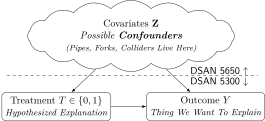
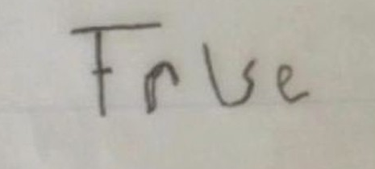
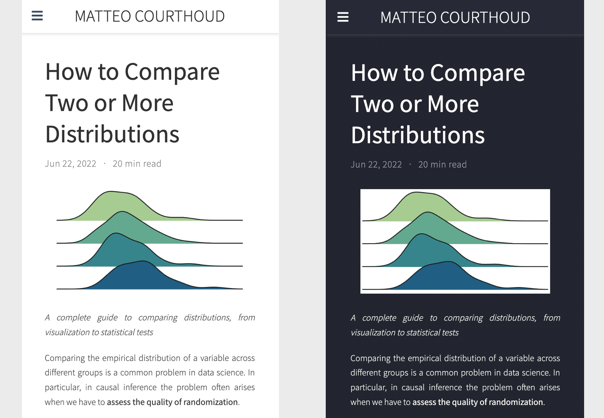
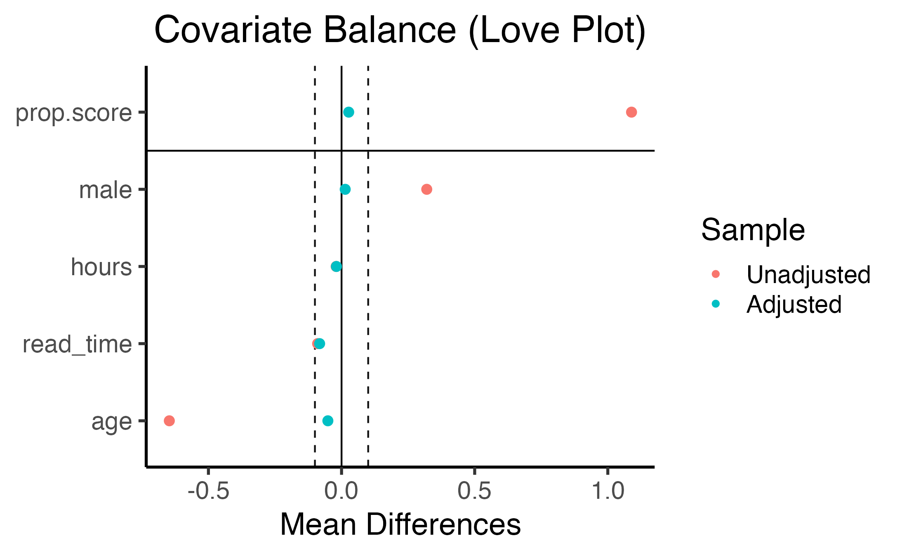
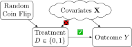
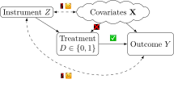
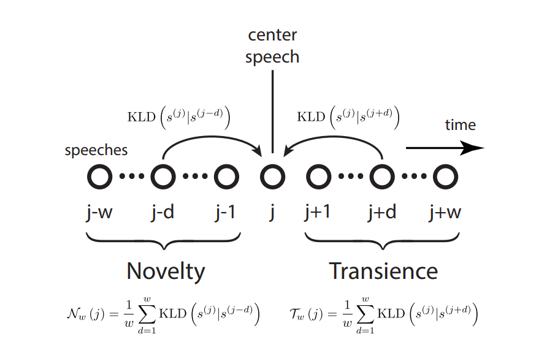
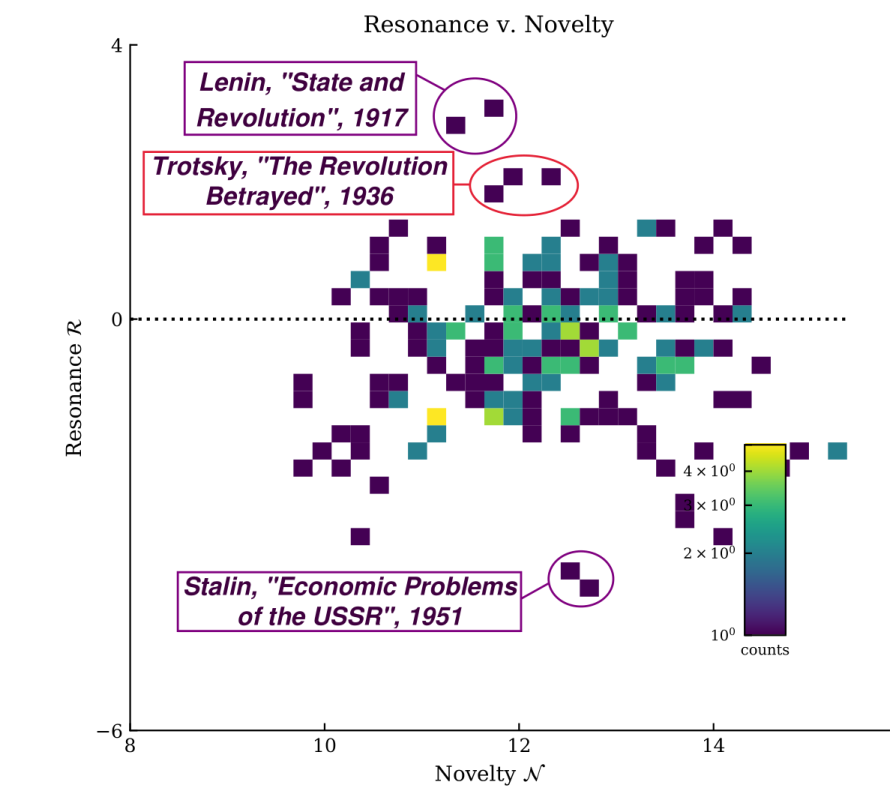

::: {.content-visible unless-format="revealjs"}

<a class="h2" href="./slides.html" target="_blank">Open slides in new window &rarr;</a>

:::

# Schedule {.smaller .crunch-title .crunch-callout .code-90 data-stack-name="Schedule"}

Today's Planned Schedule:

| | Start | End | Topic |
|:- |:- |:- |:- |
| **Lecture** | 6:30pm | 6:45pm | [Final Projects &rarr;](#final-projects-independent-vs.-dependent-variables) |
| | 6:45pm | 7:10pm | [Instrumental Variables Lite &rarr;](#instrumental-variables) |
| | 7:30pm | 8:00pm | [When Conditioning Won't Cut It: IVs &rarr;](#hard-mode-when-conditioning-cant-fix-things) |
| | 7:10pm | 8:00pm | [Text-as-Data Part 1: TAD in General &rarr;](#text-as-data-part-1-tad-in-general) |
| **Break!** | 8:00pm | 8:10pm | |
| | 8:10pm | 9:00pm | [Text-as-Data Part 2: Causal Text Analysis &rarr;](#text-as-data-part-2-causal-inferences-with-text) |

: {tbl-colwidths="[12,12,12,64]"}



# Final Project Timeline {.smaller .title-13 .crunch-title data-stack-name="Final Projects"}

* **First Draft**:
  * ***Submitted*** on Canvas to instructors for review by **Friday, July 31st**, 5:59pm EDT
  * ***Approved*** on Canvas (instructor comment) by **Wednesday, August 5th**, 11:59pm
* **Final Submission**:
  * ***Submitted*** via Canvas by **Friday, August 7th**, 5:59pm
  * ***Graded*** by **Friday, August 14th**, 11:59pm
* **Final Project Gallery** (Opt-Out Allowed)
  * Projects **contribute to scientific knowledge!** (Example later today 🤯)
  * Need to know your audience+goal: [Business case](https://en.wikipedia.org/wiki/Business_case)? Policy recommendations? Research findings?

## Final Project Huddle {.smaller .title-11 .crunch-title .crunch-quarto-figure .crunch-quarto-layout-panel .crunch-ul .crunch-img .crunch-p .ul-block .crunch-li-8}

**🥳 You're doing great 🥳**

{fig-align="center" width="540" .nostretch}

* Reminder: The two options are **not mutually exclusive**: let the research question drive your trajectory!
* [Emerging Theme 1]{.badge} What is required to take [thing people already study], push it into the realm of **causality**?
* *I can **measure** change in **text** property (sentiment, topic) before and after **event**... how do I know event **caused** change?*
* [Emerging Theme 2]{.badge} I have an outcome ("puzzle") $Y$, plus a treatment $T$ that I think causes it... How do I concretely "connect the dots" from $T$ to $Y$?
* *Ex: I think introduction of Fox News Channel caused increased polarization...*
* [In Both Cases]{.badge} Start project with the **associational** connections, then explore possibilities of (a) controlling for forks/pipes, (b) existence of colliders, (c) if there's some "exogenous variation" you can exploit (stand-in for coin flip)

# Double Robustness {.crunch-title .title-13 data-stack-name="Double Robustness" .smaller}

* Propensity Score Weighting seems so much easier than all the hard work of modeling... why can't we just propensity score all the things and be done with it!?
* By using **doubly-robust** estimation methods, you can:
  * <i class='bi bi-1-circle'></i> Carefully develop a **covariate adjustment strategy** (then use e.g. regression),
  * <i class='bi bi-2-circle'></i> Carefully develop a **propensity score strategy**, and then
  * <i class='bi bi-3-circle'></i> Be only as wrong as the least-wrong of <i class='bi bi-1-circle'></i> and <i class='bi bi-2-circle'></i>!!

{fig-align="center"}

## Doubly-Robust Estimation {.smaller .crunch-title .crunch-quarto-layout-panel .crunch-quarto-figure}

:::: {layout="[1,1]" layout-align="center" layout-valign="center"}
::: {.column width="50%"}

!](images/darkmode.svg){fig-align="center" width="40%"}

:::
::: {.column width="50%"}

{fig-align="center" width="80%"}

:::
::::



...So, is this a causal effect? Does dark theme **cause** users to spend less time reading?

## Unit of Observation: (Article, Reader) {.title-10 .smaller .crunch-title}

*(...since I couldn't figure out how to fit it on the last slide)*



## What Does the Data Look Like? {.smaller .crunch-title .title-11 .crunch-img}



## Control-Treatment Balance {.smaller .crunch-title .table-90}

:::: {.columns}
::: {.column width="50%"}

Enter **Uber**'s causal inference library: [`causalml`](https://causalml.readthedocs.io/en/latest/about.html)



:::
::: {.column width="50%"}

And then `WeightIt` to generate a "love plot":

{fig-align="center"}

:::
::::

## *Augmented* Inverse Propensity Weighting (AIPW) {.smaller .crunch-title .title-09 .math-90}

$$
\hat\tau = \frac{1}{n}\sum_i \left[ \hat\mu_1(X_i) - \hat\mu_0(X_i) + \frac{T_i(Y_i - \hat\mu_1(X_i))}{\hat e(X_i)} - \frac{(1-T_i)(Y_i - \hat\mu_0(X_i))}{1-\hat e(X_i)} \right]
$$

## Model 1: Propensity Score {.smaller .crunch-title .crunch-img .crunch-quarto-figure}





## Model 2: Regression with Controls {.smaller}

First, with `scikit-learn`:



Enter [`EconML`](https://econml.azurewebsites.net/index.html), Microsoft's "Official" ML-based econometrics library 😎



## Double-Robustness to the Rescue! {.smaller}

:::: {.columns}
::: {.column width="50%"}

Wrong **regression** model:



:::
::: {.column width="50%"}

Wrong **propensity score** model:



:::
::::

# Instrumental Variables {.crunch-title .title-12 .text-85 .not-title-slide .crunch-quarto-figure .crunch-img .crunch-p .crunch-math data-stack-name="Instrumental Vars"}

:::: {.columns}
::: {.column width="50%"}

*If **randomization** works to obtain causal effects...*  

{fig-align="center" width="90%"}

:::
::: {.column width="50%"}

*...Find something random in the causal system, use e.g. matching to "force" the same scenario!*

{fig-align="center" width="90%"}

:::
::::

General form: $\text{Effect}(D \rightarrow Y) = \frac{\text{Effect}(Z \rightarrow Y)}{\text{Effect}(Z \rightarrow D)}$ [*(Try "plugging in" $Z$ = Coin Flip!)*]{.text-70}

$$
\beta_{\text{IV}}^{\text{Wald}} = \frac{
  \mathbb{E}[Y_i \mid Z_i = 1] - \mathbb{E}[Y_i \mid Z_i = 0]
  }{
    \mathbb{E}[D_i \mid Z_i = 1] - \mathbb{E}[D_i \mid Z_i = 0]
  }, \;
\beta_{\text{IV}} = \frac{\text{Cov}[Y, Z]}{\text{Cov}[D,Z]}
$$

## Demo: Birthday as Instrument

[Birthdays as Instruments for Catholic School Effects](../writeups/birthday-instrument/)

# Text-as-Data Part 1: TAD in General {.crunch-title .title-09 data-stack-name="Text-as-Data"}

* Computers don't exactly "read" text! They process **numeric representations** of some feature(s) of the text
  * Ex: **sentiment**, **topic**, **embedding in semantic space**
* $\Rightarrow$ When we do causal inference with text, we're **not studying $D \rightarrow Y$ itself!** Instead, we study:
  * **Text as Outcome**: $D \rightarrow g(Y)$ and/or
  * **Text as Treatment**: $g(D) \rightarrow Y$

# Text-as-Data Part 2: Causal Inferences with Text {.smaller .crunch-title .title-10 .crunch-ul .crunch-p data-stack-name="Causal Text Analysis"}

*(The necessity for **sample splitting**!)*

* Recall the **media effects** example from [Week 3](https://jjacobs.me/dsan5650/w03/#studying-fake-news); here an experiment where:
* **Treatment** ($D_i = 1$) watches **presidential debate** (control doesn't watch anything)
* **Outcome** $Y_i$: We estimate a **topic model** of the respondent's verbal answer to "what do you think are the most important issues in US politics today?"

| | $Y_i \mid \textsf{do}(D_i \leftarrow 1)$ | $Y_i \mid \textsf{do}(D_i \leftarrow 0)$ |
|:-:|:-:|:-:|
| Person 1 | Candidate's Morals | Taxes |
| Person 2 | Candidate's Morals | Taxes |
| Person 3 | Polarization | Immigration |
| Person 4 | Polarization | Immigration |

: From @egami_how_2022 {#tbl-naoki cap-location="bottom"}

## "Discovered" Topics *Depend on the Data* 😟 {.smaller .crunch-title .title-11 .table-85}

| | $Y_i \mid \textsf{do}(D_i \leftarrow 1)$ | $Y_i \mid \textsf{do}(D_i \leftarrow 0)$ |
|-:|:-:|:-:|
| Person 1 | Candidate's Morals | Taxes |
| Person 2 | Candidate's Morals | Taxes |
| Person 3 | Polarization | Immigration |
| Person 4 | Polarization | Immigration |

: From @egami_how_2022 {#tbl-naoki cap-location="bottom"}

:::: {.columns}
::: {.column width="50%"}

| | Actual Assignment | Outcome $Y_i$ |
|:-:|:-:|:-:|
| Person 1 | $D_1 = 1$ | Morals |
| Person 2 | $D_2 = 1$ | Morals |
| Person 3 | $D_3 = 0$ | Immigration |
| Person 4 | $D_4 = 0$ | Immigration |

: Realized assignments and outcomes in World 1 {#tbl-world1}

:::
::: {.column width="50%"}

| | Actual Assignment | Outcome $Y_i$ |
|:-:|:-:|:-:|
| Person 1 | $D_1 = 1$ | Morals |
| Person 2 | $D_2 = 0$ | Taxes |
| Person 3 | $D_3 = 1$ | Polarization |
| Person 4 | $D_4 = 0$ | Immigration |

: Realized assignments and outcomes in World 2 {#tbl-world2}

:::
::::

## The Solution? *Sample Splitting!* {.crunch-title .crunch-ul}

* Machine learning noticed this long ago: the goal is a model that **generalizes**, not **memorizes!**

{fig-align="center"}

## Topic Models {.smaller .crunch-title .crunch-ul .table-90}

* Intuition is just: let's model **latent topics** "underlying" **observed words**

| Section | Keywords |
| - | - |
| U.S. News | state, court, federal, republican |
| World News | government, country, officials, minister |
| Arts | music, show, art, dance |
| Sports | game, league, team, coach |
| Real Estate | home, bedrooms, bathrooms, building |

* Already, by just classifying articles based on these keyword counts:

| | Arts | Real Estate | Sports | U.S. News | World News | Total |
|-:|:-:|:-:|:-:|:-:|:-:|
| **Correct** | 3020 | 690 | 4860 | 1330 | 1730 | 11630 |
| **Incorrect** | 750 | 60 | 370 | 1100 | 590 | 2870 |
| **Accuracy** | 0.801 | 0.920 | 0.929 | 0.547 | 0.746 | 0.802 |

## Topic Models as PGMs {.smaller .crunch-title .crunch-img}

{fig-align="center"}

*...Unlocks a world of social modeling through text!*

## Cross-Sectional Analysis

@blaydes_mirrors_2018

## Influence Over Time

{fig-align="center"}

## Textual Influence Over Time

{fig-align="center"}

## Text as *Outcome*

* ["Has 9/11 changed the focus of Congress on different topics?"](https://web.stanford.edu/class/cs224n/final-reports/256564135.pdf)

## References

::: {#refs}
:::
