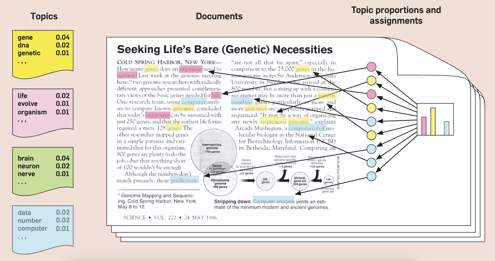

# Topic Models Over Space and Time {data-stack-name="Topic Models"}

## Topic Models {.smaller .crunch-title .crunch-ul .table-90}

* Intuition is just: let's model **latent topics** "underlying" **observed words**

| Section | Keywords |
| - | - |
| U.S. News | state, court, federal, republican |
| World News | government, country, officials, minister |
| Arts | music, show, art, dance |
| Sports | game, league, team, coach |
| Real Estate | home, bedrooms, bathrooms, building |

* Already, by just classifying articles based on these keyword counts:

| | Arts | Real Estate | Sports | U.S. News | World News | Total |
|-:|:-:|:-:|:-:|:-:|:-:|
| **Correct** | 3020 | 690 | 4860 | 1330 | 1730 | 11630 |
| **Incorrect** | 750 | 60 | 370 | 1100 | 590 | 2870 |
| **Accuracy** | 0.801 | 0.920 | 0.929 | 0.547 | 0.746 | 0.802 |

## Topic Models as PGMs {.smaller .crunch-title .crunch-img}

{fig-align="center"}

<center>

*...Unlocks a world of social modeling through text!*

</center>

---

```{python}
# A = np.column_stack((A,new_ages))
# new_happiness = np.linspace(-2, 2, num=n_births)
# H = np.column_stack((H, new_happiness))
# new_marriage = np.zeros(n_births)
# M = np.column_stack([M, new_marriage])
# # for each person over 17, chance get married
# for j in range(18, A.shape[1]):
#   for i in range(0, n_births):
#     if (A[i,j] >= 18) and (M[i,j] == 0):
#       M[i,j] = stats.bernoulli(1,expit(H[i,j]-4))


# Plotting code

# ax = pw.Brick(figsize=(5,3))
# ax.scatter(
#     A[:,M == 0],
#     H[:,M == 0],
#     s=11,
#     alpha=0.8,
#     color="lightgray",
#     label="Unmarried",
# )
# ax.scatter(
#     A[:,M == 1],
#     H[:,M == 1],
#     s=11,
#     alpha=1,
#     color="C0",
#     label="Married",
# )
# ax.set_xlabel("Age")
# ax.set_ylabel("Happiness (std)")
# ax.legend();
# ax.savefig()
```