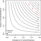
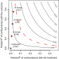
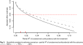

::: {.content-visible unless-format="revealjs"}

<center>
<a class="h2" href="./slides.html" target="_blank">Open slides in new window &rarr;</a>
</center>

:::

# Final Project Progress Report / Draft: Friday, 11:59pm EDT {data-name="Final Projects"}

* [On Canvas](https://georgetown.instructure.com/courses/231688/assignments/1394145)
* **Help us help you!**
* [Rubber duck debugging](https://en.wikipedia.org/wiki/Rubber_duck_debugging)

# Robustness and Sensitivity Analysis: Complementary! {data-stack-name="Sensitivity Analysis"}

## Car Safety Metaphor {.smaller .crunch-title}

* **Robustness**: Doing stuff to **maximize "safety" (from getting causal effect wrong)**

```{=html}
<table>
<thead>
</thead>
<tbody>
<tr>
  <td colspan='2' style='border-bottom: none;'></td>
  <td colspan='2' class='tdc tdvc'><span data-qmd="Seatbelts Installed?[*Covariates Adjusted?*]{.mini-row}</small>"></span></td>
</tr>
<tr>
  <td style='border-bottom: none;'></td>
  <td></td>
  <td class='tdc'>No</td>
  <td class='tdc'>Yes</td>
</tr>
<tr>
  <td rowspan="2" class='tdc tdvc' style='border-bottom: none;'><span data-qmd="Airbag Installed?[*Propensity Score Estimated?*]{.mini-row}"></span></td>
  <td class='tdc tdvc'>No</td>
  <td class='tdc tdvc'>OLS</td>
  <td class='tdc tdvc'>OLS + "Controls"</td>
</tr>
<tr>
  <td class='tdc tdvc'>Yes</td>
  <td class='tdc tdvc'>IPW</td>
  <td class='tdc tdvc'><b>Doubly Robust!</b> 🥳</td>
</tr>
</tbody>
</table>
```

* **Sensitivity Analysis**: What is the "breaking point" of my safety measures?
* $\Pr($Not enough time for airbag to inflate$) \propto$ speed
* $\leadsto$ Over 100mph, $\Pr($Not enough time for airbag to inflate$) > 0.95$
* $\Pr($Wrong causal effect$) \propto$ correlation of omitted confounder with treatment, outcome
* $\leadsto$ Over $\rho = 0.6$, $\Pr($Wrong causal effect$) > 0.95$

<!-- Sensitivity Analysis 1: Sensitivity to Priors -->

# Sensitivity Analysis 1: Sensitivity to Priors {data-stack-name="Sensitivity to Priors"}

```{python}
#| label: py-imports
#| fig-align: center
import pandas as pd
import numpy as np
import matplotlib.pyplot as plt
import seaborn as sns
cb_palette = ['#e69f00','#56b4e9','#009e73']
sns.set_palette(cb_palette)
import pymc as pm
import arviz as az
def draw_prior_sample(model, return_idata=False):
  with model:
    prior_idata = pm.sample_prior_predictive(draws=10_000, random_seed=5650)
  prior_df = prior_idata.prior.to_dataframe().reset_index().drop(columns='chain')
  if return_idata:
    return prior_idata, prior_df
  return prior_df
# Plotting function
def gen_dist_plot(
  dist_df, plot_title, size='third', custom_ylim=None
):
  plot_width = 2
  if size == 'quarter':
    plot_width = 1.5
  plot_height = 0.625 * plot_width
  plot_figsize = (plot_width, plot_height)
  fig = plt.figure(figsize=plot_figsize)
  ax = fig.gca()
  sns.histplot(
    x="p_heads", data=dist_df,
    ax=ax,
    bins=25, alpha=0.8,
    stat='probability',
  );
  ax.set_xlim(0, 1);
  if custom_ylim is not None:
    ax.set_ylim(custom_ylim)
  ax.set_title(plot_title)
  return fig, ax
```

## The Beta Distribution $\text{Beta}(\alpha, \beta)$: The "Workhorse" Prior! {.smaller .title-09 .crunch-title .crunch-quarto-figure .crunch-ul .crunch-img .text-60}

<center style='margin: 5px;'>

[**Biased coin** framing: $\alpha$ is "pseudo-count" of **heads**, $\beta$ = "pseudo-count" of **tails**]{style="border: 1px solid black; padding: 5px;"}

</center>

:::: {.columns}
::: {.column width="33%"}

<center>

<i class='bi bi-1-circle'></i> $p \sim$ "$\text{Beta}(0, 0)$"

</center>

```{python}
#| label: beta00-plot
#| fig-align: center
# b00_df = pd.DataFrame({'p_heads': np.arange(0, 1+1/25, 1/25)})
# b00_df['Probability'] = 0
fig = plt.figure(figsize=(2, 1.25))
ax = fig.gca()
sns.histplot(
  x=[], # data=b00_df
);
ax.set_xlabel('p_heads');
ax.set_ylabel('Probability')
ax.set_xticks([0, 0.25, 0.5, 0.75, 1]);
ax.set_ylim(0, 1);
plt.show()
```

:::
::: {.column width="33%"}

<center>

<i class='bi bi-2-circle'></i> $p \sim$ "$\text{Beta}(1, 0)$"

</center>

```{python}
#| label: beta10-plot
#| fig-align: center
b10_df = pd.DataFrame({
  'draw': [0],
  'p_heads': [0],
})
fig = plt.figure(figsize=(2, 1.25))
ax = fig.gca()
sns.histplot(
  x='p_heads', stat='probability',
  ax=ax,
  bins=25,
  data=b10_df
);
ax.set_xlim(0, 1);
ax.set_ylim(0, 1);
plt.show()
```

:::
::: {.column width="33%"}

<center>

<i class='bi bi-3-circle'></i> $p \sim$ "$\text{Beta}(0, 1)$"

</center>

```{python}
#| label: beta01-plot
#| fig-align: center
b01_df = pd.DataFrame({
  'draw': [0],
  'p_heads': [1],
})
fig = plt.figure(figsize=(2, 1.25))
ax = fig.gca()
sns.histplot(
  x='p_heads', stat='probability',
  ax=ax,
  bins=25,
  data=b01_df
);
ax.set_xlim(0, 1);
ax.set_ylim(0, 1);
plt.show()
```

:::
::::

:::: {.columns}
::: {.column width="33%"}

<center>
<i class='bi bi-4-circle'></i> **Informative** Prior
</center>

```{python}
#| label: fig-informative-prior
#| crop: false
#| fig-align: center
#| fig-cap: "*\"I'll start by assuming a **fair** coin\"*"
# Informative Prior
with pm.Model() as informative_model:
  p_heads = pm.Beta("p_heads", alpha=2, beta=2)
  result = pm.Bernoulli("result", p=p_heads)
informative_df = draw_prior_sample(informative_model)
informative_fig, informative_ax = gen_dist_plot(
  informative_df, "Beta(2, 2) Prior on p"
);
plt.show()
```

:::
::: {.column width="33%"}

<center>
<i class='bi bi-5-circle'></i> **Weak** Prior
</center>

```{python}
#| label: fig-weak-prior
#| fig-align: center
#| fig-cap: "*\"I have no idea, I'll assume all biases equally likely\"*"
# Weakly Informative
with pm.Model() as weak_model:
  p_heads = pm.Beta("p_heads", alpha=1, beta=1)
  result = pm.Bernoulli("result", p=p_heads)
weak_df = draw_prior_sample(weak_model)
weak_fig, weak_ax = gen_dist_plot(
  weak_df, "Beta(1, 1) Prior on p"
);
plt.show()
```

:::
::: {.column width="33%"}

<center>
<i class='bi bi-6-circle'></i> **Skeptical** (Jeffreys) Prior
</center>

```{python}
#| label: fig-skeptical-prior
#| fig-align: center
#| fig-cap: "*\"I don't trust this coin, it'll take lots of flips with H/T balance to convince me it's fair!\"*"
# Skeptical / Jeffreys
with pm.Model() as skeptical_model:
  p_heads = pm.Beta("p_heads", alpha=0.5, beta=0.5)
  result = pm.Bernoulli("result", p=p_heads)
skeptical_df = draw_prior_sample(skeptical_model)
skeptical_fig, skeptical_ax = gen_dist_plot(
  skeptical_df, "Beta(0.5, 0.5) Prior on p"
);
# And combine
plt.show()
```

:::
::::

## Modeling *Domain Knowledge* with Priors {.smaller .crunch-title .title-12}

**Population proportion** framing: $\frac{\alpha}{\alpha + \beta}$ = mean, $\alpha + \beta$ = "precision"

:::: {.columns}
::: {.column width="50%"}

```{python}
#| label: heads-more-likely
#| fig-align: center
with pm.Model() as heads_model:
  p_heads = pm.Beta("p_heads", alpha=2, beta=1)
  result = pm.Bernoulli("result", p=p_heads)
heads_df = draw_prior_sample(heads_model)
heads_fig, heads_ax = gen_dist_plot(
  heads_df, "Beta(2, 1) Prior on p"
);
plt.show()
```

:::
::: {.column width="50%"}

```{python}
#| label: tails-more-likely
#| fig-align: center
with pm.Model() as tails_model:
  p_heads = pm.Beta("p_heads", alpha=1, beta=2)
  result = pm.Bernoulli("result", p=p_heads)
tails_df = draw_prior_sample(tails_model)
tails_fig, tails_ax = gen_dist_plot(
  tails_df, "Beta(1, 2) Prior on p"
);
plt.show()
```

:::
::::

:::: {.columns}
::: {.column width="50%"}

```{python}
#| label: tails-very-likely
#| fig-align: center
with pm.Model() as beta23_model:
  p_heads = pm.Beta("p_heads", alpha=2, beta=3)
  result = pm.Bernoulli("result", p=p_heads)
beta23_df = draw_prior_sample(beta23_model)
beta23_fig, beta23_ax = gen_dist_plot(
  beta23_df, "Beta(2, 3) Prior on p"
);
# beta23_plot.savefig()
plt.show()
```

:::
::: {.column width="50%"}

```{python}
#| label: beta2030-model
#| fig-align: center
with pm.Model() as beta100_model:
  p_heads = pm.Beta("p_heads", alpha=40, beta=60)
  result = pm.Bernoulli("result", p=p_heads)
beta100_df = draw_prior_sample(beta100_model)
beta100_fig, beta100_ax = gen_dist_plot(
  beta100_df, "Beta(40, 60) Prior on p"
);
# beta100_plot.savefig()
plt.show()
```

:::
::::

# Sensitivity Analysis 2: How Sensitive Are My Results to *Included Variable Bias*? {.smaller .title-10 .crunch-title data-stack-name="Included Variable Bias"}

* You probably know about **omitted variable bias** from previous classes / intuition... but, **included variable bias?**
* That's right folks... **colliders** can be agents of chaos, laying waste to our best, most meticulously-planned-out models

{fig-align="center"}

## Does Aging Cause Sadness? {.text-70 .table-90 .crunch-title .crunch-ul .crunch-quarto-figure .crunch-img .crunch-quarto-layout-panel .crunch-quarto-layout-cell .crunch-figure .crunch-figcaption .inline-80}

```{=html}
<table>
<thead>
</thead>
<tbody>
<tr>
  <td width="5%" align="right" class='tdvc' style='border-top: 1px solid #00000000;'><span data-qmd="<i class='bi bi-1-circle'></i>"></span></td>
  <td width="95%">Each year, 20 people are born with uniformly-distributed happiness values</td>
</tr>
<tr>
  <td class='tdvc' style='border-top: 1px solid #00000000;'><span data-qmd="<i class='bi bi-2-circle'></i>"></span></td>
  <td>Each year, each person ages one year; Happiness does not change</td>
</tr>
<tr>
  <td class='tdvc' style='border-top: 1px solid #00000000;'><span data-qmd="<i class='bi bi-3-circle'></i>"></span></td>
  <td>At age 18, individuals can become married; Odds of marriage each year proportional to individual's happiness; Once married, they remain married</td>
</tr>
<tr>
  <td class='tdvc' style='border-top: 1px solid #00000000;'><span data-qmd="<i class='bi bi-4-circle'></i>"></span></td>
  <td>At age 70 individuals leave the sample (They move to Boca Raton, Florida)</td>
</tr>
</tbody>
</table>
```

:::: {layout="[65,35]" layout-valign="center"}
::: {#collider-plot}

```{python}
#| label: happiness-plot
#| fig-align: center
import pandas as pd
import numpy as np
rng = np.random.default_rng(seed=5650)
import matplotlib.pyplot as plt
import seaborn as sns
cb_palette = ['#e69f00','#56b4e9','#009e73']
sns.set_palette(cb_palette)
from scipy.special import expit

# The original R code:
# sim_happiness <- function( seed=1977 , N_years=1000 , max_age=65 , N_births=20 , aom=18 ) {
#     set.seed(seed)
#     H <- M <- A <- c()
#     for ( t in 1:N_years ) {
#         A <- A + 1 # age existing individuals
#         A <- c( A , rep(1,N_births) ) # newborns
#         H <- c( H , seq(from=-2,to=2,length.out=N_births) ) # sim happiness trait - never changes
#         M <- c( M , rep(0,N_births) ) # not yet married
#         # for each person over 17, chance get married
#         for ( i in 1:length(A) ) {
#             if ( A[i] >= aom & M[i]==0 ) {
#                 M[i] <- rbern(1,inv_logit(H[i]-4))
#             }
#         }
#         # mortality
#         deaths <- which( A > max_age )
#         if ( length(deaths)>0 ) {
#             A <- A[ -deaths ]
#             H <- H[ -deaths ]
#             M <- M[ -deaths ]
#        }
#     }
#     d <- data.frame(age=A,married=M,happiness=H)
#     return(d)

# DGP: happiness -> marriage <- age
years = 70
num_births = 41
colnames = ['age','a','h','m']
sim_dfs = []
A = np.zeros(shape=(num_births,1))
H = np.linspace(-2, 2, num=num_births)
M = np.zeros(shape=(num_births,1))
def update_m(row):
  if row['m'] == 0:
    return int(rng.binomial(
      n=1,
      p=expit(row['h'] - 3.875),
      size=1,
    )[0])
  return 1
def sim_cohort_to(max_age):
  sim_df = pd.DataFrame({
      'age': [1 for _ in range(num_births)],
      'h': np.linspace(-2, 2, num=num_births),
      'm': [0 for _ in range(num_births)],
    }
  )
  for t in range(2, max_age + 1):
    sim_df['age'] = sim_df['age'] + 1
    if t >= 18:
      sim_df['m'] = sim_df.apply(update_m, axis=1)
  return sim_df
all_sim_dfs = []
for cur_max_age in range(1, 71):
  cur_sim_df = sim_cohort_to(cur_max_age)
  all_sim_dfs.append(cur_sim_df)
full_sim_df = pd.concat(all_sim_dfs)

# And plot
fig, ax = plt.subplots(figsize=(8, 4))
cbg_palette = ['#c6c6c666'] + cb_palette
full_sim_df['m_label'] = full_sim_df['m'].apply(lambda x: "Unmarried" if x == 0 else "Married")
full_sim_df = full_sim_df.rename(columns={'age': 'Age', 'h': 'Happiness'})
happiness_plot = sns.scatterplot(
  x='Age', y='Happiness', hue='m_label',
  data=full_sim_df,
  palette=cbg_palette[:2],
  s=24,
  ax=ax,
  legend=True,
);
# happiness_plot.move_legend("upper center", bbox_to_anchor=(0.5, 1.15), ncol=2);
sns.move_legend(ax, "upper center", bbox_to_anchor=(0.5, 1.15), ncol=2);
happiness_plot.legend_.set_title("");
happiness_plot.axvline(x=17.5, color='black', ls='dashed', lw=1);
plt.show();
```

:::
::: {#collider-text}

<figcaption>

Happiness by Age, 70 birth cohorts of size 41 each (DC minimum marriage age = 18)

</figcaption>

<center>

...What's happening here?<br>
$\textsf{Happy} \rightarrow {}^{🤔}\textsf{Marriage}^{🤔} \leftarrow \textsf{Age}$

</center>

:::
::::

# Sensitivity Analysis 3: How Sensitive Are My Results to *Omitted Variable Bias*? {.smaller .title-10 .crunch-title data-stack-name="Omitted Variable Bias"}

## Assessing the Impact of Omitted Vars {.smaller .crunch-title .title-10 .math-90 .crunch-math .crunch-ul}

* Working example: [**PCPSR**](https://www.pcpsr.org/en), People's Company for Public Survey Research (شركة الشعب الأبحاث المسحية)
* What is **causal impact** of **experiencing violence** on **support for armed struggle?**
* Researcher A models this scenario as:

$$
\textsf{ArmedStruggle}_i = \alpha^\text{res} + \tau^\text{res} \textsf{DirectHarm}_i + \hat{\beta}_\text{c}^\text{res}\textsf{RefugeeCamp}_i + \textsf{Muhaf}_i \hat{\boldsymbol \beta}_\text{m}^\text{res} + \hat{\varepsilon}^\text{res}
$$

* Researcher B instead prefers:

$$
\textsf{ArmedStruggle}_i = \alpha + \tau \textsf{DirectHarm}_i + \hat{\beta}_\text{c}\textsf{RefugeeCamp}_i + \textsf{Muhaf}_i \hat{\boldsymbol \beta}_{\text{m}} + \boxed{\hat{\gamma}\textsf{PFLP}_i} + \hat{\varepsilon}^{\text{full}}
$$

> Our earlier estimate $\tau_{\text{res}}$ would differ from our target quantity $\tau$: but **how badly?**
> 
> How strong would the confounder(s) have to be to change the estimates in such a way **to affect the main conclusions** of a study?

## The Classical OVB Equation {.smaller .crunch-title .title-12 .crunch-ul .crunch-math .footnotes-0 .math-90 .inline-90}

* Remember that $T$ is our **treatment** variable! ($\mathbf{X}$ = covariates, $Y$ = outcome)
* In a perfect world, we would estimate $Y = \hat{\tau}T + \mathbf{X} \hat{\beta} + \hat{\gamma}Z+ \varepsilon_{\text{full}}$
* But, $Z$ is **unobserved** $\leadsto$ **"restricted"** model $Y = \hat{\tau}_{\text{res}}T + \mathbf{X} \hat{\beta}_{\text{res}} + \varepsilon_{\text{res}}$
* What is the "gap" between $\hat{\tau}$ and $\hat{\tau}^{\text{res}}$? $\text{OVB} = \hat{\tau}_{\text{res}} - \hat{\tau}$

:::: {.columns}
::: {.column width="40%"}

$$
\begin{align*}
\hat{\tau}_{\text{res}} &= \frac{
  \text{Cov}[T^{\top \mathbf{X}}, Y^{\top \mathbf{X}}]
}{
  \text{Var}[T^{\top \mathbf{X}}]
} \\
&= \frac{
  \text{Cov}[T^{\top \mathbf{X}}, \hat{\tau}T^{\top \mathbf{X}} + \hat{\gamma}Z^{\top \mathbf{X}}]
}{
  \text{Var}[T^{\top \mathbf{X}}]
} \\
&= \hat{\tau} + \hat{\gamma}\frac{
  \text{Cov}[T^{\top \mathbf{X}}, Z^{\top \mathbf{X}}]
}{
  \text{Var}[T^{\top \mathbf{X}}]
} \\
&= \hat{\tau} + \hat{\gamma}\hat{\delta} \\
\implies \text{OVB} &= \hat{\tau}_{\text{res}} - \hat{\tau} = \overbrace{
  \boxed{\hat{\gamma} \times \hat{\delta}}
}^{\mathclap{\text{Impact} \, \times \, \text{Imbalance}}}
\end{align*}
$$

:::
::: {.column width="60%"}

{fig-align="center" width="360"}

:::
::::

::: {.aside}

The ability to produce **orthogonalized** ($\top \mathbf{X}$) versions of vars in the model utilizes the [Frisch-Waugh-Lovell Theorem](https://en.wikipedia.org/wiki/Frisch%E2%80%93Waugh%E2%80%93Lovell_theorem)

:::

## More Generally

* What if we don't have a **specific** omitted variable in mind? We just want to know the expected impact **if** there were omitted vars... Enter "Partial $R^2$"

:::: {.columns}
::: {.column width="50%"}

{fig-align="center"}

:::
::: {.column width="50%"}

{fig-align="center"}

:::
::::

## References

::: {#refs}
:::
